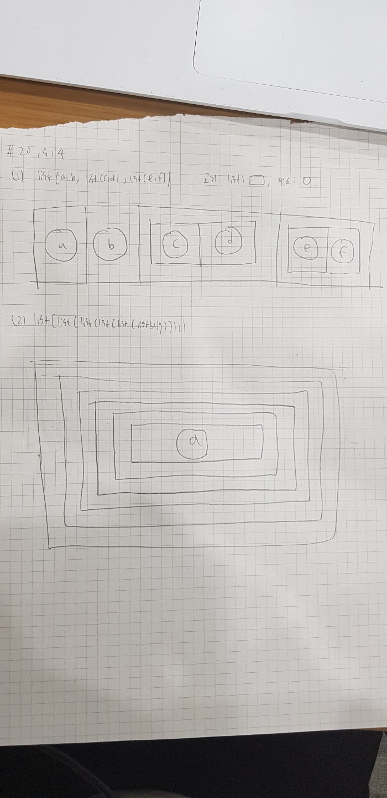

---
title: "326.212 Homework 4"
output:
  html_document:
    df_print: paged
---

```{r setup, include=FALSE}
knitr::opts_chunk$set(echo = TRUE)
library(tidyverse)
library(nycflights13)
library(stringr)
library(forcats)
library(lubridate)
library(modelr)
```


## 2014-16757
## 컴퓨터공학부 김보창

### Textbook 19.3.1

#### Problem 1. Read the source code for each of the following three functions, puzzle out what they do, and then brainstorm better names.

```{r}
f1 <- function(string, prefix) {
  substr(string, 1, nchar(prefix)) == prefix
}
```

f1의 경우, argument 이름을 보면 string과 prefix를 받아서, substr함수에 집어넣고, substr함수의 결과같을 prefix와 비교해서, 그 결과를 리턴함을 알 수 있다.


nchar의 경우, ?nchar를 통해 documentation을 보면, 


"nchar takes a character vector as an argument and returns a vector whose elements contain the sizes of the corresponding elements of x. Internally, it is a generic, for which methods can be defined."

와 같은 설명이 있으므로, prefix의 길이가 됨을 알 수 있고,

?substr를 통해 documentation을 보면, substr는 string과, 그 string의 start point, end point를 나타내는 integer를 받아, 해당 위치의 substring을 리턴하는 함수임을 알 수 있다.

따라서, 위 함수는 string과 prefix vector를 받아, 
각 string이 해당 prefix를 가지는지를 판단하는 함수임을 알 수 있다.

실제로, 아래와 같이 결과를 확인해 볼 수 있다.


```{r}
f1(c("abc","bc"),"a")

f1(c("abc","bc"),c("a", "c"))

f1(c("abc","bc"),"c")
```


따라서, f1의 이름은, is_string_start_with 와 같이 지어주는게 타당할 것이다.


```{r}
f2 <- function(x) {
  if (length(x) <= 1) return(NULL)
  x[-length(x)]
}
```

f2의 경우, 벡터 x를 받아 length x가 1보다 작으면, NULL을 리턴하고, 그렇지 않은 경우 x벡터의 length(x)위치에 있는 원소를 빼고 리턴함을 알 수 있다.

따라서, 이 함수는 x벡터의 마지막 원소만 제외하고 나머지 원소를 리턴하는 함수임을 알 수 있으므로,

except_last_element 와 같은 이름이 적합할것이다.

```{r}
x <- c(1)
y <- c(5,4,1,2,3)

f2(x)

f2(y)
```

실제 동작을 확인해보면 위와 같음을 알 수 있다.


```{r}
f3 <- function(x, y) {
  rep(y, length.out = length(x))
}
```

f3의 경우, x와 y를 받아서, rep에 집어넣고 있는데,

?rep를 통해 무슨 동작을 하는지 확인해보면,
위 함수는 y라는 벡터를 x라는 벡터의 길이와 같아질때까지 반복한 결과를 출력해주는 함수임을 알 수 있다.

따라서 f3의 경우, repeat_by_first_length와 같은 이름이 적당할 것이다.


실제로, 다음과 같이 실제 동작을 확인해 볼 수 있다.

```{r}
x <- c(1,2,3)
y <- c(5,4,1,2,3)

f3(y, x)

f3(1:10, y)
```


### Textbook 19.4.4

#### Problem 1. What’s the difference between if and ifelse()? Carefully read the help and construct three examples that illustrate the key differences.

?`if`와 ?`ifelse`를 통해 살펴보면,

if의 경우 if(cond) expr 과 같은 형태로 사용되고,
condition이 참인경우, expr이 실행되고 expr의 결과가 리턴값이 된다.

ifelse의 경우, ifelse(test, yes, no) 와 같은 형태로 사용되고, test가 TRUE일경우, yes값을, test가 FALSE일경우, no에 해당되는 값을 리턴한다.

언뜻보기에는 별 차이가 없어보이지만, 다음과 같은 차이점이 존재한다.


1. if의 경우, cond 자리에 length 1짜리 TRUE/FALSE로 계산될 수 있는 값만 들어와야 하고, 그렇지 않으면 가장 앞의 값을 cond값으로 사용하지만, ifelse의 경우 cond자리에 length가 1보다 긴 객체가 들어와도 상관없다.


아래와 같이, cond 자리에 들어갈 벡터 x를 길이 3짜리 벡터로 설정한경우, 다음 결과를 보면

```{r}
x <- c(TRUE,FALSE,TRUE)

if(x) 1 else 2

ifelse(x,1,2)
```


if문의 실행결과로는 1과, 경고메시지가 출력되지만,

ifelse의 경우 결과로 1 2 1의 벡터가 출력되고, test vector의 길이와 같아지도록, yes와 no의 값이 recycle됨을 알 수 있다.


2. if의 경우, cond자리에 NA값이 들어오면 오류이지만, ifelse의 경우 cond자리에 NA값이 들어오면 NA를 리턴한다.

```{r, eval = FALSE}
if(NA) 1 else 2
```

(eval = FALSE문을 주어, 실행되지는 않게하였다)
if문의 경우, cond자리에 NA가 들어오면 error가 발생하지만,

```{r}
ifelse(NA,1,2)
```

ifelse의 실행결과로는 NA가 출력됨을 알 수 있다.


3. if의 경우, 정직하게 expr의 실행결과를 리턴하지만, ifelse의 경우, yes나 no자리의 값을 그대로 리턴하는게 아니라,
값의 attribute를 제거하고 리턴하게 된다.


```{r}
x <- as.Date("2000-02-29")

y <- if (as.POSIXlt(x)$mday == 29) x else NA

y

str(y)
```

if문의 결과로는, x값 그대로 Date형, "2000-02-29"가 리턴되지만,


```{r}
x <- as.Date("2000-02-29")

y <- ifelse(as.POSIXlt(x)$mday == 29,x ,NA)

y

str(y)
```

ifelse문의 결과로는 Date형이 아니라, num형이 리턴되고, 11016이라는 값이 리턴됨을 확인할 수 있다.


#### Problem 6. What does this switch() call do? What happens if x is “e”? Experiment, then carefully read the documentation.

```{r}
switch(x, 
  a = ,
  b = "ab",
  c = ,
  d = "cd"
)
```


?`switch`를 이용해, documentation을 살펴보면, switch(EXPR,...) 문은 EXPR 자리에 number나 character string
을 받아서, 뒤에 'value1 = expr1' 와 같은 문장이 오면, EXPR의 값이 value1와 같으면 expr1 을 실행한 결과를 리턴하고, 아니면 다음으로 넘어가면서 EXPR의 값과 같은 value를 가지는 문장을 찾는다. 
'value2 = "와 같은 형태라면, 다음으로 'value3 = expr3' 와 같은 형태가 나올때까지 계속해서 뒤 문장을 찾아간다음, expr3을 실행한 결과를 리턴한다.

만약, 끝까지 가면서 EXPR과 같은 value를 가지는 문장을 찾지 못했을때는, 'default_expr' 와 같이 =로 연결되지 않은 문장이 오면, default_expr을 실행한 결과를 리턴하고,
만약 이러한 문장이 없다면, NULL값을 리턴한다.

따라서, 앞의 switch문장은 x로 character를 받아서, 
x가 "a","b"일경우, "ab"를, x가 "c","d" 일경우, "cd"를, 그 이외의 경우에는 NULL을 리턴할것이다.

이를 확인해보기 위해, 다음과 같이 실행해보면 결과를 알 수 있다.

```{r}
my_func <- function(x) {
  switch(x, 
  a = ,
  b = "ab",
  c = ,
  d = "cd"
  )
}

my_func("a")

my_func("b")

my_func("c")

my_func("d")

e <- my_func("e")

e
```

x가 "e"인 경우에는 NULL이 리턴됨을 알 수 있다.


### Textbook 19.5.5


#### Problem 4. The default value for the method argument to cor() is c("pearson", "kendall", "spearman"). What does that mean? What value is used by default?

?cor를 통해, documentation을 보면,
cor 함수는 x와 y벡터를 받아, x와 y벡터간의 
corrlation을 구하는 함수임을 알 수있다.

이때, cor의 인자로
method = c("pearson", "kendall", "spearman") 와 같이 표기되어있는데, 이 문장의 뜻은, method의 값으로 "pearson", "kendall", "spearman" 중의  하나를 받을 수 있음을 뜻한다.

이것이 의미하는것은, correlation값을 구할때, 어떤 방식을 사용해서 correlation을 구할것인지를 의미한다.

correlation은 크게 pearson correlation, kendall correlation, spearman correlation등이 있으므로,

이중 pearson, kendall, spearman중 하나의 correlation을 구하게 된다.

기본값으로는 "pearson"을 사용하여, pearson correlation을 구한다.


구글링을 통해 알아본 각 correlation들은 다음과 같다.

-------------------------------------------------------

pearson correlation


$r_{x y}=\frac{n \sum x_{i} y_{i}-\sum x_{i} \sum y_{i}}{\sqrt{n \sum x_{i}^{2}-\left(\sum x_{i}\right)^{2}} \sqrt{n \sum y_{i}^{2}-\left(\sum y_{i}\right)^{2}}}$ 

rxy = Pearson r correlation coefficient between x and y

n = number of observations

xi = value of x (for ith observation)

yi = value of y (for ith observation)

-------------------------------------------------------

kendall rank correlation

a,b가 sample size n인 sample에서 나온 variable들일때,
각 a,b에대해 concordant의 개수와 discordant의 개수를 구한다.

$\tau=\frac{n_{c}-n_{d}}{\frac{1}{2} n(n-1)}$

Nc= number of concordant

Nd= Number of discordant

Concordant: Ordered in the same way.

Discordant: Ordered differently.

-------------------------------------------------------
spearman rank correlation

$\rho=1-\frac{6 \sum d_{i}^{2}}{n\left(n^{2}-1\right)}$


ρ= Spearman rank correlation

di= the difference between the ranks of corresponding variables

n= number of observations


### Textbook 20.3.5


#### Problem 2. Read the source code for dplyr::near() (Hint: to see the source code, drop the ()). How does it work?

dplyr::near의 소스코드는, console에

dplyr::near라 치면 나오고, 소스코드는 아래와 같다.

```{r, eval = FALSE}
function (x, y, tol = .Machine$double.eps^0.5) 
{
    abs(x - y) < tol
}
```

소스코드를 통해 작동방식을 보면, near 함수는 x, y와 tol (totlerance)를 받아서,
x와 y의 차이의 절댓값이 주어진 tol보다 작으면, TRUE를, 그렇지 않으면 FALSE를 리턴하도록 되어있음을 알 수 있다.


따라서, x와 y의 차이가 충분히 크지 않으면, TRUE를, 그렇지 않으면 FALSE를 리턴하는 방식으로 작동함을 알 수 있다.


### Textbook 20.5.4


#### Problem 1.





여기서, 동그라미로 표시된것은 각 원소,

네모낳게 표시된것은 리스트를 나타낸다.

각 리스트의 원소들을 구분하였다.


### Textbook 20.7.4


#### Problem 2. Try and make a tibble that has columns with different lengths. What happens?


```{r, eval = FALSE}
tibble::tibble(x = 1:5, y = 1:4)
```
```{r, eval = FALSE}
Error: Tibble columns must have consistent lengths, only values of length one are recycled:
* Length 4: Column `y`
* Length 5: Column `x`
```

(eval = FALSE를 통해 knit할때는 실행되지 않는다.)
위 코드를 통해 column의 길이가 각각 5, 4인 tibble을 만들려고하면, 위와 같은 에러가 난다.

에러메시지를 읽어보면, tibble의 column으로는 같은 길이가 오던가, 아니면 recycle될수 있도록, length 1짜리 원소가 와야한다고 말해주고 있다.

이는 tibble형이, class로 "data.frame"을 가지고 있기 때문으로, data.frame class의 경우 column의 길이가 같아야하므로, 따라서 위와같이 길이가 다른 column을 가지는 tibble을 생성하는것은 불가능하다.


#### Problem 3. Based on the definition above, is it ok to have a list as a column of a tibble?

위의 정의에서는 다음과 같이 쓰여있다.

Tibbles are augmented lists: they have class “tbl_df” + “tbl” + “data.frame”, and names (column) and row.names attributes:

The difference between a tibble and a list is that all the elements of a data frame must be vectors with the same length. All functions that work with tibbles enforce this constraint.


즉,위의 정의에서는 tibble이 class로 "data.frame", "tbl", "tbl_df"를 가지는데, 각 class의 조건만 만족시키면 tibble로 만들 수 있음을 알 수 있다.

여기서 중요한건, data.frame인데, data.frame class의 경우 column을 이루는 벡터의 길이가 같아야 하고,

이때, list는 각 원소의 타입이 다를 수 있는 벡터의 일종이므로, 

따라서 list들의 길이가 같기만 하면, list를 tibble의 column으로 써도 아무런 문제가 없을것이다.

실제로, list를 column으로 가지는 list를 만들어보면, 다음과 같이 만들 수 있다.

```{r}
x <- tibble::tibble(x = 1:5, y = list("a", 2, list(3,4), 3:7, list("a","b","c")), z = list(1,2,3,4,5))

x
```

각 vector의 길이가 같기만하면, 문제가 없음을 알 수 있다.


### Textbook 21.2.1


#### Problem 2. Eliminate the for loop in each of the following examples by taking advantage of an existing function that works with vectors:

1.
```{r}
out <- ""
for (x in letters) {
  out <- stringr::str_c(out, x)
}

out
```


위의 경우, for loop는 letters벡터에 들어있는 모든 원소들을 하나의 문자열로 합치는 역할을 한다.

for 문을 사용하지 않고, 이와 같은 연산을 하고싶다면,

str_c의 옵션으로 collapse 인자를 주면 된다.

즉, 아래와 같이 실행하면, 같은 결과가 나온다.

```{r}
out <- str_c(letters, collapse = "")

out
```


2.
```{r}
x <- sample(100)
sd <- 0
for (i in seq_along(x)) {
  sd <- sd + (x[i] - mean(x)) ^ 2
}
sd <- sqrt(sd / (length(x) - 1))

sd

```

위 for loop의 역할은, x의 sample variance를 구하는 과정에서, X의 값과 X의 표본평균의 편차를 구한다음, 편차를 모두 제곱해서 더하는 역할을 하고있는데,

이 과정을 for문을 사용하지 않고 하고싶다면, 
R 내장함수인 sd()를 사용하면, x의 sample variance를 구할 수 있다.

```{r}
sd <- sd(x)

sd
```

결과가 같음을 알 수 있다.


3.
```{r}
x <- runif(100)
out <- vector("numeric", length(x))
out[1] <- x[1]
for (i in 2:length(x)) {
  out[i] <- out[i - 1] + x[i]
}

out
```

위 for loop의 경우, out 벡터의 i번째 자리에, x의 각 벡터에서 i번째까지의 합을 저장하게 함을 알 수 있다.

이 과정을 for 문을 사용하지 않고, 함수를 이용해서 하려면, 다음과 같이 cumsum()함수를 사용하면
같은 결과를 내놓음을 알 수 있다.

```{r}
out <- cumsum(x)

out
```


### Textbook 21.3.5


#### Problem 3. Write a function that prints the mean of each numeric column in a data frame, along with its name. For example, show_mean(iris) would print: 

```{r, eval = FALSE}
show_mean(iris)
#> Sepal.Length: 5.84
#> Sepal.Width:  3.06
#> Petal.Length: 3.76
#> Petal.Width:  1.20
```
(eval = FALSE 사용함. 실행되지 않음)


#### (Extra challenge: what function did I use to make sure that the numbers lined up nicely, even though the variable names had different lengths?)


각 data frame의 numeric column들의 평균과 이름을 출력하는 show_mean 함수를 만들기 위해, for loop을 사용하여 다음과 같이 만들면 된다.

```{r}
show_mean <- function(x){
   
   names_x <- names(x)
   maxlength <- max(str_length(names_x))
   
   for(i in seq_along(x)){
     column_i <- x[[i]]
     name_i <- names_x[[i]]
     
     if(is.numeric(column_i))
     {
        padded_name <- str_pad(str_c(name_i, ":"), maxlength + 1L, side = "right")
        formatted_mean <- format(mean(column_i, na.rm = TRUE), digits = 3, nsmall = 2)
        
        cat(str_c(padded_name, formatted_mean, "\n", sep = " "))
     }
     
   }
}

show_mean(iris)
```

위와 같이 잘 작동함을 알 수 있다.

함수를 작성하기 위해, 데이터를 받은 뒤, 데이터 내부의 이름들과 이름들중 가장 긴 길이를 추출한 다음, for loop을 통해 데이터를 순회한다.

이때, 데이터의 column이 numeric인 경우만 작동하도록 is.numeric함수를 사용하고,

extra challenge를 해결하기 위해, str_pad 함수를 사용하여 name중 가장 긴 길이에 맞춰 column name의 오른쪽에 공백을 추가하였다.

그리고나서, format 함수를 이용하여 구한 column mean에 대해 소수점 2째자리까지 출력하도록 하였다.

그 후, str_c 함수를 이용해 문자열을 붙이고, 
cat문을 이용하여 문자열을 출력하도록 하였다.


### Textbook 21.4.1


#### Problem 1. Read the documentation for apply(). In the 2d case, what two for loops does it generalise?

?apply를 통해, apply 함수의 설명을 읽어보면, apply함수는 

apply(x, margin, fun, ...)과 같은 형태로 사용되며,

x는 배열, fun은 각 원소에 적용할 함수, ...은 함수의 argument,

그리고, margin의 경우 함수가 적용될 영역을 나타내게 된다.

matrix의 경우, margin으로 1이 들어오면 row들에 대해,
margin으로 2가 들어오면 column들에 대해 function이 적용됨을 알 수 있고,

margin으로 c(1,2)와 같이 들어오면, 각 row, column들에 대해 (즉 하나하나의 원소에 대해) function이 적용됨을 알 수 있다.


따라서, 2d의 경우, apply가 generalize하는 for loop은 다음과 같다.

margin이 1일때,

apply(x, 1, func, ...)는 아래와 같다.

```{r}
for_apply_1 <- function(x, func, ...)
{
   output <- vector("numeric", length = nrow(x))
   for(i in seq_len(nrow(x)))
   {
      output[[i]] <- func(x[i,], ...)
   }
   return(output)
}
```

각 row에 대해 loop를 돌면서, function을 적용한다.


margin이 2일때,

apply(x, 2, func, ...)는 아래와 같다.

```{r}
for_apply_2 <- function(x, func, ...)
{
   output <- vector("numeric", length = ncol(x))
   for(i in seq_len(ncol(x)))
   {
      output[[i]] <- func(x[,i], ...)
   }
   return(output)
}
```

각 column에 대해 loop를 돌면서, function을 적용한다.


실제로, apply에 해당하는 for-loop가 잘 작동하는지 확인해보면, 아래와 같다.


```{r}
x <- matrix(1:9, nrow = 3, ncol = 3)

apply(x, 1, mean)

apply(x, 2, mean)

for_apply_1(x, mean)

for_apply_2(x, mean)

apply(x, 1, str_c, collapse = "")

apply(x, 2, str_c, collapse = "")

for_apply_1(x, str_c, collapse = "")

for_apply_2(x, str_c, collapse = "")
```

결과가 똑같이 나오고, 따라서 잘 작동함을 알 수 있다.


### Textbook 21.5.3


#### Problem 1. Write code that uses one of the map functions to:

map function을 사용해서, 각 문제에 맞는 코드를 작성하면 다음과 같다.

##### 1. Compute the mean of every column in mtcars.

```{r}
map_dbl(mtcars, mean, na.rm = TRUE)
```

mean의 return value는 character 형이다.


##### 2. Determine the type of each column in nycflights13::flights.

```{r}
map_chr(nycflights13::flights, typeof)
```

typeof의 return value는 character 형이다.


##### 3. Compute the number of unique values in each column of iris.

```{r}
map_int(iris, function(x) length(unique(x)))
```

unique 함수는 duplicate된 값들을 모두 제거한 결과를 리턴하고,

length를 이용해 unique 벡터의 길이를 얻어내면, 그 값이 column의 unique value들의 개수가 된다.

length의 return value는 int 형이므로, map_int를 사용하였다.


##### 4. Generate 10 random normals for each of u = -10, 0, 10, and 100

```{r}
u <- c(-10, 0, 10, 100)

map(u, function(x) rnorm(n = 10, mean = x))

```

map_dbl 함수는 각 function return value의 length가 1이어야 하므로, 이때는 map_dbl함수를 사용하지 못한다.

따라서 map 함수를 통해 값을 생성해 주었다.


### Textbook 21.9.3


#### Problem 3. A possible base R equivalent of col_summary() is:

```{r}
col_sum3 <- function(df, f) {
  is_num <- sapply(df, is.numeric)
  df_num <- df[, is_num]

  sapply(df_num, f)
}
```


#### But it has a number of bugs as illustrated with the following inputs:

```{r, eval = FALSE}
df <- tibble(
  x = 1:3, 
  y = 3:1,
  z = c("a", "b", "c")
)
# OK
col_sum3(df, mean)
# Has problems: don't always return numeric vector
col_sum3(df[1:2], mean)
col_sum3(df[1], mean)
col_sum3(df[0], mean)
```
(eval = FALSE를 통해 실제로는 실행하지 않음)

#### What causes the bugs?


버그는 col_sum3(df[0], mean)을 실행했을때,

다음과 같은 오류메시지와 함께 일어난다.

Error: Can't subset with `[` using an object of class list.
Call `rlang::last_error()` to see a backtrace 

즉, []안에 list Object가 들어와서 오류가 나는것인데, 이러한 오류의 원인은 sapply의 작동방식에 있다.

col_sum3 함수 내부에서는 sapply 함수가 사용되는데,
sapply(vector, func, ...) 함수에서,
sapply함수는 vector의 원소들에 function을 실행한 결과들이 존재하지 않으면, 아래와 같이 empty list를 리턴한다.

```{r}
str(sapply(vector("integer"),mean))
```

따라서, sapply의 return type은 vector로 보장되는것이 아니므로, 

col_sum3(df[0], mean)을 실행할때,
col_sum3의 내부에서 is_num 변수에는 empty list가 저장되게 되고, df_num 변수에 df[, is_num] 값을 할당하는 과정에서, df[]에서 [] 내부에는 list가 들어갈 수 없기 때문에 여기서 버그가 발생하게 된다.

따라서 col_sum3함수를 제대로 작동하도록 고치려면,

is_num 변수를 구할때, sapply함수가 아니라, map_lgl 함수를 이용해 return value의 type이 logical vector로 고정되도록 해야한다.


위 함수를 제대로 동작하도록 고치면 다음과 같다.


```{r}
df <- tibble(
  x = 1:3, 
  y = 3:1,
  z = c("a", "b", "c")
)

new_col_sum3 <- function(df, f) {
  is_num <- map_lgl(df, is.numeric)
  df_num <- df[, is_num]

  sapply(df_num, f)
}

new_col_sum3(df, mean)

new_col_sum3(df[1:2], mean)

new_col_sum3(df[1], mean)

new_col_sum3(df[0], mean)
```


sapply함수의 경우, 일관된 결과를 리턴하지 않기때문에, 사용할때는 별로 좋지 않은 경우가 많다.

따라서 마지막의 sapply(df_num, f)함수도 map으로 바꾸면 다음과 같이 쓸수도 있다.

```{r}
map_col_sum3 <- function(df, f) {
  is_num <- map_lgl(df, is.numeric)
  df_num <- df[, is_num]

  unlist(map(df_num, f))
}

map_col_sum3(df, mean)

map_col_sum3(df[1:2], mean)

map_col_sum3(df[1], mean)

map_col_sum3(df[0], mean)
```

unlist를 통해, map의 결과로 나온 list를 벡터로 풀어준다.


### Textbook 23.4.5


#### Problem 1. What happens if you repeat the analysis of sim2 using a model without an intercept. What happens to the model equation? What happens to the predictions?

```{r}
mod2 <- lm(y ~ x , data = sim2)
mod2_modify <- lm(y ~ x - 1, data = sim2)
```

sim2를 analysis할때 intercept를 제외하고 분석을 하려면, 위와 같이 formula의 우측에 - 1을 추가하면 된다.

이때 model equation은, 

mod2 (intercept가 포함된 경우)에는 

```{r}
mod2
```

y = intercept + xb + xc + xd

와 같이 표현되고,

mod2_modify (intercept가 포함되지 않은경우) 에는

```{r}
mod2_modify
```

y = xa + xb + xc + xd 

로 표현됨을 알 수 있다.

여기서, xa, xb, xc, xd는 각각 
xa : x=a이면 1, 아니면 0
xb : x=b이면 1, 아니면 0
xc : x=c이면 1, 아니면 0
xd : x=d이면 1, 아니면 0

이 된다.

실제로, 이를 확인해보기 위해 모델 매트릭스를 계산해보면,

```{r}
model_matrix(sim2, mod2)

model_matrix(sim2, mod2_modify)
```

mod2의 경우, 모든 행에서 intercept가 1이지만,

mod2_modify의 경우, x가 a인 경우에만 xa = 1인것을 확인할 수 있다.


따라서, model equation에는 intercept가 사라지고,

xa항이 추가되는 차이점이 생긴다.


반면, prediction에서 생기는 차이점을 알아보기 위해,

직접 prediction을 계산해보면,

```{r}
grid <- sim2 %>% 
  data_grid(x) %>% 
  spread_predictions(mod2,mod2_modify)

grid
```

intercept가 있는 모델과, 없는 모델간에 prediction의 값은 차이가 없음을 알 수 있다.

차이가 생기지 않는 이유는, categorical variable만을 가지고 regression을 할때 intercept가 제거되면, 원래 intercept로 추정되었을 값이, 전체 categorical variable의 계수에 추가되었기 때문이다.

실제로, 이를 확인해보면

```{r}
coef(mod2)

coef(mod2_modify)
```

mod2의 xb, xc, xd와, mod2_modify의 xb, xc, xd를 비교해보면, 정확히 mod2의 intercept에 해당하는 값들이 더해져있음을 알 수 있다.


### Textbook 24.2.3


#### Problem 2. If log(price) = a_0 + a_1 * log(carat), what does that say about the relationship between price and carat?

price와 carat 사이에

log(price) = a_0 + a_1 * log(carat)와 같은 관계가 성립할때, price와 carat사이에 가지는 관계를 파악해보자.


이러한 경우, 양변을 e 에대해 지수로 올려주면,

price = e^(a_0 + a_1*log(carat)) 과 같아지고, 이를 다시 정리하면

price = k_0 * carat ^ (a_1) 과 같은 관계가 성립한다고 할 수 있다. (k_0 = exp(a_0))


즉, $price = {k}_{0} {(carat)}^{{a}_{1}}, {k}_{0} = {e}^{{a}_{0}}$

와 같은 관계가 성립한다고 할 수 있으므로, 

carat^(a_1)에 price가 선형적으로 비례한다고 말할 수 있다.


이때, k_0 = exp(a_0)는 언제나 양수에서,

a_1 = 0 이면, price는 상수,
a_1 > 0 이면, price는 carat이 증가할수록 증가하며,
a_1 < 0 이면, price는 carat이 증가할수록 감소한다고 말할 수 있다.


### Textbook 24.3.5


#### Problem 2. What do the three days with high positive residuals represent? How would these days generalise to another year?


```{r}
daily <- flights %>% 
  mutate(date = make_date(year, month, day)) %>% 
  group_by(date) %>% 
  summarise(n = n())

daily <- daily %>% 
  mutate(wday = wday(date, label = TRUE))
mod <- lm(n ~ wday, data = daily)
daily <- daily %>% 
  add_residuals(mod)

term <- function(date) {
  cut(date, 
    breaks = ymd(20130101, 20130605, 20130825, 20140101),
    labels = c("spring", "summer", "fall") 
  )
}

daily <- daily %>% 
  mutate(term = term(date)) 
```

(교과서에 있던, 아래코드에 사용될 daily를 만들기 위해 필요한 코드들)

```{r}
daily %>% 
  top_n(3, resid)
#> # A tibble: 3 x 5
#>   date           n wday  resid term 
#>   <date>     <int> <ord> <dbl> <fct>
#> 1 2013-11-30   857 Sat   112.  fall 
#> 2 2013-12-01   987 Sun    95.5 fall 
#> 3 2013-12-28   814 Sat    69.4 fall
```

이 daily tibble의 resid는, 다음과 같은 모델에서 나왔다.

```{r}
coef(mod)
```

즉, categorical variable인 요일을 사용해서, 이 값들을 이용해서  비행횟수 (n)을 선형회귀로 추정하는 모델에서 나왔다.

이때, residual = raw_value - prediction에서, residual이 뜻하는것은 원래 데이터에서, 모델을 이용하여 설명할 수 있는 부분을 제외한 것을 뜻한다.

즉, 모델이 데이터를 설명하지 못하는 부분이라고 생각할 수 있고,

residual이 크다는것은, 모델을 이용해서 예측한것보다 비행이 훨씬 많았다는 이야기가 된다.

즉, 이 세가지 날들은, 다른 토요일, 일요일에 있는 비행보다 훨씬 더 많은 비행이 있었던 날을 의미하게 된다.


이러한 날들에 대한 정보를 다른 년에도 적용하기 위해, 
위 세 날짜에 왜 비행이 많았는지를 생각해보자.

nycflights13 데이터는 미국내에서의 비행 데이터이므로, 미국에서 무언가 특별한 날이 있어서 저러한 결과가 나왔다고 예측할 수 있다.

실제로, 2013년 11월 28일은 미국의 추수감사절이었으므로, 2013년 11월 30일과 12월 1일에 왜 비행이 많았는지를 예측할 수 있다.

추수감사절때 가족끼리 모인 다음, 주말에 집으로 돌아가는 과정에서 비행이 많았다는 추측이 가능하고, 따라서 다른 년에도 추수감사절이 있는 주의 주말에는 비행이 많을것이라고 추측할 수 있다.


마찬가지로, 2013년 12월 28일은 성탄절 이후 처음 맞는 토요일이므로, 추수감사절과 비슷한 이유로 비행이 많았던 것이라는 추측을 할 수 있다.

따라서, 다른년에도 크리스마스가 있는 주의 주말에는 비행이 많을것이라는 추측할 수 있을것이다.


### Extra question(s)

#### Problem 1. Frances, Professor Won’s 5-year old daughter, is bored in her dad’s office, so she decided to fill a page of her dad’s research notebook with random lines. The paper is square-ruled, with rules exactly 1 cm apart. Frances’ lines have centers uniformly distributed over the page, and uniformly distributed angles. Each of her lines is exactly 0.5 cm long.


#### a. Explain why the vertical distance from the center of one of Frances’ lines to the nearest horizontal rule on the paper should be uniformly distributed between 0 and 0.5 cm.

(공책의 Horizontal rule을 HR, Frances가 그린 Line을 FL로 표기한다.)

Frances'가 그린 line의 길이가 0.5cm이고, 공책은 모눈종이로 구성되어있고 각 모눈의 크기가 높이 1cm, 너비 1cm로, 넓이가 1cm^2 임을 안다.

이때, Frances' 가 그린 line의 center가 페이지 내부에서 uniformly distribute되어 있고, angle 역시 uniformly distribute 되어있으므로,

Frances`가 그린 line에 가장 가까운, 공책의 horizontal rule의 y좌표를 0으로 설정하고 Francis가 그린 line을 좌표평면에 표기하면,

FL이 page에 uniform하게 분포하고, Frances`가 그린 line에 가장 가까운 공책의 horizontal rule의 y좌표를 0으로 설정했으므로, FL의 중점의 y좌표는 -0.5~0.5의 값을 가질수 있게된다.

(만약 FL의 center의 y좌표의 절댓값이 0.5를 초과하는 값을 가지면, y = 0으로 설정한 HL에 FL이 가장 가깝다는것에 모순이므로.. y > 0.5인 경우, 위 라인과 더 가깝고, y < -0.5인경우, 아래 라인과 더 가까워진다.) 

따라서 FL의 Center의 Y좌표를 CY라 하면, CY가 page에 uniform하게 분포하므로,

CY ~ unif(-0.5, 0.5)를 따르게 되고, 따라서 FL의 중심과 HL과의 거리, |CY - 0| = |CY| 의 분포는 unif(0, 0.5)가 되므로 

(CY의 cdf가 

${cdf}_{CY}(x) = \begin{cases}
 0 &  x<-\frac{1}{2}  \\ 
 x +\frac{1}{2} & (-\frac{1}{2} \leq  x \leq  \frac{1}{2}) \\ 
 1 & \frac{1}{2} < x 
\end{cases}$

에서, |CY|의 cdf는 0<=x<=1/2일때, 
${cdf}_{|CY|}(x) = P(|CY| \leq  x) = P(-x\leq CY\leq x)  = (x + \frac{1}{2})-(-x+\frac{1}{2}) = 2x$

이므로

|CY|의 cdf는 

${cdf}_{|CY|}(x) = \begin{cases}
 0 &  x<0  \\ 
 2x & (0 \leq  x \leq  \frac{1}{2}) \\ 
 1 & \frac{1}{2} < x 
\end{cases}$

에서, 이는 Unif(0,0.5)의 cdf와 같으므로,

cdf이 분포결정성에 의해 |CY| ~ Unif(0, 0.5) )

따라서 FL의 center와 그에 가장 가까운 공책의 가로선의 거리의 분포는 Unif(0,0.5)을 따름을 보였다.


#### b. How would you generate the random centers of 1000 of Frances’ lines in R?

r의 runif(n, min, max) 함수를 이용하면, 
Unif(min, max) 분포를 따르는 n개의 표본값들을 생성할 수 있다.

Francis가 그린 line이 page의 끝에서 잘리는것을 무시한다면,

FL의 중심의 분포는 Page 전체에 걸쳐 unif하므로, 

FL 페이지 위의 x값, y값을 가질 확률은 모두 같다.

따라서, 만약 page의 너비가 30cm, 높이가 50cm라면,

page의 왼쪽 아래 끝점의 좌표를 (0,0)이라 할때,

다음과 같이 FL의 center를 생성할 수 있다.

```{r}
x <- runif(1000, 0, 30)

y <- runif(1000, 0, 50)

FL <- tibble(x = x, y = y)
```


만약, x좌표 없이, FL과 가장 가까운 HR에서의 center의 좌표를 생성한다면, 다음과 같이 생성할 수도 있다.

```{r}
y <- runif(1000, -0.5, 0.5)
```


더 나아가서, FL의 center와 가장 가까운 HR과의 거리만을 생성한다면,

```{r}
y <- runif(1000, 0, 0.5)
```

으로 가능하다.


#### c. Generate the angles between a vertical rule and Frances’ lines.

VR을 vertical rule이라고 하면,

vertical rule과 frances가 그린 line 사이의 각도는, 

이루는 각의 예각만을 생각하면 0 ~ pi/2의 값을 가질 수 있고,

이때 FL의 각도의 분포가 unif하므로, 따라서 VR과 FL이 이루는 각도는 unif(0,pi/2)의 분포를 따른다.


그러므로, 다음과 같이 각도를 생성할 수 있다.

```{r}
angle <- runif(1000,0,pi/2)
```


혹은, vertical rule과 Frances` line이 이루는 각도를 θ라 할때, frances가 그린 line이 vertical rule과 평행할때는 0, 그렇지 않을때는 frances가 그린 line을 연장해서, vertical rule과 만나는 점이 있는데,
그 점으로부터 위쪽부분에 해당하는 vertical rule을 기준으로, 시계방향으로 FL과 이루는 각도를 θ라 하면, θ는 0~pi의 값을 가질 수 있고, 

FL의 각도의 분포가 unif하므로, 따라서 VR과 FL이 이루는 각도는 unif(0, pi)의 분포를 따른다.

그러므로, 다음과 같이 각도를 생성할 수 있다.


```{r}
angle <- runif(1000,0,pi)
```


#### d. Let y be the vertical distance from the center of one of Frances’ lines to the nearest horizontal rule, and θ be its angle from the vertical rule. When does the line cross one of the horizontal rules?

y가 FL의 중심과, 가장 가까운 horizontal rule로부터의 수직 거리이고, 이때 y는 0~0.5의 값을 가진다. 그리고 θ가 vertical rule과 이루는 각도중 예각이라 할때, θ는 0~pi/2 의 값을 가진다.

이때, horizontal rule과 line이 만나는 조건을 구하자.

θ가 FL과 VR이 이루는 예각이므로,

FL의 총 길이가 0.5cm에서, FL의 중심에서 FL의 끝점까지의 길이는 0.25cm가 되고,

이때 이 길이의 y성분, 즉, 수직 길이는

0.25 * cosθ가 성립하게 된다.

따라서, y - 0.25 * cosθ <= 0일때, 즉,

horizontal rule과 FL의 center의 거리가, 0.25 * cosθ보다 작으면, FL과 horizontal rule이 만나게 되므로,

이러한 조건을 찾았다.


#### e. Write an R expression to calculate the fraction of Frances’ 1000 lines crossing horizontal rules? What is the fraction?

y를 FL의 중심과 가장 가까운 horizontal rule과의 거리라 하면, y ~ unif(0, 0.5)이고,

θ를 FL과 Vertical rule이 이루는 예각이라 하면,

θ ~ unif(0, pi/2)이므로,

다음과 같이 1000개의 line을 생성할 수 있다.


```{r}
y <- runif(1000, 0, 0.5)
theta <- runif(1000, 0, pi/2)
```

이제, 이중 horizontal rule과 만나는 line의 개수를 세면,

```{r}
is_meet_line <- (y <= 0.25 * cos(theta))

num_meet_line <- sum(is_meet_line)

num_meet_line
```

is_meet_line에, y가 0.25 * cos(theta)보다 작으면 TRUE, 아니면 FALSE값이 할당되는, 길이 1000짜리 logical vector를 만든 뒤, 이 벡터의 TRUE의 개수를 sum함수를 이용해 세주면, horizontal rule과 만나는 line의 개수를 구할 수 있다.

```{r}
prac <- num_meet_line/1000

prac
```


그리고, horizontal rule과 만나는 line의 개수를 1000으로 나눠주면, 1000개의 line중 horizontal rule과 만나는 line의 fraction을 구할 수 있다.


#### f. This is a version of the famous problem called Buffon’s needle. What should be the fraction in part (e)?

line의 길이가 0.5, 수평선으로부터 line의 중심의 거리 y ~ unif(0, 0.5)이고,

line이 수직선과 이루는 예각 x ~ unif(0, pi/2)일때,

P(y - 0.25*cosx <= 0) 일 확률을 구하면 된다.

(y, x는 independent)

이때, y와 x가 independent하므로, y의 pdf와 x의 pdf의 곱이 (x, y)의 pdf가 되고,

y의 pdf는 ${pdf}_{Y}(y) = 2{I}_{(0,0.5)}(y)$,
x의 pdf는 ${pdf}_{X}(x) = \frac{2}{\pi}  {I}_{(0,\frac{\pi }{2})}(x)$ 에서, (x,y)의 pdf를 구하면

x,y의 pdf ${pdf}_{X,Y}(x,y) = \frac{4}{\pi}  {I}_{(0,0.5)}(y) {I}_{(0,\frac{\pi }{2})}(x)$ 가 성립한다.

이때, $P(Y <= \frac{1}{4}cos(X))$ 가 우리가 원하는 확률이 되므로, 이 확률을 구하면

$\int_{0}^{\frac{\pi }{2}}\int_{0}^{\frac{1}{4}cosx}\frac{4}{\pi }dydx$

$= \int_{0}^{\frac{\pi }{2}} \frac{1}{\pi } cosxdx$

$= \frac{1}{\pi }$

이 되므로, 1/pi가 되어야 함을 알 수 있다.


r에서, 1/pi를 계산해보면,

```{r}
1/pi
```

로, 앞에서 구한 prac과 꽤 유사함을 알 수 있다.


#### Problem 2. (Data manipulation)

#### a. For the R built-in iris dataset, the following R code is given:

```{r}
data(iris)
swidth.versicolor <- NULL
for (i in seq_len(nrow(iris)) ) {
    if (iris$Species[i]=="versicolor") {
            swidth.versicolor <- c(swidth.versicolor, iris$Sepal.Width[i])
    }
}
```

Vectorize the above code.


위 코드가 하는 역할은, iris tibble의 길이 (즉, 하나의 column에 들어있는 데이터의 개수)만큼 반복하면서, 
iris의 Species column의 i번째 data가 "versicolor" 일때, swidth.versicolor에 iris의 Sepal.Width column의 i번째 값을 추가한다.

즉, iris에서 Species가 versicolor인 데이터의 width를 swidth.versicolor에 추가해주는 역할을 한다.


위 코드를 vectorize 하기위해, for문을 쓰지 않는 형태로 바꾸면,


```{r}
data(iris)
my_swidth.versicolor <- NULL
my_swidth.versicolor <- iris %>% filter(Species == "versicolor") %>% select(Sepal.Width)


diff = my_swidth.versicolor - swidth.versicolor

diff
```

filter를 이용해, Species가 "versicolor"인 값들만 남긴 뒤, select를 이용해 Sepal.Width에 해당하는 데이터만 뽑아서 my_swidth.versicolor에 대입해주었다.

그 뒤, 실제로 나오는 결과가 같은지 알아보기 위해,
my_swidth.versicolor와 swidth.versicolor의 차이를 계산해보면, 0으로 모두 같음을 알 수 있다.


#### b. Type and run the following R code.

```{r}
data(iris)
head(iris$Sepal.Length[iris$Species])
```


Explain why you get those results.


모두 5.1의 값이 6번 나타남을 알 수 있다.


data(iris)문으로 iris 데이터를 불러온 뒤,

`head(iris$Sepal.Length[iris$Species])`를 실행하는데,

먼저 `iris$Sepal.Length` 를 통해, iris의 Sepal.Length column을 가져온 뒤, Sepal.Length column에 
[`iris$Species`] column을 통해 참조를 하게 된다.

이때, iris의 Species column의 구조를 보면,

```{r}
str(iris$Species)

levels(iris$Species)

unique(iris$Species)
```

`iris$Species`는 factor로 이루어진 vector이고, 

각 level은 "setosa", "versicolor", "virginica"로 3가지의 레벨이 존재함을 알 수 있다.

이때, factor는 근본적으로 integer vector의 형태로 구현되어 있으므로, implicit type conversion 이 일어날때는, 해당 정수값으로 바뀌게 된다.

실제로 어떤값으로 변환되는지 확인해보기 위해,

as.integer를 통해 강제적으로 integer 값으로 변환해보면,

```{r}
as.integer(iris$Species)
```

"setosa"의 경우 1, "versicolor"의 경우 2, "virginica"의 경우 3으로 변환됨을 알 수 있다.


여기서, ?`[`를 통해 벡터 참조연산에 대해 알아보면,

x[i] 와 같은 형태로 쓰여질때, i에 대한 설명을 보면 다음과 같이 적혀있다.

i,j : indices specifying elements to extract or replace. Indices are numeric or character vectors or empty (missing) or NULL. Numeric values are coerced to integer as by as.integer (and hence truncated towards zero)

즉, 벡터 참조연산의 vector[i] 에 들어오는 i값으로는 numeric vector 혹은 character 벡터를 기대하며,

numeric vector가 들어올때는, as.integer함수를 통해 integer 값으로 변환됨을 알 수 있다.


따라서, factor의 경우 numeric vector를 통해 구현되므로, as.integer 함수를 통해 내부적으로 값이 바뀌게 되고,

따라서 `iris$Sepal.Length[iris$Species]` 에서 iris$Species에 해당하는 부분이 1,1,1,1.......... 2,2,2.........,3,3,...... 인 integer vector로 취급되기 때문에,

따라서 `iris$Sepal.Length`의 첫번째, 두번째, 세번째 값들만 가지고 오게된다.

실제로, `iris$Sepal.Length[iris$Species]` 의 값을 확인해보면

```{r}
iris$Sepal.Length[iris$Species]

iris$Sepal.Length[1]

iris$Sepal.Length[2]

iris$Sepal.Length[3]

```


위와 같음을 알 수 있다.


따라서, `head(iris$Sepal.Length[iris$Species])`의 경우, head(n = x)와 같이 지정해주지 않으면,
head의 경우 맨 앞 6개의 값만을 가져오므로,

`iris$Sepal.Length[iris$Species]`의 맨 앞 6개의 값만을 가져와, 5.1이 6번 출력되게 된다.


