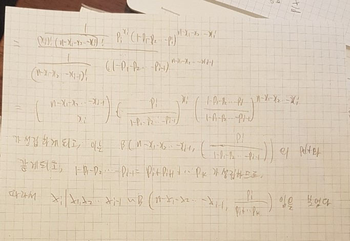
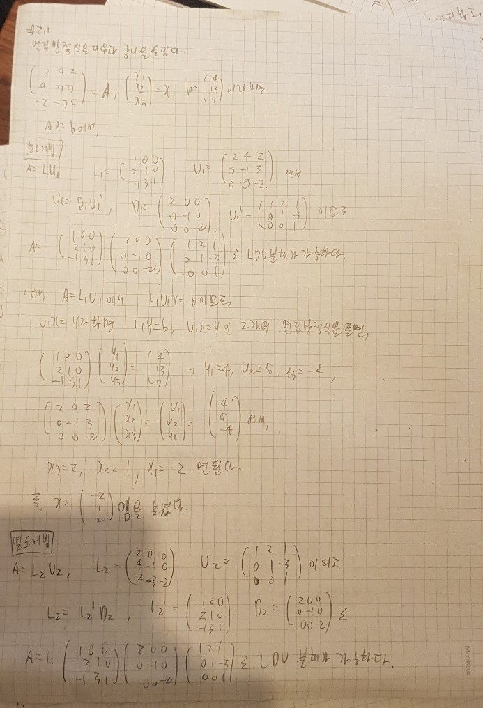
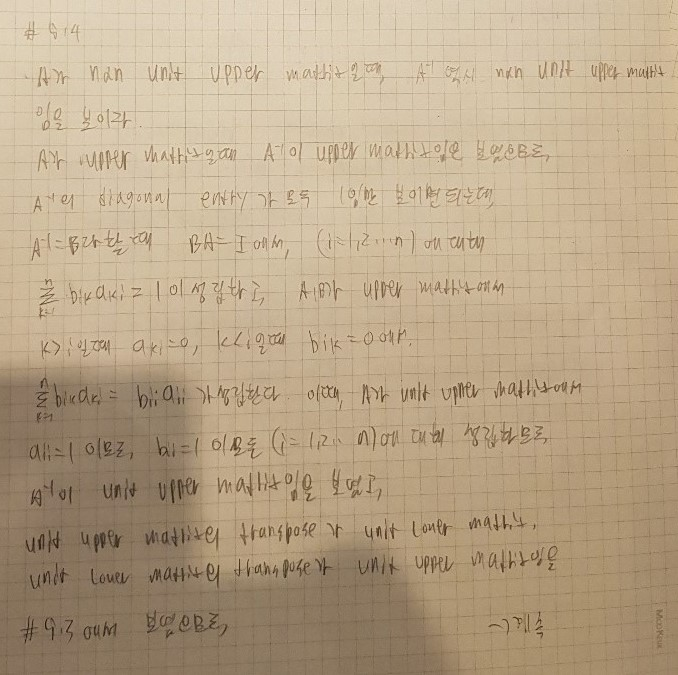

```{r setup, include=FALSE}
knitr::opts_chunk$set(echo = TRUE)
# Dig into the internal representation of R objects
library(tidyverse) # install.packages('tidyverse')
library(lobstr)  # if not installed, use install.packages('lobstr')
# For unsigned integers
library(uint8) # devtools::install_github('coolbutuseless/uint8')
# For bitstrings
library(pryr)
# For big integers
library(gmp)
# For single precision floating point numbers
library(float)
library(Rcpp)
```


## Q1. Textbook Problems

### 1.4


### 1.6




### 1.8


### 2.1




### 2.2


## Q2. Floating point

### 1. R uses the IEEE 754 double precision in most of the platforms. 

#### 1-(a) What is the number of significant digits (in base 2) for R `double`? 

R에서의 double형은 IEEE 754의 double precision 형을 사용하고,

이는 64비트를 floating point를 나타내는데에 사용한다.

64비트중, 1비트는 부호를 나타내는데에, 11비트는 지수부를 나타내는데에,
그리고 52비트를 가수부로 사용하기 때문에 base 2에서

52자리의 유효숫자를 가진다고 생각할 수 있지만, 기본적으로 유효숫자를 나타낼때 1은 이미 앞에 붙어있는것으로 간주하도록 구현하였기 때문에,

1개의 유효숫자 이득을 보게되고, 따라서 53개의 유효숫자를 가지게 된다.


    
#### 1-(b) Denote your answer to part (a) by $p$. What is the next representative number larger than 1?

R에서 표현할 수 있는, 1보다 큰 가장 작은 숫자를 생각해보면, R에서 1이 어떻게 표현되는지 알아야한다.

R에서 숫자는 double 형으로 저장되기 때문에 앞에서 말한 double precision 구조를 따르므로,

부호로는 +기때문에 0, 지수부는 2의 0승이 곱해진 것이기 때문에 01111111111 로 표현되고,

가수부는 모두 0의 값을 가진다. 실제로 pryr로 확인해보면 알 수 있다.

```{r}
pryr::bits(1.0)
```

1.0보다 큰 가장 작은 숫자는, 가수부의 LSB가 1로 바뀐 숫자일것이기 때문에,

즉, $1.0 + 2^{-52}$가 가장 작은 숫자일 것이다.

앞에서 유효숫자를 $p = 53$으로 나타내었기 때문에, 따라서 이를 p로 나타내면

$1.0 + 2^{-p + 1}$이 1보다 큰 가장 작은 숫자가 된다.

실제로 이를 알아보면

```{r}
pryr::bits(1.0 + 2^{-52})
```

로, 비트 배열에서 가장 아래의 가수부분만 1로 바뀌었음을 확인할 수 있다.


#### 1-(c) We want to find the smallest number that added to 1 will give a result different from 1 (i.e., $\epsilon_{\max})$. Try adding $\frac{1}{2^p}$ to 1. Provide your R code and the result. Set the number of decimal digits to be displayed to 20 using .

1에 더했을때 결과가 달라지는 가장 작은 숫자를 찾고싶다. 
즉, 1에 더했을때 1보다 커지는 가장 작은 숫자를 찾으면 된다.

$p = 53$이므로, 먼저, 1에 $\frac{1}{2}^{53}$을 더해보자.

다행히 $\frac{1}{2}^{53}$은 R의 double precision으로 표현이 됨을 알수있다.

```{r}
pryr::bits(2^(-53))
```


이를 1에다 더하면 어떻게 될까?


```{r}
x = 1.0 + 2^(-53)
```

더한 x의 값을 소수점 아래 20자리까지 출력해보자.

```{r}
options(digits=20)
print(x)
```

놀랍게도 그냥 1로 출력됨을 알 수 있다.

실제로 x의 값이 어떻게 나타나는지 살펴보면

```{r}
pryr::bits(x)
```

1과 똑같이 나타남을 알 수 있다.


이는 1 다음숫자인 $1+2^{-52}$가 되려면, 1에 $2^{-53}$을 더한 결과를 반올림하여 나타내려 할때, $1 + 2^{-52}$가 되기에는 값이 너무 작기 때문이다.


#### 1-(d) Find $\epsilon_{\max}$ and verify $1+\epsilon_{\max}$ does give a value different from 1. Provide your R code and the result.

위의 문제점을 고쳐보자.

하지만 만약 $2^{-53}$의 가수부의 LSB가 1이된다면, 즉, $2^{-53}$보다 아주 조금 큰 값을 1에 더해준다면, 반올림되어 1보다 큰값이 출력될것이라는것을 기대할 수 있을것이다.


$2^{-53}$의 LSB를 1로 만들면, 다음과 같은 값이 된다. $2^{-53} + 2^{-105}$

```{r}
pryr::bits(2^(-53) + 2^(-105))
```

$2^{-53}$에서 가수부의 LSB만 1로 바뀌었음을 쉽게 확인할 수 있다.


이 값을 더하면, 1에서 값이 바뀔것이라고 기대할 수 있고, 실제로 바뀌는것을 확인하기 위해 코드를 써보자.

```{r}
y = 2^(-53) + 2^(-105)
x = 1 + y

print(x)

pryr::bits(x)
```


실제로 1.0의 가수부의 LSB가 1이 된 값으로 변함을 확인할 수 있다.

즉, $\epsilon_{max} = 2^{-p} + 2^{-2p + 1}$임을 알 수 있다.


#### 1-(e) Repeat all of the above for IEEE 754 single precision floating point numbers. (Hint. Use the package float.)

float은 single precison을 가지는 부동소수점 데이터형으로,

총 32비트중 부호부분 1비트, 지수부분 8비트, 가수부 23비트로 이루어져있다.

double presicion과 마찬가지로, 유효숫자를 나타내는데에 1이 이미 앞에 붙어있다고 생각하기 때문에, 가수부 비트수 + 1이 base2에서 유효숫자의 개수가된다.

즉, float에서 $p = 24$가 된다.

single precision에서 표현할 수 있는, 1보다 큰 가장 작은 수를 생각해보면,

1.0의 bit representation이 다음과 같으므로

`00111111 10000000 00000000 00000000`


이보다 큰 가장 작은수는, 

`00111111 10000000 00000000 00000001`로, 즉 $1.0 + 2^{-23}$이 될것이다.

p에대해 나타내면 $1.0 + 2^{-p + 1}$로, 앞과 똑같은 결과이다.


이제, 1.0에다 $2^{-p}$를 더해보자.

```{r}
one = as.float(1)
small = as.float(2^(-24))
x = one + small
print(x)

print(as.numeric(x))
pryr::bits(as.numeric(x))
```

역시, 반올림이 이루어지지 않아 결과 그대로 1이 나옴을 확인할 수 있다.

double형으로 형변환 해보고 bit를 살펴봐도, 정확히 1.0이 나온다.


반올림이 이루어지게 하기 위해서는, $2^{-24}$보다 큰 수를 더해야한다.

$2^{-24}$의 bit representation은 다음과 같으므로,

`00110011 10000000 00000000 00000000`

이보다 큰 가장 작은 수는 다음과 같은 bit representation을 가진다.

`00110011 10000000 00000000 00000001`


이는 $2^{-24} + 2^{-47} = 2^{-p} + 2^{-2p + 1}$이 된다.

즉, $\epsilon_{max} = 2^{-p} + 2^{-2p + 1}$가 되고, 

실제로 이값을 더했을때 값이 바뀌는것을 확인하기 위해 r code를 작성하면


```{r}
one = as.float(1)
small = as.float(2^(-24) + 2^(-47))
x = one + small
print(x)

print(as.numeric(x))
pryr::bits(as.numeric(x))
```

값에 차이가 생기는것을 확인할 수 있다.


### 2. In R, let `a <- 0.7`, `b <- 0.2`, and `c <- 0.1`. Make sure setting `options(digits=20)`.

```{r}
options(digits=20)
a <- 0.7
b <- 0.2
c <- 0.1
```

#### 2-(a) Test whether `(a + b) + c` equals 1. 

```{r}
x <- (a + b) + c
print(x)

print(x == 1)
```

1과 다름을 알 수 있다.

#### 2-(b) Test whether `a + (b + c)` equals 1. 

```{r}
x <- a + (b + c)
print(x)

print(x == 1)
```

1과 같음을 알 수 있다.

#### 2-(c) Test whether `(a + c) + b.` equals 1.

```{r}
x <- (a + c) + b
print(x)

print(x == 1)
```


1과 같음을 알 수 있다.


#### 2-(d) Explain what you found.(*Hint* find the internal representation of these numbers).

수학적으로는 위 값들의 합이 모두 같아야하지만, R에서는 더하는 순서에 따라 미세하게 값의 차이가 생김을 확인할 수 있다.

이는 R 내부적으로 숫자를 표현할때 double precision 부동소수점 자료형인 double형을 사용하기 때문이다.

double형은 숫자를 정확하게 나타내는것이 아니라, 그 숫자의 근삿값을 나타내며, 그 값의 유효숫자 개수에 따라 double형이 값을 저장했을때 정확하게 저장할 수 있는가, 없는가가 결정된다.


특히, 위의 0.7, 0.2, 0.1은 유한개의 2의 거듭제곱의 합으로 나타낼 수 없는 수들이므로, 컴퓨터에 저장될때 근삿값으로 저장되게 된다.


이는 bit representation을 확인해보면 더욱 명확해진다.

```{r}
pryr::bits(a)
pryr::bits(b)
pryr::bits(c)

print(a)
print(b)
print(c)
```

보다시피, 정확히 0.7, 0.2, 0.1이 저장되지 않았음을 확인할 수 없다.


따라서 계산 순서에 따라 근삿값 계산이 달라지게 되므로, 순서에 따라 값이 변하는 경우가 발생한다.


그러므로 이러한 값들을 더할때는, 최대한 근삿값 계산에서 손해를 보지 않도록, 크기가 작은 값들을 먼저 더하고, 그 결과에 크기가 큰값들을 더해야 할 것이다.

```{r}
x <- (b + c) + a
print(x)
```


## Q3. Numerical precision

Consider the evaluation of $e^x$ using the Taylor series
$$
    e^x = 1 + x + \frac{x^2}{2!} + \frac{x^3}{3!} + \dotsb
$$
in R. Write function `expTaylor()` that takes a double-precision floating point number `x` and executes the following.
```R
	stop <- 100
	ex <- 1
	xi <- 1
	ifac <- 1
	for (i in 1:stop) {
		xi <- xi * x
		ifac <- ifac * i
		ex <- ex + xi / ifac
	}
	ex
```

Now let `x <- 20.0`. A correct implementation of `expTaylor()` should yield `485165195.40979015827` (with `options(digits=20)`, which is close enough to `485165195.40979027748` that the built-in fuction `exp()` yields.


```{r}
expTaylor <- function(x){
    stop <- 100
	ex <- 1
	xi <- 1
	ifac <- 1
	for (i in 1:stop) {
		xi <- xi * x
		ifac <- ifac * i
		ex <- ex + xi / ifac
	}
	ex
}

options(digits = 20)

expTaylor(20.0)
```


### 1. Compare the values of `expTaylor(-20.0)` and `1 / expTaylor(20.0)`. Calculate the relative error of the two values, assuming that `exp(-20.0)` is the true value. Explain what you found.


```{r}
print(expTaylor(-20.0))

print(1/expTaylor(20.0))

print(exp(-20))
```

두 값이 다름을 확인할 수 있다.

이 두값의 relative error을 구하기 위해, $x = `exp(-20.0)`$을 true value라 하면,

$\frac{| [x] - x |}{|x|}$가 relative error이므로,

```{r}
relative_error <- function(assume_val,true_val){
    abs(assume_val - true_val) / abs(true_val)
}


true_val = exp(-20.0)

custom_relative_error_first = relative_error(expTaylor(-20.0), true_val)
custom_relative_error_second = relative_error(1/expTaylor(20.0), true_val)
    
print(custom_relative_error_first)
print(custom_relative_error_second)
```

`expTalyor(-20.0)`으로 구한 값은 상대오차가 1.97로 굉장히 높게 나왔고,

`1/expTalyor(20.0)`으로 구한 값은 상대오차가 $2 * 10^{-16}$정도로 매우 낮게 나와, 정확한값에 매우 근접함을 알 수 있다.

x = -20.0을 통해 값을 계산했을때, 오차가 크게 생기는 원인에 대해 생각해보면

위 함수를 이용하여 값을 계산할때, 루프에서 ex에 xi/frac에 해당하는 값을 계속해서 더해나가는 과정을 거치는데, 만약 x = -20.0일경우, $\frac{x^n}{n!}$의 값을 더해나가는 과정에서 번갈아가며 음수, 양수를 더하게 된다.

이때, $x_n = \frac{-20^n}{n!}$이라 하면, $0 \le n \le 100$의 범위에서
$x_n$과 $x_{n+1}$의 크기차이가 별로 나지 않고, $x_{n+1}$과 $\sum_{i=0}^{n} x_n$의 크기 차이도 그렇게 크지 않으므로,

즉, 상대적으로 크기가 비슷한 수들끼리의 뺄셈을 진행하게 되는일이 빈번하게 발생하게 된다.

때문에 catastrophic cancellation이 일어나 유효숫자를 잃어버릴 위험성이 커지게 되고, 따라서 위와같이 극단적으로 근삿값 계산의 값이 달라져버리는 일이 발생하는 것이다.


### 2. We can think of the algorithm given in the R code above as an iterative algorithm in `i`. At each value of `i`, there is a difference in the value of ex and the true value `ex`. (The exact value of this difference is the truncation error.) Modify the code (or use different code) to determine the relative error in `ex` for each value of `i`. For `x = 20.0`, make a plot of the relative error and the number of iterations (that is, of `i`) for 1 to 100 iterations. Now, repeat this for `x = −20.0`. Explain what you found.

true value가 무엇인지 알수 없으므로,  true value를 exp()함수를 이용해서 나온 값이라 생각하자.

즉, r 내부 함수로 구해진 값이다.

이제 i값에 따라, true value의 relative error를 알기 위해서,
다음과 같이 각 i값에 따라 ex의 값을 리턴하도록 함수를 변경할것이다.

```{r}
cum_expTaylor <- function(x){
    stop <- 100
	ex <- 1
	xi <- 1
	ifac <- 1
	res <- 1
	for (i in 1:stop) {
		xi <- xi * x
		ifac <- ifac * i
		ex <- ex + xi / ifac
		res <- c(res, ex)
	}
	res
}

```
위 함수는 i=0 to 100까지의 ex값을 리턴해준다.


그 후, 이 결과를 이용해 i값에 따라 relative error vector를 만들어주는 함수와, 이를 plot해주는 함수를 만들었다.

```{r}
get_relative_err_vec <- function(x) {
    cum_vec <- cum_expTaylor(x)
    true_val <- exp(x)
    relative_vec <- vector()
    
    for(i in 1:101)
    {
        relative_vec <- c(relative_vec,relative_error(cum_vec[i], true_val))
    }
    relative_vec
}

plot_relative_error <- function(x) {
    relative_vec <- get_relative_err_vec(x)
    relative_tb <- tibble(i = 0:100, relative_err = relative_vec)
    ggplot(relative_tb, aes(x = i, y = relative_err)) + geom_point() + labs(title = sprintf("relative error for i = 0 to 100, at x = %d",x))
}
    
```


이제, x=20일때와 x=-20일때 그래프를 출력해보면 다음과 같다.


```{r}
plot_relative_error(20)
```


먼저, x=20일때 그래프를 그려보면, 위와 같이 i = 0일때 상대적으로 에러가 크다가, i가 증가할수록 에러가 감소하는것을 볼 수 있다.

즉, 점점 참값에 접근해 갈수록 상대 오차가 감소하는것을 볼 수 있고, 따라서 정상적으로 근삿값 계산이 진행되고 있음을 알 수 있다.


```{r}
plot_relative_error(-20)
```

x=-20일때의 그래프는 x=20일때의 결과와는 사뭇 다른데, i = 10~30정도에서 매우 큰양의 상대오차가 발생하는것을 알 수 있다.

무려 $10^{16}$정도의 상대오차가 발생하는데, 이정도의 상대오차라면 근삿값이라고 말하기도 어려운정도의, 문제가 매우 많은 값이 계산되고 있음을 알 수 있다.

즉, catastrophic cancellation의 영향이 매우 크게 나타남을 알 수 있다.

이를 직접 확인해보기위해, 중간에 계산되는 값 자체가 어떻게 되는지 살펴보면,

```{r}
cum_expTaylor(-20)
```

i = 10~30부근에서, 계산된 값의 부호가 계속해서 바뀜을 알 수 있다.

즉, 서로 비슷한 단위의 값에 대해 뺄셈이 계속해서 일어나고 있는것으로,

이렇게 되면 catastrophic cancellation의 영향이 매우 커질것으로 예측할 수 있다.


### 3. Determine the order of the error for approximating `ex` with the Taylor series for `x = 20` in terms of the number of iterations (that is, the number of terms in the Taylor series).

number of iteration을 n이라고 하자.


테일러 정리에 의해, $f(x)$가 n+1번 미분가능할때, f(x)를 다음과 같이 나타낼 수 있다.

$$f(x) = \sum_{i=0}^{n} \frac{f^{(i)}(0)}{i!}x^{i} + \frac{f^{(n)}(c)}{(n+1)!}x^{n+1}, \quad c \in (0,x)$$

$e^x$는 무한번 미분가능하고, 미분 결과는 $e^x$로 자기 자신이기 때문에, 
n계도함수에서 $x=0$에서의 미분계수의 값이 $1$이므로,

$$
    e^x = \sum_{i=0}^{n} \frac{x^{i}}{i!} + \frac{e^{c}}{(n+1)!}x^{n+1}, \quad c \in (0,x)
$$
위와 같이 나타낼 수 있다.


여기서, 위 `expTaylor`함수에서 loop를 n번 돌아 ex의 값을 구하는것은 위 식의 $\sum_{i=0}^{n}\frac{x^{i}}{i!}$의 값을 구하는것에 해당되므로,

따라서 x = 20일때, iteration을 n번했을때의 error는 다음과 같다.

$$e^{20} - [e^{20}] = \frac{e^{c}}{(n+1)!}20^{n+1} \quad c \in (0,20)$$

따라서, $e^c$를 상수로 보면, 결국 $\frac{20^{n+1}}{(n+1)!}$ order의 error를 가짐을 알 수 있다.


		
## Q4. Rcpp

### 1. In class, we used the following function
	```r
	Rcpp::cppFunction('int float32bin(double x) {
    	float flx = (float) x; 
    	unsigned int binx = *((unsigned int*)&flx); 
    	return binx; 
	}')
	```
to inspect single-precision floating point numbers. 
Figure out and explain what the included C++ code does.


위 명령문은 C++로 구현된 함수, float32bin을 R의 global invironment에 추가해주는 역할을 한다.

위 코드가 하는 역할은, 다음과 같다.

먼저, double형 x를 받는다. C++에서 double형은 8바이트 double-precision floating point로, R의 double형과 동일하다.

그 후, x를 float형으로 변환하여 float 형 flx 변수에 집어넣는다.

float형은 4바이트 single-precision floating point로, double형을 float로 바꿀때는 유효숫자의 손실이 발생할 수 있다.

그 후, &flx를 통해 flx가 저장된 메모리의 주소를 따오고, (&는 포인터 reference 연산)
이렇게 받아온 주소를 (unsigned int *)으로 형변환을 하여, 코드에서 unsigned int가 저장된 주소라고 생각하게 만든다.

그후, `*((unsigned int*)&flx)`문을 통해, 이곳에 저장된 값을 unsigned int로 해석하여 그대로 가져오게 된다. (*은 포인터 dereference 연산)

여기서, unsigned int는 4바이트 정수형으로, 이렇게 float형을 unsigned int로 해석하여 가지고오게 되면 flx에 저장된 비트배열을 그대로 가지고 와 binx라는 변수에 저장하게 된다.

그 후, binx 값을 리턴하게 되는데, 여기서 함수의 return형이 int라, binx에 저장된 비트배열을 그대로 리턴하되, 이 값의 해석은 int형이라 이는 32bit signed integer로 해석되게 된다.

즉, 정리하면 x의 값에 해당하는 single-precision floating point로 저장된 값의 비트배열을 토대로, 이 값에 해당하는 32bit signed integer를 리턴하는 함수인것이다.

실제로, 1.0의 single precision 표현은 다음과 같음을 알고 있으므로,

`00111111 10000000 00000000 00000000`

return되는 값은 $2^{23} + 2^{24} + 2^{25} + 2^{26} + 2^{27} +2^{28} + 2^{29} = 1065353216$의 값이 리턴될것이다.


```{r, eval = FALSE}
float32bin(1.0)
[1] 1065353216
```

마찬가지로, -1.0의  single precision 표현은 다음과 같음을 알고 있으므로,

`10111111 10000000 00000000 00000000`

return되는 값은 위의 비트형태의 2의 보수를 생각하면, `0100000 10000000 00000000 00000000`

즉, $2^{30} + 2^{23} = 1082130432$ 이므로, $-1082130432$의 값이 리턴될것이다.

```{r, eval = FALSE}
float32bin(-1.0)
[1] -1082130432
```

예상과 정확히 일치함을 확인할 수 있다.


## Q5. Triangular systems

Show the following facts about triangular matrices. A unit triangular matrix is a triangular matrix with all diagonal entries being 1.

문제에도 써놨지만, 표기의 편의를 위해 upper triangle matrix를 upper matrix로,
lower triangle matrix를 lower matrix로 표기했습니다.

### 1. The product of two upper (lower) triangular matrices is upper (lower) triangular.


### 2. The inverse of an upper (lower) triangular matrix is upper (lower) triangular.


### 3. The product of two unit upper (lower) triangular matrices is unit upper (lower) triangular.


### 4. The inverse of a unit upper (lower) triangular matrix is unit upper (lower) triangular.




### 5. An orthogonal upper (lower) triangular matrix is diagonal.


## Q6. LU decomposition

### 1. Let $A\in\mathbb{R}^{n\times n}$ be nonsingular. Show that $A$ has an LU decomposition if and only if for each $k$ with $1\le k \le n$, the upper left $k\times k$ block `A[1:k,1:k]` is nonsingular. Prove that this LU decomopsition is unique.


### 2. Write an R function `LUdecomp` with interface 
    ```r
    LUdecomp(obj, tol=1e-8)
    ```
The decomposition **must** be done *in place*. That is, if $A=LU  \in \mathbb{R}^{n\times n}$, the $U$ should overwrite the upper triangular part of the input matrix `A`, and the strictly lower triangular part of `A` should be overwritten by the same part of the $L$ matrix computed. (Where does the diagonal part of $L$ go?) Since R does not allow in-place modification of atomic objects, you are recommended to use a [Reference Class](http://adv-r.had.co.nz/R5.html) (RC) object. 
The RC for this homework can be declared by
	```r
	setRefClass("LUclass",
    	fields = list(
        	mat = "matrix",
        	vec = "vector"
    	)
	)
	```
A RC object can be created, for instance, by
	```r
	A <- matrix(c(1.0, 0.667, 0.5, 0.333), nrow=2)
	b <- c(1.5, 1.0)
	obj <- new("LUclass", mat=A, vec=b)
	```
Matrix `A` stored in `obj` can be referenced by `obj$mat`, and vector `b` can be by `obj$vec`
(field `vec` is reserved for the next question).
\
\
You must also implement partial pivoting: function `LUdecomp` must return a `list` that consists of two elements:
the first element of the list is the array of the permutation indexes of the rows, 
and the second element is the indicator of success: if `A` is (numerically) singular, the function must return the row index where singularity occurs (where may a singularity occur in the LU decomposition?) as the second return value; otherwise return `0`. Use `tol` to determine the singularity.


```{r}

setRefClass("LUclass",
    	fields = list(
        	mat = "matrix",
        	vec = "vector"
    	)
	)


LUdecomp <- function(obj, tol = 1e-8){
    if(is.matrix(obj$mat))
    {
        dimension <- dim(obj$mat)
        dim_row <- dimension[1]
        dim_col <- dimension[2]
        if(dim_row == dim_col) # do job when matrix is square
        {
            n <- dim_row
            pivot <- seq_len(n)
            
            for (k in seq_len(n-1)) 
            {
                max_row = k
                max_val = abs(obj$mat[k,k])
                for (i in k+seq_len(max(n - k, 0))) #find max number of row for partial pivoting
                {
                    row_val = abs(obj$mat[i,k])
                    if(row_val > max_val)
                    {
                        max_val = row_val
                        max_row = i
                    }
                }
                
                if(abs(max_val) < tol) # singular problem occured. just return error.
                {
                    return(list(pivot,k))
                }
                 # need to implement pivot index
                
                if(max_row != k) # change row order of matrix and pivot, in place.
                {
                    temprow <- obj$mat[k,]
                    obj$mat[k,] <- obj$mat[max_row,]
                    obj$mat[max_row,] <- temprow
                    
                    temp <- pivot[k]
                    pivot[k] <- pivot[max_row]
                    pivot[max_row] <- temp
                }
                
                for (i in k+seq_len(max(n - k, 0))) 
                {
                    obj$mat[i, k] <- obj$mat[i, k] / obj$mat[k, k]
                    for (j in k+seq_len(max(n - k, 0))) 
                    {
                        obj$mat[i, j] <- obj$mat[i, j] - obj$mat[i, k] * obj$mat[k, j]
                    }
                }
            }
            
            if(obj$mat[n,n] < tol) # important!! code for check singularity at last row
            {
                return(list(pivot,n))
            }
            
            return(list(pivot,0))
            
        }
        else
        {
              return(list(NULL,1)) #need to return error value
        }
    }
    
    return(list(NULL,1))
}
    
    
```

위가 decompostion 되는 원리는 다음과 같다.

A를 partial pivoting을 통해 decomposition할때,

다음과 같은 과정을 거치게 된다.

1. A에서 첫째열 원소의 절대값이 가장 큰 행을 찾고, A에서 행의 위치를 바꿔준다.

$P_1A = A^{'}$ ($P_1$은 행의 위치를 바꿔주는, type 1 elementary matrix, $A^{'}$은 A에서 행위치가 바뀐 행렬)

알고리즘상에서는 A'의 값이 저장되어있다.

2. LU decomposition의 과정을 행이 변환된 $A^{'}$에 적용한다. 

$P_1A =L_1A_1$ ($A^{'} = L_1A_1$로 바뀜, A_1은 계속 decompose를 해야하는 행렬.)

여기서 $L_1$, $A_1$은 위 함수에서 저장되게 된다. 즉, $A^{'} = P_1A$가 현재 함수에서 저장되어 있는 값.

3. $A_1$에서 둘째열 원소의 절대값이 가장 큰 행을 찾고, $A_1$에서 행의 위치를 바꿔준다.

$P_2P_1A = P_2L_1A_1 = A_1^{'}$ ($P_2$은 행의 위치를 바꿔주는, type 1 elementary matrix, $A_1^{'}$은 $L_1A_1$에서 행위치가 바뀐 행렬)

현재 함수에는 $A_1^{'}$ 이 저장된다.

4. LU decomposition의 과정을 행이 변환된, $A_1^{'}$에 적용한다.

$P_2P_1A = L_2A_2$ ($A_1^{'} = L_2A_2$로 바뀜, A_2은 계속 decompose를 해야하는 행렬.)

현재 함수에는 $A_1^{'} = P_2P_1A$의 값이 저장되어 있다.

5. 이를 반복해서 $A_n$이 uppermatrix가 될때까지 진행하면,

$P_n...P_1A = L_nU$, $U = A_n$이 되게 된다.

이때, 함수에 저장된 값은 $P_n...P_1A$에 대한 값이 저장되어 있게 되므로,

함수가 리턴하는 L과 U를 곱하면 $A$가 나오지 않고, $P_n...P_1A$의 값이 나오게 된다.

따라서, 이를 다시 원래 A로 돌려줄 수 있도록, 중간에 어떻게 행렬 행의 순서를 바꿨는지를 기록한 pivot vector를 리턴해주는것이다.

pivot vector는 초기에 $(1,2,3,4...n)$의 값이 저장되어 있으며, 행이 바뀌면 pivot vector에 저장된다.

예를들어, 1행과 3행을 바꿔주었다면, pivot vector는 $(3,2,1,4,..n)$이 되는 식이다.

이렇게 변환된 pivot vector를 $(1,2,3...n)$으로 변환시켜주는 type 1 elementary matrix들의 곱을

알고리즘에서 나온 결과인 $LU = P_n...P_1A$에다 곱해주면,

$P_1,P_2$가 elementary matrix일때, $P_1P_2 = P_2P_1$임을 아므로, 

A를 얻어낼 수 있게된다.


예로, 다음과 같은 과정을 해보면,

```{r}
A <- matrix(c(2,-3,-8,-6,-1,1,-1,7,-2), nrow=3)
b <- 1:3

obj <- new("LUclass", mat = A, vec = b)
ret <- LUdecomp(obj)

ret

obj$mat
```

위와 같이 정상적으로 decompose됨을 알 수 있다.


위 알고리즘에서, A가 singular matrix라면, LU decompose를 하는 도중에 pivot이 되는 row의 k번째 값이 0이되고 다른 행들도 k번째 index가 0이되는 경우가 생기게 된다.

즉, 루프를 도는도중 max_val이 0에 가까운 경우가 발생하면 이 matrix가 singular하다는 뜻으로, 이를 처리해주는 과정을 위에 써넣어주었다.


실제로, singular한 matrix를 넣어보면,

```{r}
C <- matrix(c(0,1,0,1,0,0,0,0,0), nrow=3)

obj$mat <- C

ret <- LUdecomp(obj)

ret

obj$mat
```

3번째에서 singularity가 발생했음을 알 수 있다.


### 3. Using the `LUdecomp` function written above, write function `LUsolve0` that solves the linear equation $Ax = b$  with interface
    
    ```r
    LUsolve0(obj) 
    ```
again *in place*. That is, in addition to `A` overwritten by `LUdecomp`, vector `b` should be overwritten by the solution $A^{-1}b$. Then, write a [wrapper function](https://en.wikipedia.org/wiki/Wrapper_function)
	
    ```r
    LUsolve(A, b)
    ```
which does **not** alter neither `A` nor `b` but solves $Ax=b$ by calling `LUdecomp`. 
Compare your results with the R expression `solve(A, b)`.

Write your functions in a separate `.R` file within your branch. 


```{r}

LUsolve0 <- function(obj){
    res <- LUdecomp(obj)
    if(res[[2]] != 0) # matrix is singular, Ax=b doesn't have unique solution.
    {
        return(1)
    }
     
    pivot <- res[[1]]            #when Ax = b, Ludecomp decompse PA to LU.
    obj$vec <- obj$vec[pivot]  #so, for to solve PAx = Pb , convert b to Pb using pivot
    
    dimension <- dim(obj$mat)
    n <- dimension[1]
    
    
    # at LUx = Pb = c, in-place forward substitution to solve y, for Ly = c
    for (i in seq_len(n)) {
      for (j in seq_len(i-1)) {
          obj$vec[i] <- obj$vec[i] - obj$mat[i, j] * obj$vec[j]
      }
      # obj$vec[i] <- obj$vec[i] / obj$mat[i, i] <- we skip this part because L[i,i] = 1
    }
    
    #now obj$vec has y
    
    
    # at Ux = y, in-place backward substitution to solve x, for Ux = y
    for (i in rev(seq_len(n))) {
      for (j in i + seq_len(max(n - i, 0))) {
          obj$vec[i] <- obj$vec[i] - obj$mat[i, j] * obj$vec[j]
      }
      obj$vec[i] <- obj$vec[i] / obj$mat[i, i]
    }
    
    #now obj$vec has x
    
    return(0)
}

LUsolve <- function(A, b)
{
    obj <- new("LUclass", mat = A, vec = b)
    
    if(LUsolve0(obj) == 0)
    {
        return(obj$vec)
    }
    else
    {
        stop('A is singular matrix')
    }
    
}


    
```


$Ax = b$인 방정식을 풀기 위해서는 A를 LU decompostion한 다음,

$Ux = y$로 두고 $Ly = b$, $Ux = y$를 각각 forward substitution, backward substitution방법으로 풀면 된다.

하지만 우리가 위에서 쓴 알고리즘은 partial pivoting을 이용하여 $PA = LU$로 decompose하기 때문에,

$PAx = Pb$인 방정식을 $LUx = c$꼴로 두고, $Ly = c$, $Ux = y$를 풀면 될것이다.


P는 pivot을 통해 구해지므로, 위와같이 함수를 구현하면 된다.


작동을 확인하기 위해, 간단한 예를 몇개 풀어보자.

```{r}
a <- matrix(c(3,1,2,1),nrow=2,ncol=2)
b <- c(8,2)

solve(a,b)

LUsolve(a,b)
```

결과가 같다.

```{r}
a <- matrix(c(1,2,3,2,-1,0,3,1,-1), nrow = 3)
b <- c(9,8,3)

solve(a,b)

LUsolve(a,b)
```

역시 결과가 같음을 알 수 있다.


```{r, eval = FALSE}
a <- matrix(c(1,2,-1,3,6,-3,3,9,3), nrow = 3)
b <- c(1,5,5)

solve(a,b)
>Error in solve.default(a, b) : 
  Lapack routine dgesv: system is exactly singular: U[2,2] = 0

LUsolve(a,b)
>Error in LUsolve(a, b) : A is singular matrix
    
```

singular matrix인 예시이다. (error message 발생으로, knit한 결과에서는 실행되지 않음)