```{r setup, include=FALSE}
knitr::opts_chunk$set(echo = TRUE)
# Dig into the internal representation of R objects
library(Matrix)
library(readr)
```


$$A^{T} = A^{'}$$
표기의 편의성을 위해,위와같이 표기하였습니다!!!


## Q1. Choleksy decomposition 

### 1. Complete the [proof of the Cholesky decomposition](https://github.com/won-j/M1399_000100-2020spring/blob/master/lectures/lecture3/chol.ipynb) by showing that 
    * $\mathbf{A}_{22}$ is positive definite, and
    * $\mathbf{A}_{22} - \mathbf{b} \mathbf{b}^T = \mathbf{A}_{22} - a_{11}^{-1} \mathbf{a} \mathbf{a}^T$ is positive definite of size $(n-1)\times(n-1)$.

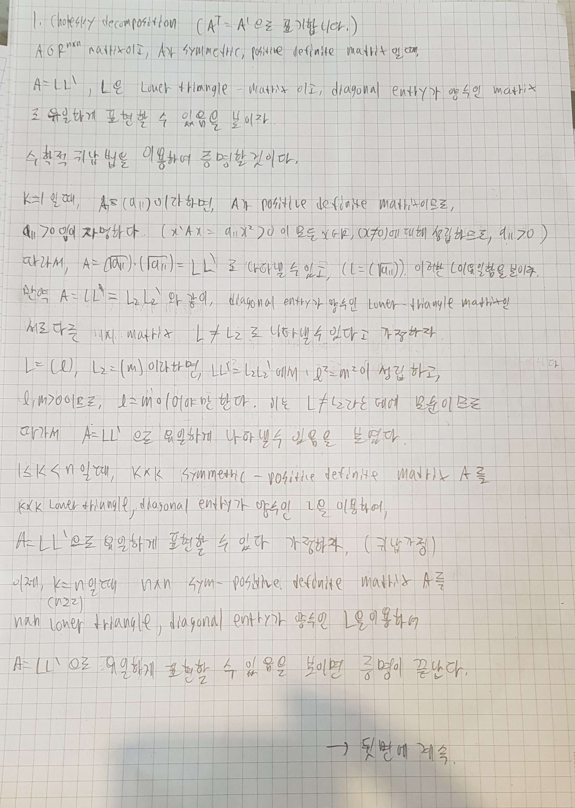
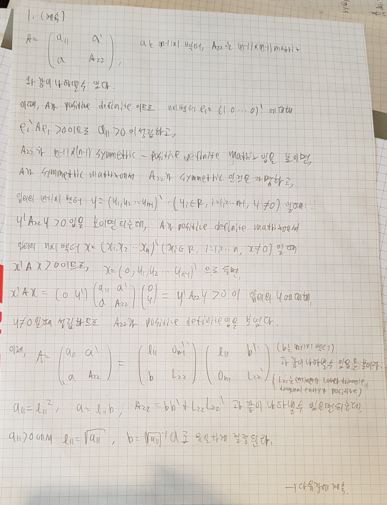
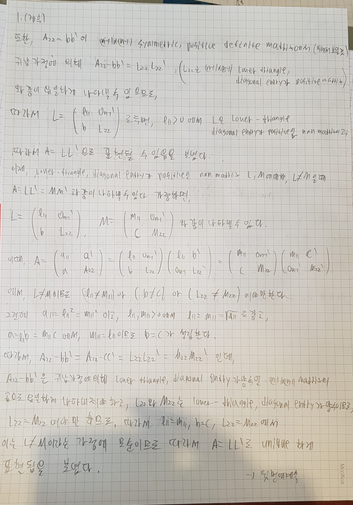
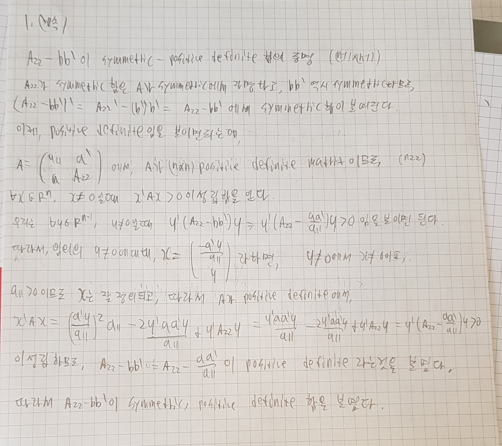

## Q2. QR decomposition

### 2-1. From the [lecture note on QR decompostion](https://github.com/won-j/M1399_000100-2020spring/blob/master/lectures/lecture4/qr.ipynb), explain why classical Gram-Schmidt (`cgs()`) fails with the given matrix `A`.


```{r}
cgs <- function(X) {  # not in-place
    n <- dim(X)[1]
    p <- dim(X)[2]    
    Q <- Matrix(0, nrow=n, ncol=p, sparse=FALSE)
    R <- Matrix(0, nrow=p, ncol=p, sparse=FALSE)
    for (j in seq_len(p)) {
        Q[, j] <- X[, j]
        for (i in seq_len(j-1)) {
            R[i, j] = sum(Q[, i] * X[, j])  # dot product
            Q[, j] <- Q[, j] - R[i, j] * Q[, i]
        }
        R[j, j] <- Matrix::norm(Q[, j, drop=FALSE], "F")
        Q[, j] <- Q[, j] / R[j, j]
    }
    list(Q=Q, R=R)
}
```

classical Gram-Schmidt를 수행하는 함수는 위와 같이 구현되어있다.

이 함수가 돌아가는 과정을 세세히 살펴보면,

Q의 $1\sim i-1$번째 column이 계산되어있을때, (이는 Q matrix의 $1 \sim i-1$ column에 저장됨) Q의 i번째 column을 다음과 같은 과정을 통해 계산하게 된다.

1. $v_k$를 구하고, 그 과정에서 R matrix의 upper 원소들인 $r_{ik}$를 구한다. $(i < k)$
2. $v_k$를 $||v_k||_2$로 나눠서 $q_k$를 구한다. 이 과정에서 R matrix의 diagonal 원소인 $r_{kk}$를 구한다.

이를 더 자세히 살펴보면, 다음과 같다.

1번 과정에서, $v_k$를 
$v_k = x_k - \sum_{j=1}^{k-1}<q_j,x_k> q_j$ 와 같은 과정으로 구하는데,

바로 이 부분에서 문제가 생기게 된다.

```{r}
e <- .Machine$double.eps
(A <- t(Matrix(c(1, 1, 1, e, 0, 0, 0, e, 0, 0, 0, e), nrow=3)))
A
```


주어진 matrix A는, 위와 같이 생겼는데, A의 각 column을 자세히 살펴보면,
각 column의 크기가 1과 매우 근접함을 알 수 있다.

실제로 A의 각 column의 크기를 계산해보자.

```{r}
Matrix::norm(A[, 1, drop=FALSE], "F")
1 == Matrix::norm(A[, 1, drop=FALSE], "F")
```

위와같이, norm을 구했을때 1과 `==`을 이용하여 비교하였을때 True라는 결과가 나오게 된다.

이는 실제 크기가 1이 아닐지라도, 컴퓨터에서 각 column의 크기가 1로 계산된다는 뜻과 같다. 즉, 위의 `e`의 크기가 너무 작아 크기에 영향을 미치지를 못하게 된다. 

결론적으로, 이 때문에 계산에서 orthogonality가 손실되는 문제가 생기게 된다.

A의 각 column을 각각 $x_1, x_2, x_3$이라 하자.


이렇게되면, $q_1 = \frac{x_1}{||x_1||_2}$ 에서, $||x_1||_2 \approx 1$에서,

$q_1 \approx x_1$이 성립하게 된다. 즉, 컴퓨터에서는 $q_1 = x_1$이 성립하게 되는것이다. 

이제, $q_2$를 구하기 위해 $v_2$를 구하는 과정에서, $v_2 = x_2 - <q_1,x_2> q_1$을 계산하는데, $q_1 = x_1$ 이므로 

$<q_1,x_2> \approx <x_1, x_2> = 1$에서 $v_2 = x_2 - x_1$이 된다. 즉, $v_2$위치에는 $x_2 - x_1$ 이 저장되게 되고, $r_{12}$는 1이 저장된다.

이제, $q_2 = \frac{v_2}{||v_2||_2}$를 구하기 위해, $r_{22} = ||v_2||_2$를 구해보면,

```{r}
r_22 = Matrix::norm(A[, 2, drop=FALSE] - A[, 1, drop=FALSE], "F")
r_22
q_2 = (A[, 2, drop=FALSE] - A[, 1, drop=FALSE]) / r_22
q_2
```

위와 같이 너무나 작은값이 나오게 되고, 따라서 $q_2$에 저장되는 값은 위와 같이 각 column의 e의 값이 극대화 된 0.7정도의 값이 저장되게 된다.

여기서, 주목해야할점은 $q_2$의 첫번째 원소는 알맞은 계산을 통해 진행되었다면 0이어서는 안되는데, 0이 나왔음을 알 수 있다.

즉, 여기서 orthogonality가 손실될 조짐이 보이는 것이다.

따라서, $q_2$와 $x_3$가 수직이 되게 되고, 이를 통해 $<q_2, x_3> = 0$이 되어, $x_3$에서 $q_2$에 해당하는 성분을 제거할수 없게 되어 결과로 구해진 $v_3$, 즉 $q_3$는 $q_2$와의 orthogonality를 잃어버리게 된다.


실제로 $q_3$를 구하면,
$v_3 = x_3 - <q_1,x_3> q_1 - <q_2,x_3> q_2$에서 $q_1 = x_1$이므로, 
$v_3 = x_3 - x_1$가 되고,


```{r}
v_3 = A[, 3, drop=FALSE] - A[, 1, drop=FALSE] - q_2 * sum(A[, 3] * q_2)
r_33 = Matrix::norm(v_3, "F")
q_3 = v_3 / r_33
q_3
```

위과 같은 결과가 나오게 된다. 여기서 확인할 수 있듯, $q_2$와 $q_3$가 orthogonal 하지 않음을 알 수 있다.

실제 위 함수를 돌린 결과와 비교해보면,

```{r}
res <- cgs(A)
res$Q
```
결과가 같음을 알 수 있다.


결론적으로, 각 column이 거의 colinear하기 때문에, 이러한 문제가 생기게 된다.


### 2-2. From the same lecture note, explain why the modified Gram-Schmidt (`mgs()`) fails with the given matrix `B`. Will the classical Gram-Schmidt succeed?

mgs함수는 다음과 같다.

```{r}
mgs <- function(X) { # not in-place
    n <- dim(X)[1]
    p <- dim(X)[2]
    R <- Matrix(0, nrow=p, ncol=p)
    for (j in seq_len(p)) {
        for (i in seq_len(j-1)) {
            R[i, j] <- sum(X[, i] * X[, j])  # dot product
            X[, j] <- X[, j] - R[i, j] * X[, i]
        }
        R[j, j] <- Matrix::norm(X[, j, drop=FALSE], "F")
        X[, j] <- X[, j] / R[j, j]
    }
    list(Q=X, R=R)
}
```


classical gram_schmidt 방법은 $v_3$를 구할때, $x_3$에서 $<q_1,x_3>q_1$ ($x_3$의 $q_1$에 대한 projection), $<q_2,x_3>q_2$를 ($x_3$의 $q_2$에 대한 projection) 빼서 구한다.

즉, $x_3$에서 $q_1$과 $q_2$에 관련된 성분을 제거하는것과 같다.

A의 경우, 이렇게 구할때 실제로는 수직하지 않은 $q_2$와 $x_3$가 수직했기 때문에, $q_3$를 구할때 문제가 생겼지만,

modified gram_schmidt 방법을 이용하면 $v_3$를 구할때, $x_3$에서 $<q_1,x_3>q_1$을 빼는것까지는 같지만,
$x_3$에서 $q_1$성분을 제거한 이것을 $x_{3|1}$ 이라 하면, 여기에서 $<q_2,x_{3|1}>q_2$를 빼서 $v_3$를 구하게 된다.

즉, $q_1$성분이 제거된 $x_{3|1}$에서 $q_2$로 projection 한 성분을 빼서 $q_2$성분을 제거하게 되고, 

위의 A의 경우 $x_{3|1}$과 $q_2$가 수직하지 않기때문에, ($x_{3|1} = x_3 - x_1$로 계산되고, $q_2 = k * (x_2 - x_1)$로 계산됨.)

두 값을 내적할때 2번째 row의 성분이 살아있게 되어 $<q_2,x_{3|1}>$가 0이 아니게 된다. 즉, 수직하지 않게된다.

따라서 값이 제대로 계산될 수 있게된다.


```{r}
mres <- mgs(A)
mres$Q
with(mres, t(Q) %*% Q)
```

위와 같이, Q의 orthogonality가 지켜지는것을 볼 수 있다.


```{r}
(B <- t(Matrix(c(0.7, 1/sqrt(2), 0.7 + e, 1/sqrt(2)), nrow=2)))
B
mres2 <- mgs(B)
mres2$Q
with(mres2, t(Q) %*% Q)
```

하지만, 위와같이 B를 계산할때 다시 문제가 생기게 된다.

B의 특징을 살펴보면, 첫번째 column과 2번째 column이 거의 colinear함을 볼 수 있는데, 따라서 계산과정에서 다음과 같은 문제가 생기게 된다.

B의 각 column을 $y_1, y_2$라 하자.

```{r}
options(digits=20)
q_1 <- B[, 1, drop = FALSE] / Matrix::norm(B[, 1, drop=FALSE], "F")
y_2 <- B[, 2, drop = FALSE]
q_1
y_2
sum(q_1 * y_2)
sum(q_1 * y_2) == 1
```

$q_1$과 $y_2$가 거의 비슷함을 알 수 있다.

또한, 여기서 $q_1$과 $y_2$를 내적한 값이 1은 아니지만 (`==`를 통해 비교 가능), 1에 매우 가까움을 알 수 있다.

따라서 여기서 $v_2$를 구할때,$v_2 = y_2 - <q_1, y_2>q_1 \approx y_2 - q_1$ 와 같이 되는데,

$y_2$와 $q_1$의 값이 거의 비슷하므로, catastrophic cancellation이 일어나 유효숫자를 잃어버릴 가능성이 매우 높아진다.

때문에 이곳에서 문제가 생길 확률이 매우 높음을 추측할 수 있다.

실제로 값을 구해보면,

```{r}
v_2 <- y_2 - sum(q_1*y_2)*q_1
v_2
v_2[2] == 0
```

`==`을 통해 0과 같은지 비교해보면, 본래는 0이 아니어야 하는 $v_2$의 두번째 성분이 0이 되어버렸음을 알 수 있다.

즉, catastrophic cancellation때문에 모든 유효숫자를 잃어버리고 0으로 변해버렸다.

이 때문에 $q_2$를 구할때도 문제가 생긴다.


```{r}
q_2 <- v_2 / Matrix::norm(v_2, "F")
q_2
q_1
```

$q_2$와 $q_1$이 orthogonal하지 않음을 바로 확인할 수 있다.

즉, B의 각 column이 거의 colinear하기 때문에 mgs를 통해 값을 구할때 catastrophic cancellation이 일어났고, ($y_2 - <q_1, y_2>q_1$부분)
이때문에 orthogonality가 깨지는 문제가 생겼다.


### 2-3. Implement the Householder QR decomposition in R. 

The algorithm should be **in-place**: let the $\mathbf{R}$ matrix occupy the upper triangular part of the input $\mathbf{X}\in\mathbf{R}^{n\times p}$. Below the diagonal place the vectors $\mathbf{u}_k$ that define the Householder transformation matrix $\mathbf{H}_k=\mathbf{I}-2\mathbf{u}_k\mathbf{u}_k^T/\mathbf{u}_k^T\mathbf{u}_k$. By setting the first element of $\mathbf{u}_k$ to 1, you can fit in these vectors in $\mathbf{X}$. The algorithm should return an additional vector storing the values of $\mathbf{u}_k^T\mathbf{u}_k$. This is how the LAPACK routine `geqrf` is designed. Note that $\mathbf{Q}$ can be recovered from $\mathbf{u}_1, \mathbf{u}_2, \ldots, \mathbf{u}_p$. The function interface should be

```{r, eval = FALSE}
householder <- function(qrobj)
```

taking a [Reference Class](http://adv-r.had.co.nz/R5.html) (RC) object

```{r, eval = FALSE}
setRefClass("QRclass",
    	fields = list(
        	mat = "matrix",
        	vec = "vector"
    	)
	)
```

```{r, eval = FALSE}
recoverQ <- function(qrobj)
```

 
that recovers $Q$. (*Hint*. For $\mathbf{P}_i=\mathbf{I}-2\mathbf{v}_k\mathbf{v}_k^T$ with $\|\mathbf{v}_k\|=1$, $\mathbf{P}_1\mathbf{P}_2 \cdots \mathbf{P}_{n} = \mathbf{I}- \mathbf{V}\mathbf{T}\mathbf{V}^T$, where $\mathbf{V}=[\mathbf{v}_1 | \mathbf{v}_2 | \dotsb | \mathbf{v}_n]$ for some *upper triangular* matrix $\mathbf{T}$.)
\    
    * Using your function, compute the QR decomposition of the matrices `A` and `B` of the previous question. Compare the orthogonality of the computed $Q$ matrix.

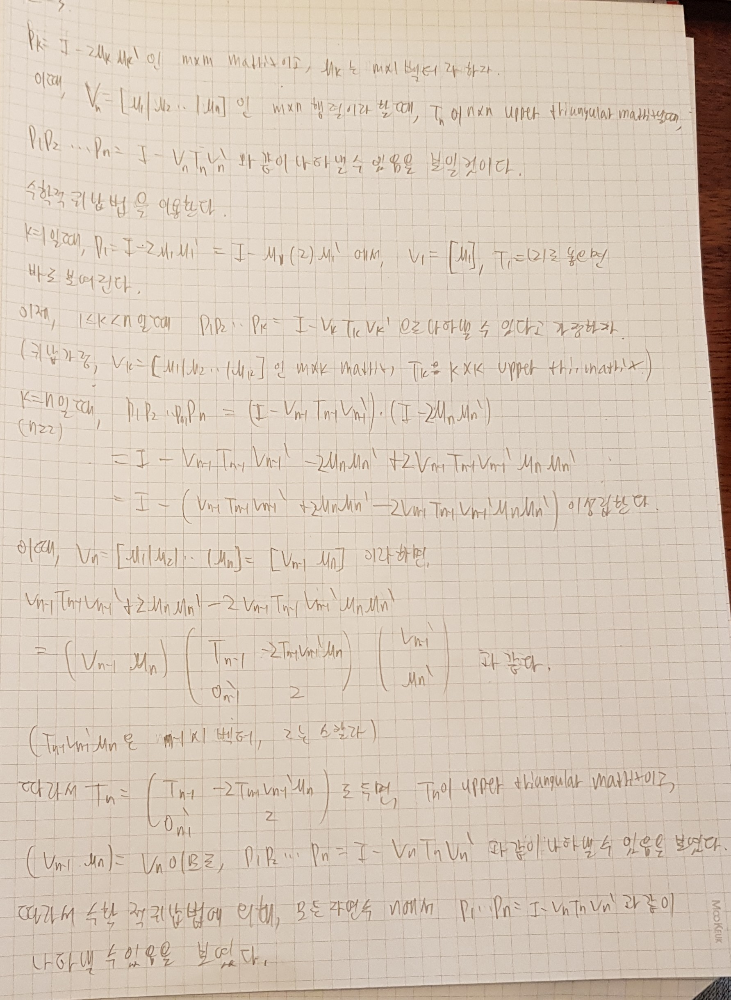

먼저, recoverQ에서 사용할 정리를 증명한다. ($A^{'} = A^{t}$)

m x m matrix $P_i$에 대해,

$P_i = I - u_i u_i^{t}$일때, $V_n = [u_1 | u_2 | ... | u_n]$인 m x n matrix, $T_n$은 n x n upper triangular matrix 일때,
$P_1 ... P_n = V_n T_n V_n^{t}$와 같이 나타낼 수 있음을 위와 같이 보였다.

이제 in-place로 householder algorithm을 구현하자.

```{r}
setRefClass("QRclass",
    	fields = list(
        	mat = "matrix",
        	vec = "vector"
    	)
	)

sudo_sign <- function(x) # it is equal to sign, but when x is 0, it returns 1 to positive sign.
{
    if(sign(x) == 0) return(1)
    else return(sign(x))
}

householder <- function(qrobj){
    if(is.matrix(qrobj$mat))
    {
        dimension <- dim(qrobj$mat)
        n <- dimension[1]
        p <- dimension[2]
        
        if(n < p) # X has not full-column rank, we can't House holder.
        {
            return(NULL)
        }

        qrobj$vec <- rep(0,p)
        
        for (i in seq_len(p))
        {
            u <- qrobj$mat[i:n,i]
            u[1] <- u[1]+sudo_sign(u[1])*Matrix::norm(Matrix(u), "F")
            
            u_square <- sum(u*u)
            
           
            for (j in i - 1 + seq_len(max(p - i + 1, 0))) # in-place
            {
                qrobj$mat[i:n, j] <- qrobj$mat[i:n, j] - 2 * u * sum(u * qrobj$mat[i:n, j]) / u_square
                # re-scaling u's size to 1. I use u_square for preserve significant digit.
            }
            
            u <- u / u[1] # re-scaling make u[1] size to 1.
            qrobj$vec[i] <- sum(u * u) # save u'u 's value.
            if(length(u) != 1) # if u's size is 1, we don't need save u's value to X.
            {
                 qrobj$mat[(i+1):n, i] = u[2:length(u)]
            }
            
        }
        
        return(qrobj)
    }
    return(NULL)

}
    
```

house holder 알고리즘을 구현할때 유의할점이 하나 있다.

$H = I - 2uu^{'}$의 u를 구할때, 우리의 구현 목표는 u의 첫번째 원소를 1로 scale해야 한다.
그런데, 기존 matrix의 ith column의 i~n번째 row를 차지하는 벡터를 $x_i$라 할때,
(즉, ith column의 diagonal entry를 포함하는 아래부분) 
일반적인 알고리즘을 통해 $v = x_i, w = ||x_i||e_1$이므로 $u = -\frac{v - w}{||v-w||_2}$
와 같이 구하게 되면, v-w의 첫번째 원소가 0이되는 경우가 생길 수 있다.

단순히 $v = (1,0)^{t}$인 경우만 생각해봐도 이런경우가 쉽게 발생할 수 있다는것을 알 수 있다.

그렇게되면 v-w의 상수배를 통해 u의 첫번째원소를 0으로 만드는것은 불가능하므로, 구현이 어려워진다.

하지만, H를 이용하여 $x_i$를 $||x_i||e_1$로 보내는 목적은 결국 ith column의 diagonal entry의 아래부분을 없애버리는것이 목적이므로, 따라서 $x_i$를 $||x_i||e_1$로 보내는것이 아니라,
$x_i$를 $-sign(x_{i1})||x_{i}||e_1$ 로 보낸다면, 목적을 이루면서 v-w의 첫번째 원소가 0이 되는경우를 손쉽게 제거할 수 있다.
($x_{i1} = 0$일때는,X가 full column rank에서, $||x_i|| \neq 0$이기 때문에, $sign(x_{i1}) = +$로 정의하면 첫번째 원소가 0이되는경우를 제거 가능)

즉,

$$v - w =\left[\begin{array}{c}
x_{i1}+\operatorname{sign}\left(x_{i1}\right)\left\|x_{i}\right\| \\
x_{i2} \\
\vdots \\
x_{in}
\end{array}\right]$$
에서, $||x_i|| \neq 0$일때 $v-w$의 첫번째 원소는 모든 $x_{i1}$의 값에 대해 0이 아니게 되므로, 


따라서 u의 첫번째 원소가 0이되는 경우를 제거 가능하게 된다.

또한, 이렇게 구해진 $H = I - 2uu^{'}$은 $u'u = 1$에서, orthogonality를 가진다.


이제, 이렇게 만들어진 결과를 통해 Q를 recover하는 recoverQ함수를 짜자.

$H_n H_{n-1} ... H_1 X = R$이고, $H_i$가 orthogonal한 matrix이므로 $H_i H_i^{t} = I$에서, 역행렬이 존재하고, $X = H_1 ... H_n R = Q R$에서, $Q = H_1 ... H_n$이므로 이를 구할것인데,

$H_i = I - 2 u_i u_i^{'}$이므로, 앞에서 보인 정리를 이용하면

$Q = I - V_n T_n V_n^{'}$으로 구할 수 있다.

즉, n x n matrix인 $T_n$만 구하면 Q를 구할 수 있고, $V_k = [u_1, u_2, ... u_k]$ 인 m x k matrix 일때,

$$T_n =\left(\begin{array}{c}
T_{n-1} & -2 T_{n-1} V_{n-1}^{'} u_n \\
0_{n-1} & 2\\
\end{array}\right)$$,
$$T_1 = (2)$$
와 같으므로, 이를 구하면 된다.


```{r}
recoverQ <- function(qrobj)
{
    if(is.matrix(qrobj$mat))
    {
        dimension <- dim(qrobj$mat)
        n <- dimension[1]
        p <- dimension[2]
        
        if(n < p) # X has not full-column rank, we can't House holder.
        {
            return(NULL)
        }
        
        V = qrobj$mat
        V[upper.tri(V, diag = FALSE)] = 0
        diag(V) = 1
        V <- t(t(V[,1:p])/sqrt(qrobj$vec))  # set V. transpose to divide row by row, and re-transpose.
        
        T = matrix(0, ncol=p, nrow=p) # T_n is T_p
        T[1,1] = 2 # set T_1

        for(i in 1 + seq_len(p - 1))
        {
            T[1:(i-1),i] = -2 * T[1:(i-1),1:(i-1)] %*% t(V[,1:(i-1)]) %*% V[,i]
            T[i,i] = 2
        }
        
        return (diag(1, n)-V %*% T %*% t(V)) # return I - V_n T_n V_n^{t}. (Q)
    }
    
    return(NULL)
}
```


위와 같이 recoverQ함수를 짤 수 있다. 귀납법으로 보인 내용처럼, $T_n$을 차례차례 구해나간다음 결과로 $Q = I - V_n T_n V_n^{t}$를 리턴하는 함수다.

```{r}
recoverR <- function(qrobj)
{
    R = qrobj$mat
    R[lower.tri(R, diag = FALSE)] = 0
    return(R)
}
```


또한, 편의를 위해 recoverR함수를 위와 같이 짤 수 있다. 단순히 결과 matrix의 lower triangle 부분을 제거하고 리턴한다.


이제, 우리가 구현한 이 함수를 이용하여 2-1과 2-2에서 사용했던 A, B에 대한 QR decomposition을 계산해보자.

```{r}
e <- .Machine$double.eps
(A <- t(matrix(c(1, 1, 1, e, 0, 0, 0, e, 0, 0, 0, e), nrow=3)))
(B <- t(matrix(c(0.7, 1/sqrt(2), 0.7 + e, 1/sqrt(2)), nrow=2)))
```
A, B는 위와 같았다.


```{r}
v = rep(0,3)
qrobj <- new("QRclass", mat = A, vec=v)
res <- householder(qrobj)
Q<-recoverQ(res)
res$mat
```
먼저, A를 QR decompostion을 돌려 나온 결과는 위와 같고

```{r}
R <- recoverR(qrobj)
Q
R
```

위에서 각각 Q, R만 분리하면 위와 같다.

구한 Q가 orthogonal한지를 체크해보자.

```{r}
t(Q) %*% Q
```

위와같이, diagonal entry가 1이고, diagonal entry를 제외한 곳의 원소는 거의 0에 가까운 값을 가지므로, Q가 orthogonal하고 따라서 제대로 QR decomposition이 일어났음을 알 수 있다.

B에 대해서도 마찬가지로,.

```{r}
v = rep(0,3)
qrobj <- new("QRclass", mat = B, vec=v)
res <- householder(qrobj)
Q<-recoverQ(res)
res$mat
```
B를 QR decompostion을 돌려 나온 결과는 위와 같고


```{r}
R <- recoverR(qrobj)
Q
R
```

위에서 각각 Q, R만 분리하면 위와 같다.

구한 Q가 orthogonal한지를 체크해보자.


```{r}
t(Q) %*% Q
```

위와같이, diagonal entry가 1이고, diagonal entry를 제외한 곳의 원소는 0이므로, Q가 orthogonal하고 따라서 제대로 QR decomposition이 일어났음을 알 수 있다.


즉, 우리가 구현한 House-holder알고리즘이 정상적으로 QR decomposition을 하는것을 알 수 있었다.


## Q3. Least squares

The Longley data set of labor statistics was one of the first used to test accuracy of least squares computations. 
This data set 
is available at the National Institute of Standards and Technology (NIST) website (\url{https://www.itl.nist.gov/div898/strd/lls/data/Longley.shtml}), 
consists of one response variable (number of people employed) and six predictor variables (GNP implicit price deflator, Gross National Product, number of unemployed, number of people in the armed forces, ‘noninstitutionalized’ population $\ge$ 14 years of age, year) observed yearly from 1947 to 1962, 
and is also available in R package \texttt{datasets}.

### 3-1. Download the data set from the NIST website, read into R, and construct a data matrix $\mathbf{X}$ for linear model $\mathbf{y}=\mathbf{X}\boldsymbol{\beta} + \boldsymbol{\varepsilon}$. Include an intercept in your model.
* Using the R command `svd()`, list up the 7 singular values of $\mathbf{X}$. What is the condition number of $\mathbf{X}$?
* Construct the Gram matrix $\mathbf{G} = \mathbf{X}^T\mathbf{X}$. List up the 7 singular values of $\mathbf{G}$. What is the condition number of $\mathbf{G}$?


data는 `https://www.itl.nist.gov/div898/strd/lls/data/LINKS/DATA/Longley.dat`의 위치에 있다.

이 파일을 다운받고, read.csv 함수를 이용하여 R로 데이터를 먼저 불러오자.

```{r}
data <- read.csv("Longley.dat", skip = 60, sep="", header = FALSE, col.names = c("y", "x1", "x2", "x3", "x4", "x5", "x6"))

data
```
sep으로 `""`를 주면, 모든 whitespace (공백, 탭...)을 delimiter로 인식하게 된다.

파일의 60번째 줄부터 데이터가 시작하는데, 헤더인 60번째줄에 쓸모없는 문자열인 `Data:`가 있으므로,

skip = 60을통해 60번줄까지 모두 무시하게 하고, header = FALSE로 주어 헤더가 없음을 알려주었다.

그 후, col.names에 직접 헤더를 넣어주어 데이터를 읽었다.

이제, $y = X\beta + \epsilon$의 design matrix X를 구성하자.

```{r}
X <- model.matrix(y ~ x1 + x2 + x3 + x4 + x5 + x6,data = data)

X
```

model.matrix함수를 이용하면 우리 데이터를 이용하여 design matrix를 구성할 수 있다.

intercept까지 포함한 모델로 만들어주었다.

이제, X matrix의 singular value들을 구하자.

```{r}
svd_X <- svd(X)
```

svd()함수를 이용하면, X의 singular value decompose를 구해준다.

즉, $X =UDV'$일때, U, V는 각각 X의 left-singular vector, right-singular vector로 구성된 matrix이고,
(left-singular vector는 $XX'$를 eigen decomposition할때 나오는 eigen vector들로 이루어진 행렬,
right-singular vector는 $X'X$를 eigen decomposition할때 나오는 eigen vector들로 이루어진 행렬)

D는 diagonal entry가 X의 singular value ($\sqrt{\lambda_{A'A}}$, $A'A$와 $AA'$의 eigen value들은 같음)로 구성된 diagonal matrix이다.

따라서 X의 singular value들은 다음과 같이 구할 수 있다.

```{r}
svd_X$d
```

또한, X의 condition number를 구해야 한다.

X의 condition number는 다음과 같이 정의된다.

1. X가 nonsingular square matrix일때,

$cond(X) = ||X|| ||X^{-1}||$

이때, 사용되는 norm은 다를 수 있다.

2. X가 rectangular matrix일때,

$cond(X) = ||X|| ||X^{\dagger}||$, 이때, $X^{\dagger}$는 X의 pesudo-inverse 행렬로, $X = UDV'$으로 SVD decompostion 될때,

$X^{\dagger} = VD^{+}U'$, $D^{+}$는 D를 transpose하고,diagonal 성분들의 역수를 취한 행렬이 된다.

r에서 kappa() 함수를 사용하면 이러한 condition number를 구할 수 있다.

default로는 2-norm을 사용한 cond.number를 구해주고, 문제에서 사용할 norm을 지정하지 않았으므로 2-norm을 사용하여 cond.number를 구하겠다.

```{r}
kappa(X, exact = TRUE, norm = '2')
```
X의 condition number는 위와 같다.

굉장히 큰 값이 출력되는것을 알 수 있다. 이는 d의 멤버중 `3.423709e-04`와 같이, 매우 작은값이 포함되었기 때문이다.

이제 gram matrix $G = X'X$ 에 대해 같은 작업을 반복하자.

```{r}
G = t(X) %*% X
svd_G = svd(G)
svd_G$d
```

G의 singular value들은 위와 같고,

```{r}
kappa(G,exact = TRUE, norm = '2')
```

G의 condition number는 위와 같은 값이 나오는것을 확인할 수 있다.


### 3-2. Using the function you wrote for Q2, compute the regression coefficients $\hat{\boldsymbol{\beta}}$, their standard errors, and variance estimate $\hat{\sigma}^2$. Verify your results using the R function \texttt{lm()}.

linear regression의 normal equation은 X 가 n x p matrix일때,

$X'X\beta = X'y$에서, X가 QR decomposition이 가능하다면, (즉, full-rank matrix이면)
$X = QR = Q_1R_1$이 성립한다. Q는 n x n orthogonal matrix, R은 n x p인 positive diagonal entry를 가지는 upper triangular matrix이고,

$Q_1$ 은 Q의 p번째 column까지의 n x p matrix, $R_1$은 R에서 위 p개의 row를 취한 p x p upper triangular matrix이다.

reduced QR decomposition에서, $Q_1'Q_1 = I$이므로

위 normal equation은 다음과 같이 변한다.

$$R_1'R_1\beta = R_1'Q_1'y$$
여기서, $R_1$의 diagonal entry가 모두 positive에서, triangular square matrix의 determinant는 diagonal entry의 곱이므로 $det(R_1)>0$에서 역행렬이 존재하므로 $R_1'$의 역행렬도 존재하고, 따라서 위 식은

$$R_1\beta = Q_1'y$$
위와같이 단순화 된다.

이제 이를 풀어서 beta hat을 구하자. 여기서, R_1이 upper triangular matrix이므로 backsolve를 이용하면 
비교적 빠르게 해를 구할 수 있다.


따라서 r의 함수 backsolve($R_1$, $Q_1'y$)를 이용하면 위를 구할 수 있다.


먼저 Q2의 householder 알고리즘을 이용하여 Q,R을 구한뒤에 $Q_1$, $R_1$을 구한다.

```{r}
v = rep(0,dim(X)[2])
qrobj <- new("QRclass", mat = X, vec=v)
res <- householder(qrobj)
Q<-recoverQ(res)
R<-recoverR(res)
res$mat
Q
R
```
먼저 QR decomposition의 결과는 위와 같고

```{r}
n <- dim(X)[1]
p <- dim(X)[2]
Q_1 <- Q[,1:p]
R_1 <- R[1:p,]
Q_1
R_1
```
reduced QR decomposition의 결과는 위와 같다.

이를 이용하여 beta_hat를 구하자.


```{r}
y <- data[,1]
beta_hat = backsolve(R_1, t(Q_1) %*% y)
beta_hat
```
beta_hat은 위와 같다.


또한, linear regression에서 error의 독립, 등분산 가정을 이용하면 $\epsilon_{i} \overset{\text{i.i.d.}}{\sim} (0, \sigma^2)$

에서 $\epsilon \sim (0, \sigma^2 I)$가 성립하고,

이때의 $\sigma^2$의 추정값 $\hat{\sigma^2} = MSE = \frac{y'(I - H)y}{n - p}$임을 알고있다. ($H = X(X'X)^{-1}X'$)

따라서, 이의 값을 구하자.

이때, $X'X = R_1' Q_1' Q_1 R_1 = R_1' R_1$에서

$H = X(X'X)^{-1}X' = Q_1R_1(R_1'R_1)^{-1}R_1'Q_1'$이 성립하고, $R_1^{-1}$이 존재하므로,

$H = Q_1 Q_1'$으로 간편하게 구할 수 있게 된다.

```{r}
H = Q_1 %*% t(Q_1)
SSE = t(y) %*% (diag(n) - H) %*% y
MSE = SSE / (n-p)
MSE
```

$\hat{sigma^2}$인 MSE는 위와 같고, 따라서 standard error의 추정값은 위 값의 제곱근이므로

```{r}
std = sqrt(MSE)
std
```

위와 같다.


이제, $\hat{\beta}$의 standard error를 구하자.

linear regression의 모델 $y = X\beta + \epsilon$에서, X를 상수라고 가정하면

$var(y) = \sigma^2I$ 가 된다.


따라서 $\hat{\beta} = (X'X)^{-1}X'y$에서 

$var(\hat{\beta}) = \sigma^2 (X'X)^{-1}$이 성립한다.

이때, $X'X = R_1' Q_1' Q_1 R_1 = R_1' R_1$에서, $(X'X)^{-1} = (R_1' R_1)^{-1}$이 성립한다.

따라서 이를 구하기 위해 $R_1^{-1}$을 구하면 되고, 이는 $R_1 x_i = e_i$ 인 $x_i$들이 $R_1^{-1}$의 ith column이므로,

이를 적극적으로 이용하자.

```{r}
R_1_inv = backsolve(R_1, diag(p))
G_inv = R_1_inv %*% t(R_1_inv)
var_beta_hat = as.numeric(MSE) * G_inv
var_beta_hat
```

$R_1$의 inverse를 구하고, $X'X$의 역행렬인 G_inv를 구해 앞에서 구한 추정값$\hat{\sigma^2}$을 $\sigma^2$대신 사용하면

위와같이 $var(\hat{\beta})$를 구할 수 있다.

이때, $\hat{\beta}_i$의 variance는 $var(\hat{\beta})$의 diagonal entry이므로,

```{r}
var_beta_hat_i = diag(var_beta_hat)
var_beta_hat_i
std_beta_hat_i = sqrt(var_beta_hat_i)
std_beta_hat_i
```

위와같이 각 beta_hat_i의 standard error를 구할 수 있다.

이제 이를 lm()함수의 결과와 비교해보자.


```{r}
data.lm = lm(y ~ x1 + x2 + x3 + x4 + x5 + x6, data)
summary(data.lm)

beta_hat
std
std_beta_hat_i
```

lm()함수의 결과와 거의 비슷함을 알 수 있다.


### 3-3. Using the Cholesky decomposition of $\mathbf{G}$, compute the regression coefficients $\hat{\boldsymbol{\beta}}$, their standard errors, and variance estimate $\hat{\sigma}^2$. Compare the results with the values of the above question.

Cholesky decomposition을 통해 앞의 과정을 반복하자.

X가 full-rank이므로, X'X는 symmetric, positive-definite하고, 따라서 1번에서 보였듯이 다음과 같이 unique하게 cholesky 분해가 가능하다.

$$X'X = LL'$$ (L은 lower triangle matrix)

따라서 normal equation $X'X\beta = X'y$은

$$LL'\beta = X'y$$
에서, L이 lower triangle matrix이므로  $z = L'b$라 할때,

forward solve를 이용하여 $Lz = X'y$, 
L'이 upper triangle matrix이므로 backword solve를 이용하여 $L'\beta = z$와 같이 풀면 $\hat{\beta}$의 값을 구할 수 있다.

```{r}
L_t <- Matrix::chol(G)
L <- t(L_t)
z <- forwardsolve(L, t(X) %*% y)
chol_beta_hat <- backsolve(L_t, z)
chol_beta_hat
```

마찬가지로, MSE의 값을 구할때,

$H = X(X'X)^{-1}X' = X(LL')^{-1}X' = X(L')^{-1} L^{-1} X'$이므로,

$L^{-1}$을 앞에서와 같이 $L x_i = e_i$를 이용하여 구하고, (forward solve 이용 가능.)
이를 이용하여 MSE를 구한다.

```{r}
L_inv = forwardsolve(L, diag(p))
chol_MSE = t(y) %*% (diag(n) - X %*% t(L_inv) %*% L_inv %*% t(X)) %*% y / (n-p)
chol_std = sqrt(chol_MSE)
chol_MSE
chol_std
```

마지막으로, $Var(\hat{\beta}) = \sigma^2 (X'X){-1} = \sigma^2(L')^{-1} L^{-1}$ 이므로,

추정값$\hat{\sigma^2}$을 $\sigma^2$대신 사용하면 $var(\hat{\beta})$를 구할 수 있다.


```{r}
chol_var_beta_hat = as.numeric(chol_MSE) * (t(L_inv) %*% L_inv)
chol_var_beta_hat
chol_var_beta_hat_i = diag(chol_var_beta_hat)
chol_var_beta_hat_i
chol_std_beta_hat_i = sqrt(chol_var_beta_hat_i)
chol_std_beta_hat_i
```

앞에서와 같이 각 $\beta_i$의 std error를 구한다.


이제 이 결과들을 위와 비교해보면

```{r}
beta_hat
chol_beta_hat
MSE
chol_MSE
std_beta_hat_i
chol_std_beta_hat_i
```

거의 같음을 확인할 수 있다.


## Q4. Iterative method

### 4-1. Show that the norm $\|\mathbf{x}\|_{\delta}$ in the [lecture note on iterative methods](https://github.com/won-j/M1399_000100-2020spring/blob/master/lectures/lecture5/iterative.ipynb) is indeed a vector norm

$||x||_{\infty}$가 vector norm의 성질을 만족함을 아므로, 이를 이용한다.

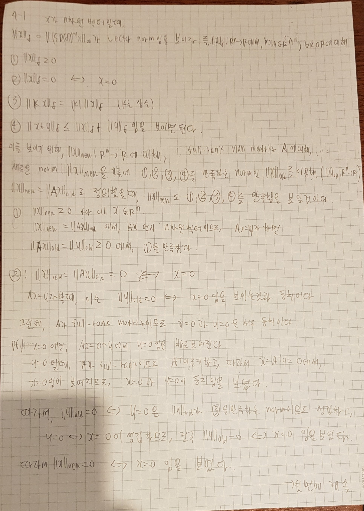
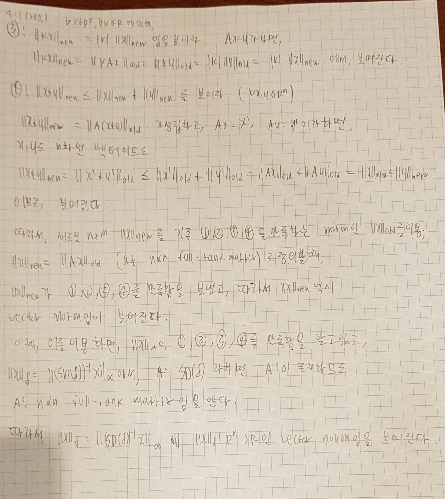


### 4-2. 심송용, 제 3장 연습문제 3.3.

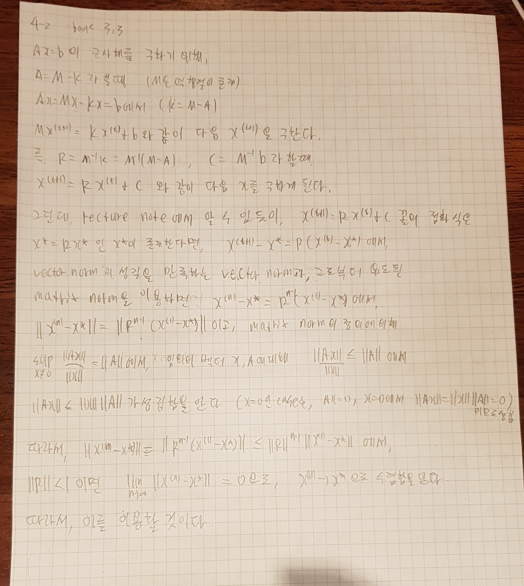
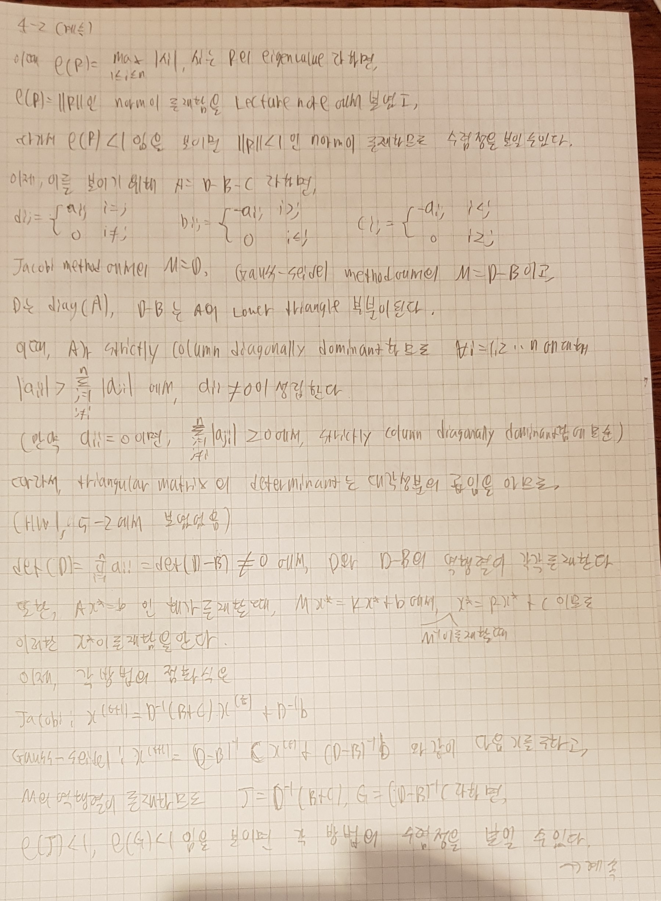
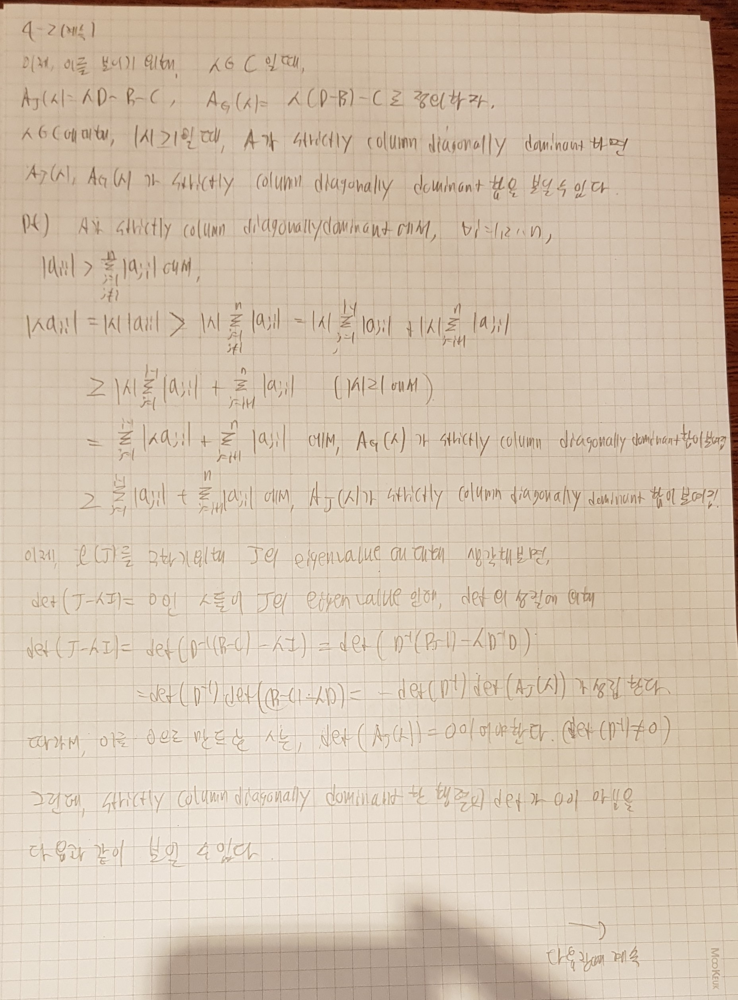
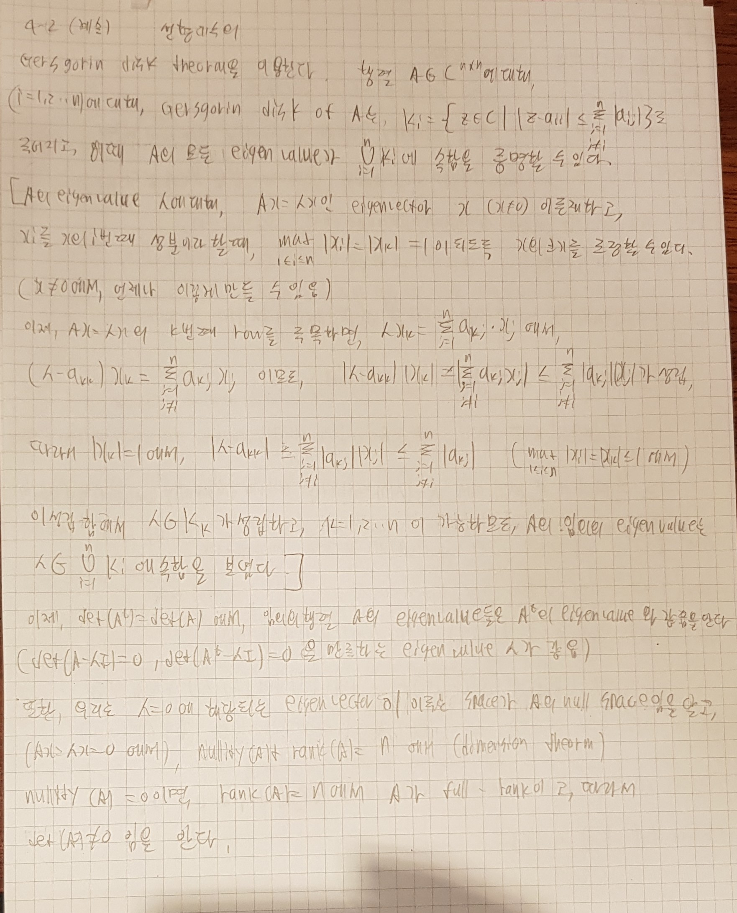
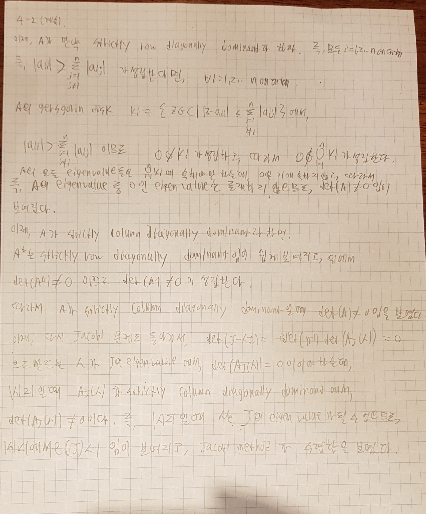
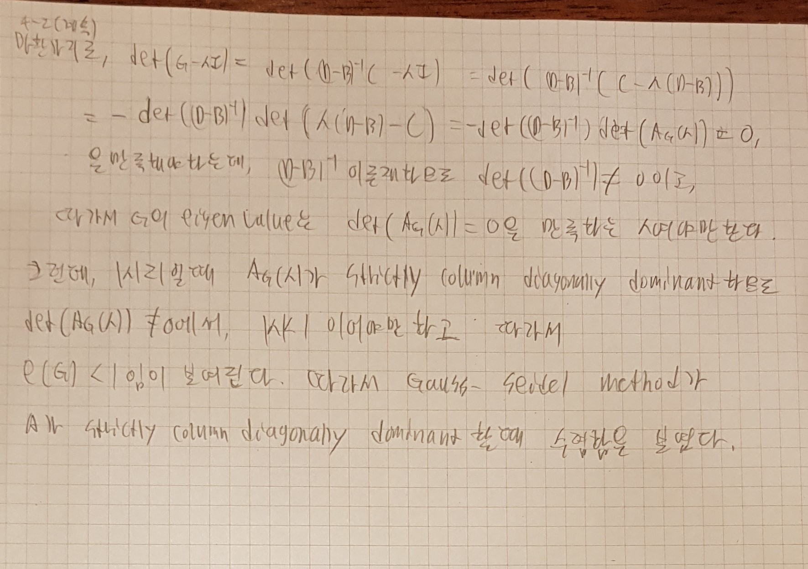


### 4-3. Consider the system of linear equations
$$
\begin{split}
     x_1 + 4x_2 +  x_3 &= 12, \\
    2x_1 + 5x_2 + 3x_3 &= 19, \\
     x_1 + 2x_2 + 2x_3 &= 9.
\end{split}
$$

```{r}
A = Matrix(c(1,2,1,4,5,2,1,3,2), nrow = 3)
b = c(12,19,9)
D = diag(diag(A))
L = A
L[upper.tri(L, diag = TRUE)] <- 0
U = A
U[lower.tri(U, diag = TRUE)] <- 0

solve(A,b)
```
위 방정식의 해는 위와 같이 구해진다.


* Determine the $\mathbf{D}$, $\mathbf{L}$, and $\mathbf{U}$ matrices of the Gauss-Seidel method and determine the spectral radius of $(\mathbf{D} + \mathbf{L})^{-1}\mathbf{U}$.

$$A =\left(\begin{array}{c}
1 & 4 & 1 \\
2 & 5 & 3\\
1 & 2 & 2 \\
\end{array}\right)$$ 에서,

$$D =\left(\begin{array}{c}
1 & 0 & 0 \\
0 & 5 & 0\\
0 & 0 & 2 \\
\end{array}\right)$$

$$U =\left(\begin{array}{c}
0 & 4 & 1 \\
0 & 0 & 3\\
0 & 0 & 0 \\
\end{array}\right)$$

$$L =\left(\begin{array}{c}
0 & 0 & 0 \\
2 & 0 & 0\\
1 & 2 & 0 \\
\end{array}\right)$$

이 성립함을 알 수 있다.


matrix A의 spectral radiusx는 다음과 같이 정의된다.

$$ \rho(A) = max|\lambda| $$

즉, A의 eigenvalue들의 절댓값중 가장 큰 값으로 정의된다.

따라서 $(\mathbf{D} + \mathbf{L})^{-1}\mathbf{U}$의 eigenvalue의 절댓값중 가장 큰 값을 구하면 된다.

이때 $$(\mathbf{D} + \mathbf{L})^{-1} = \left(\begin{array}{c}
1 & 0 & 0 \\
-\frac{2}{5} & \frac{1}{5} & 0\\
-\frac{1}{10} & -\frac{1}{5} & \frac{1}{2} \\
\end{array}\right)$$
에서, $$(\mathbf{D} + \mathbf{L})^{-1}\mathbf{U} = \left(\begin{array}{c}
0 & 4 & 1 \\
0 & -\frac{8}{5} & \frac{1}{5}\\
0 & -\frac{2}{5} & -\frac{7}{10} \\
\end{array}\right)$$ 이 성립하므로,

이의 eigenvalue들을 구해보면

$$det((\mathbf{D} + \mathbf{L})^{-1}\mathbf{U} - \lambda I) = 0$$은

$\lambda(10 \lambda^2 + 23 \lambda + 12) = 0$에서, $\lambda = 0, -\frac{4}{5}, -\frac{3}{2}$ 가 된다.

따라서 $$ \rho((\mathbf{D} + \mathbf{L})^{-1}\mathbf{U}) = 1.5$$임을 알 수 있다.

이로부터, 여기서 Gauss-Seidel method는 수렴하지 않을것이라는 정보를 알 수 있다.


* Do two steps of the Gauss-Seidel method starting with $\mathbf{x}^{(0)} = (1, 1, 1)$, and evaluate the Euclidean norm of the difference of two successive approximate solutions.

$x^{(t+1)} = R x^{(t)} + c$와 같이 다음 x가 구해지므로, $x^{(0)} = (1, 1, 1)$일때 $x^{(2)}$를 구하자.

Gauss-Seidel method에서 $R = -(\mathbf{D} + \mathbf{L})^{-1}\mathbf{U}$, $c = (D + L)^{-1}b$이므로,

이를 이용해서 구할 수 있다.

```{r}
iter_method <- function(x, R, c, n)
{
    res <- x
    for(i in (1:n))
    {
        res <- R %*% res + c
    }
    return(res)
}

euc_norm <- function(x)
{
    return(sqrt(sum(x * x)))
}


R = Matrix(c(0,0,0, -4 , 1.6, 0.4, -1, -0.2, 0.7), nrow = 3)
D_L_inv = Matrix(c(1,-0.4,-0.1,0,0.2,-0.2,0,0,0.5), nrow = 3)
c = D_L_inv %*% b
x_0 = c(1,1,1)
x_1 = iter_method(x_0, R, c , 1)
x_2 = iter_method(x_0, R, c , 2)
x_0
x_1
x_2
```
위와 같이 구해지고, $x^{(0)}$과 $x^{(1)}$의 차이, $x^{(1)}$과 $x^{(2)}$의 Euclidean norm은 다음과 같다.

```{r}
diff_12 = x_2 - x_1
euc_norm_12 = euc_norm(diff_12)
diff_01 = x_1 - x_0
euc_norm_01 = euc_norm(diff_01)

euc_norm_01
euc_norm_12
```

$x^{(0)}$과 $x^{(1)}$의 차이가 $x^{(1)}$과 $x^{(2)}$의 차이보다 큼을 알 수 있다.


* Do two steps of the Gauss-Seidel method with successive overrelaxation using $\omega = 0.1$, starting with $\mathbf{x}^{(0)} = (1, 1, 1)$, and evaluate the Euclidean norm of the difference of two successive approximate solutions.

SOR 방법을 이용한 Gauss-Seidel method에서는

$$(\mathbf{D}+\omega \mathbf{L}) \mathbf{x}^{(t+1)}=[(1-\omega) \mathbf{D}-\omega \mathbf{U}] \mathbf{x}^{(t)}+\omega \mathbf{b}$$

와 같이 구해지므로,


$R = (D + \omega L)^{-1}[(1 - \omega)D - \omega U]$,
$c = (D + \omega L)^{-1} \omega b$

가 성립한다.

따라서 이러한 R,c를 구하고, 앞의 방법을 반복하자.

$D + wL$이 lower triangular matrix이므로,
forward solve를 이용하여 효율적으로 역행렬을 구한다.

```{r}
w <- 0.1
D_wL_inv = forwardsolve(D + w * L, diag(3))
R_sor = D_wL_inv %*% ((1-w)*D - w * U)
c_sor = w * D_wL_inv %*% b
y_0 = c(1,1,1)
y_1 = iter_method(y_0, R_sor, c_sor , 1)
y_2 = iter_method(y_0, R_sor, c_sor , 2)
R_sor
y_0
y_1
y_2
```

R_sor이 strictly column diagonal dominant 하므로, iterative method가 해로 수렴할것이라는 사실을 알 수 있다.

```{r}
diff_sor_12 = y_2 - y_1
euc_norm_sor_12 = euc_norm(diff_sor_12)
diff_sor_01 = y_1 - y_0
euc_norm_sor_01 = euc_norm(diff_sor_01)

euc_norm_sor_01
euc_norm_sor_12
```

위와 비교해보면, sor방법을 사용했을때, 변화하는 속도가 더 느려진것을 확인할 수 있다.

이는 $0< w < 1$로, under relaxation 방법을 사용했기 때문이다.


## Q5. Contraction map

Recall that function $F: [a,b] \rightarrow [a,b]$ is contractive if there exists a nonnegative constant $L<1$ such that
\begin{align}\label{eqn:lipschitz}
|F(x) - F(y)| \le L |x-y|
\end{align}
for all $x,y \in [a,b]$.


### 5-1. Show that if $F$ is differentiable on $[a,b]$, then condtion \eqref{eqn:lipschitz} is equivalent to
$$
	|F'(x) | \le L
$$
for all $x \in [a,b]$.

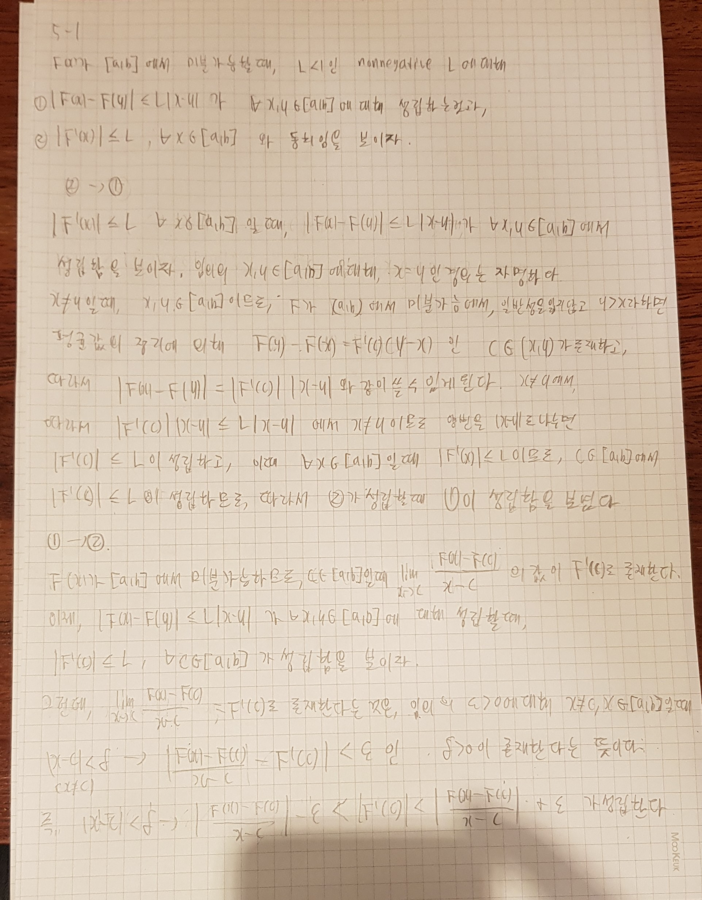
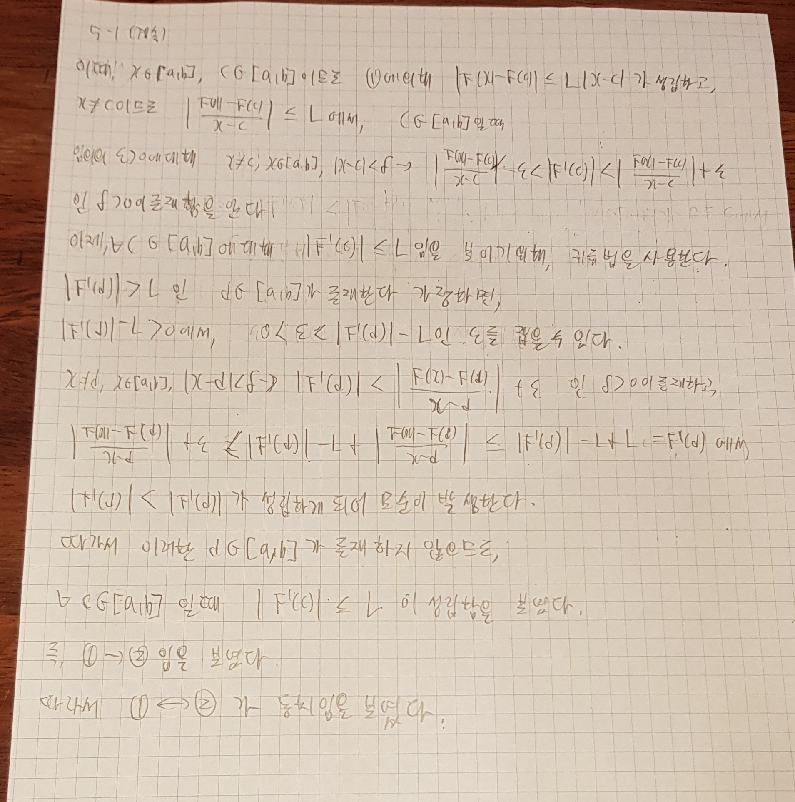


Now suppose we want to find a root of a differentiable function $f(x)$ on $(a,b)$. Consider the following iteration
$$
x^{(t+1)} = x^{(t)} + \alpha  f(x^{(t)}) \quad (\alpha \neq 0).
$$

### 5-2. When does iteration \eqref{eqn:fixedpoint} converge?

lecture note에서 알 수 있듯이,


F가 닫힌구간 $I \subset R$에서 정의된 함수고,

1. $x \in I$일때, $F(x) \in I$
2. $|F(x) - F(y)| \le L|x-y|$ ,$\forall x,y \in I$
3. $L \in [0,1)$이면 

F는 unique fixed point $x^{\star} \in I$를 가지고,

$x^{(n+1)} = F(x^{(n)})$인 fixed-point iteration은 
initial point $x^{0}$의 값에 관계없이
$x^{\star}$로 수렴함을 알고 있다.

따라서, $$x^{(t+1)} = x^{(t)} + \alpha f(x^{(t)}), (\alpha \neq 0)$$

로 정의될때, $F(x) = x + \alpha f(x)$라 하면,

F가 위의 3가지 조건을 만족하면 converge 함을 안다.

만약 5-2에서 주어진 조건이 f가 $[a,b]$에서 미분가능함이면,

F 역시 $[a,b]$에서 미분가능하므로, 앞에서 증명한 5-1을 그대로 사용할 수 있고,

$$\forall x \in [a,b], \exists L < 1, |F'(x)| \le L$$가
$|F(x) - F(y)| \le L|x-y|$ ,$\forall x,y \in I$, $L \in [0,1)$와 동치가 된다.

따라서, 5-1의 정리를 이용하면,

1. $\forall x \in [a,b], x + \alpha f(x) \in [a,b]$
2. $\forall x \in [a,b], \exists L < 1, |F'(x)| \le L$

이면 수렴성을 보일 수 있다.

$F'(x) = 1 + \alpha f'(x)$에서, 위 조건은

1. $\forall x \in [a,b], x + \alpha f(x) \in [a,b]$
2. $\forall x \in [a,b], \exists L < 1, |1 + \alpha f'(x)| \le L$
와 같이 쓸 수 있다.


하지만 5-2에서 주어진 조건은 f가 $(a,b)$에서 미분가능함이다.

f는 $(a,b)$에서 미분가능하므로, F역시 $(a,b)$에서 미분가능함을 안다.


1. $\forall x \in [a,b], x + \alpha f(x) \in [a,b]$
2. $\forall x \in (a,b), \exists L < 1, |F'(x)| \le L$
3. $\forall x \in [a,b], |F(x) - F(a)| \le L |x-a|, \exists L < 1$
4. $\forall x \in [a,b], |F(x) - F(b)| \le L |x-b|, \exists L < 1$

이때, 5-1을 증명할때, 닫힌구간의 성질을 사용하지 않았기 때문에, 구간을 $[a,b]$에서 $(a,b)$로 바꿔도 증명이 같게된다., 따라서 2.의 조건은  $x,y \in (a,b)$에서 $|F(x) - F(y)| \le L|x - y|$ 와 동치가 된다.

즉, 구간 $(a,b)$에서 $|F(x) - F(y)| \le L|x-y|$ 를 보장해준다.

2., 3., 4.을 조합하면, 2., 3., 4.의 각각의 L에 대해 $L = max(L_2,L_3,L_4)$이라 정의하면, 
이 조건들은 $\forall x,y \in [a,b], \exists L<1, |F(x) - F(y)| \le L|x-y|$ 와 같으므로, 수렴성을 보일 수 있다.

(구간 $(a,b)$를 벗어난 곳에서의 연속성, 미분가능성에 대해서는 한마디도 주어지지 않았으므로 불편하지만 3, 4와 같이 이야기 해야 한다.)


위 조건을 F가 아닌 f에 대해 다시 정리하면

1. $\forall x \in [a,b], x + \alpha f(x) \in [a,b]$
2. $\forall x \in (a,b), \exists L < 1, |1 + \alpha f'(x)| \le L$
3. $\forall x \in [a,b], |x-a + \alpha(f(x) - f(a))| \le L |x-a|, \exists L < 1$
4. $\forall x \in [a,b], |x-b + \alpha(f(x) - f(b))| \le L |x-b|, \exists L < 1$

와 같다.


### 5-3. Discuss the advantage of introducing the $\alpha$.

우리가 앞의 iteration을 활용하는 목적은,

결국 $f(x) = 0$의 해를 구하고 싶어서
$F(x) = x + f(x)$인 함수 F를 도입한 후, $F(x) = x$가 되는 고정점을 찾으면 $f(x) = 0$의 해를 찾을 수 있기 때문이다.

그런데 $F(x) = x + \alpha f(x)$의 고정점에서
$\alpha f(x) = 0$이 성립하므로, 결국 $f(x) = 0$의 해를 구한것과 같으므로, $\alpha$를 도입해도 우리의 목적을 이룰 수 있다.

그런데, 이를 도입하면 얻을 수 있는 장점이 있다.

$\alpha$를 도입하면, $|F'(x)|$가 너무 커서, 즉, $|1 + f'(x)|$의 크기가 커져서 수렴성을 보장할 수 없는경우, 적당한 $\alpha$를 도입하면 $|1 + \alpha f'(x)| $의 값을 우리가 원하는 수준으로 맞출 수 있게되고,
따라서 수렴성을 보장할 수 있게된다.

반대로, $|1 + f'(x)|$의 크기가 너무 작아, 수렴하기까지 시간이 매우 오래 걸리게 되는 경우도 있을 수 있는데,

이때는 적당한 $\alpha$를 도입해서  $|1 + \alpha f'(x)| $를 수렴성을 보장하는 정도로만 키워주면, 수렴속도를 높여 계산량을 줄일 수도 있다.

때문에, 이러한 이점을 가지게 된다.


### 5-4. Relate iteration \eqref{eqn:fixedpoint} with the gradient descent method for minimization of a twice differentiable function.

1변수일때를 이야기 하도록 하겠다.

앞의 iteration method는 $x^{(t+1)} = x^{(t)} + \alpha f(x^{(t)})$와 같은 형태로 다음 x를 구하는데,

gradient descent method는 $x^{(t+1)} = x^{(t)} - \gamma_t f'(x^{(t)})$ 와 같이 다음 $x^{(t+1)}$을 구하게 된다.

여기서 형태를 살펴보면, 계수의 부호가 바뀐것과 $f(x)$가 $f'(x)$로 바뀐것을 제외하면 거의 동일한 구조를 가지고 있다.

즉, gradient descent method는 f를 f'으로, $\alpha$를 $-\gamma_t$로 택한 iterative method라고도 생각할 수 있다.

한가지 차이점은, $\alpha$가 고정된 iterative method와 달리,

gradient descent method는 각 step마다 $\gamma_t$를 새로 구하게 된다는 차이점이 있다.

이 $\gamma_t$는 각 step에서 목적함수 $f(x^{(t+1)})$를 작게 만드는 방향으로 구하게 된다. (최대한 작게 만들수도, 그냥 적당히 작게 만들수도 있음.)

이때, 이 gradient descent method의 수렴을 위해서는 f가 두번 미분가능한 함수라면, $(-\infty, \infty) = I$라 하면, I는 닫힌 집합이고,  f는 전구간에서 두번미분가능하다.

$F(x^{(t)}) = x^{(t)} - \gamma_t f'(x^{(t)})$와 같이 F를 정의하고,

앞에서와 같이 lecture note의 수렴조건을 가져오면

1. $x \in I$일때, $F(x) \in I$
2. $|F(x) - F(y)| \le L|x-y|$ ,$\forall x,y \in I$
3. $L \in [0,1)$ 

에서, $F : R \rightarrow R$이므로 1번 조건이 자동적으로 만족되므로 

위 조건은

$\forall x,y \in I$,$\exists L < 1$,$|F(x) - F(y)| \le L|x-y|$ 

와 같이 압축되고, f가 전구간에서 두번 미분가능하므로 F는 전구간에서 미분가능하다.

따라서 앞의 5-2에서와 같이,  

$\forall x \in I, \exists L < 1, |F'(x)| = |1 - \gamma_{t} f''(x)| \le L$

일때 수렴성을 보일 수 있게 된다.

이때, 고정된 값 $\alpha$를 사용할때는 위의 조건을 지키기가 상당히 어려운 편이지만,

$\gamma_{t}$는 우리가 step마다 선택이 가능한 수이므로,

매 step마다 적절한 $\alpha_t$를 설정해 주는것으로 수렴성을 보장할 수 있게된다.

즉, 수렴에 대한 제약조건이 훨씬 적은편이라 할 수 있다.


여기서 조건을 추가해서, f가 전구간에서 두번 미분가능하고, convex이며 $L \in [0,1)$, $|f''(x)| \le L$ 인 L이 존재한다고 하면,

f가 convex에서 $f''(x) \ge 0$이고, 따라서 $f'(x) = 0$인점에서 f는 최솟값을 가짐을 안다.


테일러 전개에 의해 f는 다음과 같이 전개가 가능하다.

$f(y) = f(x) + f'(x)(y-x) + \frac{1}{2}f''(c)(y-x)^2$ (c는 y,x사이)
따라서 $f''(c) \le L$에서,
$f(y) \le f(x) + f'(x)(y-x) + \frac{1}{2}L(y-x)^2$가 성립한다.

따라서, $y = x^{(t+1)}$, $x = x^{t}$라 하면, $\gamma_t$를 고정시켰을때는,
(0보다 큰값으로)

$f(x^{(t+1)}) \le f(x^{(t)}) + f'(x^{(t)})(-\gamma_t f'(x^{(t)})) + \frac{1}{2}L(\gamma_t f'(x^{(t)}))^2$에서,

$f(x^{(t+1)}) \le f(x^{(t)}) - (1 - \frac{1}{2}L \gamma_t) \gamma_t f'(x^{(t)})^2$ 에서, $\gamma_t \le \frac{1}{L}$로 택하면,

$-(1-\frac{1}{2}Lt) \le -\frac{1}{2}$에서,

$f(x^{(t+1)}) \le f(x^{(t)})  - \frac{1}{2} \gamma_t f'(x^{(t)})^2$에서,

$ |f'(x^{t})| > 0 $일때 각 step마다 값이 감소하는것을 보장할 수 있게되고, 따라서 twice differential 한 함수에서 minimum을 찾는 방법으로 gradient descent방법을 사용할 수 있는것을 알 수 있다.
