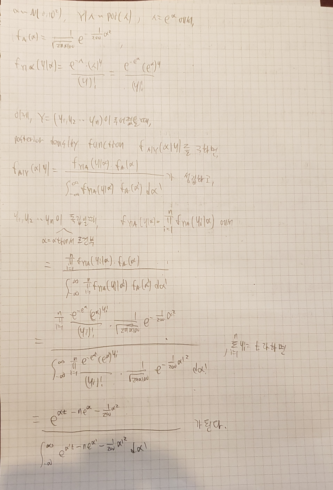

```{r setup, include=FALSE}
knitr::opts_chunk$set(echo = TRUE)
# Dig into the internal representation of R objects
library(Matrix)
library(readr)
library(statmod)
```


$$A^{T} = A^{'}$$
표기의 편의성을 위해,위와같이 표기하였습니다!!!


```{r}
set.seed(123)
```
실행시 똑같은 결과를 보장하기 위해, 위와 같은 시드를 먼저 설정해줍니다.


## Q1. Optimization

### 1-1. 
In the lecture note on optimization, we used step-halving in the Fisher scoring of the Poisson regression analysis of the quarterly count data of AIDS deaths in Australia. Repeat this using Armijo's rule.

lecture note의 코드를 적절히 고치자.


먼저 데이터를 불러온뒤, Armijo's rule에 의해 이 과정을 반복할 것이다.

내부에서 step-halving을 하는 부분만 Armijo's rule을 이용해서 iterate 하도록 바꿔주면 된다.


```{r}
# Quarterly count of AIDS deaths in Australia (from Dobson, 1990)
deaths <- c(0, 1, 2, 3, 1, 4, 9, 18, 23, 31, 20, 25, 37, 45)
(quarters <- seq_along(deaths))
```

데이터는 위와 같다.


Armijo's rule은 parameter로 $\alpha \in (0, 0.5)$, $\beta \in (0, 1)$이 필요하므로, 이를 이용하도록 lecture note의 함수를 수정할 것이다.

또한, 우리의 목적은 log-likelihood function을 maximize하는것이므로 각 iterate마다 값이 증가해야 하는데, log likelihood-function 가 unimodal 하다고 가정하면, (즉, 최대가 되는 값 기준으로 unimodal)
lecture note에 있는 armijo's rule에서 변하는 것은 없고, 단지 $s = \arg\max_{\alpha} f(\mathbf{x}^{(t)} + \alpha \Delta \mathbf{x}^{(t)})$. argmin이 아니라 argmax를 찾으면 된다.

즉, $f(x + t \Delta x) > f(x) + \alpha  t (\nabla f(x) ^ t  \Delta x)$ 인 t를 찾아야 하므로,

while문 내부의 조건이 lecture note와 부등호 방향이 반대가 되어야 한다.

결국 $\beta$에 대해 log-likelihood function을 maximize하는것이 목적이므로,

이를 구하기 위해, $\Delta \mathbf{\beta}^{(t)}$와 $\nabla f(\beta^{(t)})$를 구해야 한다.


또한, 아래 코드에서 log-likelihood의 full-form을 사용하지 않는것을 볼 수 있는데,

이는 $log(y_i)!$이 $\beta$에 따라 변하지 않는 값이므로, maximize 하기 위한 기준에서는 제외해도 되기 때문이다.


우리의 데이터는 $x_i$와 y가 모두 1차원 데이터이므로, 다음과 같이 코드로 구현할 수 있다.


```{r}
# Poisson regression using Fisher scoring (IRLS) and step halving
# Model: lambda = exp(beta0 + beta1 * quarter), or deaths ~ quarter
# Backtracking line search
  # given: descent direction ∆x, x ∈ domf, α ∈ (0,0.5), β ∈ (0,1).


poissonreg_armijo <- function(x, y, maxiter = 10, tol=1e-6, armijo_alpha = 0.4, armijo_beta = 0.5) {
    beta0 <- matrix(0, nrow=2, ncol=1)   # initial point
    betaold <- beta0
    stop <- FALSE
    iter <- 1
    inneriter <- rep(0, maxiter)  # to count no. step halving
    beta <- beta0
    lik <- function(bet) {eta <- bet[1] + bet[2] * x; sum( y * eta - exp(eta) ) } # log-likelihood
    #eta = x_i^t B
    
    # x_i : 2x1 vector, grad : 1 x 2 vector.
    grad_lik <- function(bet){
        grad <- matrix(0, nrow=1, ncol=2)
        eta <- bet[1] + bet[2] * x
        lam <- exp(eta)
        grad[1] <- sum(y - lam)
        grad[2] <- sum(x * (y-lam))
        return(grad)
    }
    
    
    likold <- lik(betaold)
    while ((!stop) && (iter < maxiter)) {
        
        
        eta <- beta[1] + x * beta[2]
        w <- exp(eta)  # lambda
        # line search by step halving
        s <- 1.0
        z <- eta + s * (y / w - 1) # working response
        m <- lm(z ~ x, weights=w)  # weighted least squares
        
        delta_beta <- as.matrix(coef(m)) - beta
        # if delta_beta once getted, it can be used in armjio rule.
        grad_beta <- grad_lik(beta)
        sum_grad_del <- sum(grad_beta %*% delta_beta)
        curlik <- lik(beta + s * delta_beta)
        
        while(lik(beta + s * delta_beta) < lik(beta) + armijo_alpha * s * sum_grad_del)
        # while increase value of likelihood function.
        {
            s <- s * armijo_beta
            inneriter[iter] <- inneriter[iter] + 1
        }
        
        beta <- beta + s * delta_beta
        curlik <- lik(beta)
        # need to update
        
        print(c(as.numeric(beta), inneriter[iter], curlik))
        betadiff <- beta - betaold
        if (norm(betadiff, "F") < tol) stop <- TRUE 
        likold <- curlik
        betaold <- beta
        iter <- iter + 1
    }
    return(list(val=as.numeric(beta), iter=iter, inneriter=inneriter[1:iter]))
}
```

위와 같이 구현하였다. alpha = 0.4, beta = 0.5로 주었다.

```{r}
poissonreg_armijo(quarters, deaths)
```
출력 결과는 위와 같다.

```{r}
m <- glm(deaths ~ quarters, family = poisson())
coef(m)
```

glm으로 구한 likelihood를 maximize하는 beta와 비교해보면, 거의 차이가 없음을 알 수 있다.


### 1-2.
In the same lecture note, it is stated that Poisson regression has the objective function 
$f(\beta) = -\sum_{i=1}^n \left[ y_i \mathbf{x}_i^T \beta - \exp(\mathbf{x}_i^T \beta) - \log(y_i!) \right]$ and its gradient
$$\begin{align*}
	\nabla f(\beta) = -\sum_{i=1}^n \left( y_i \mathbf{x}_i - \exp(\mathbf{x}_i^T \beta)\mathbf{x}_i \right) \\
	= -\sum_{i=1}^n (y_i - \lambda_i) \mathbf{x}_i = -\mathbf{X}^T (\mathbf{y} - \boldsymbol{\lambda})
\end{align*}$$
is *not* Lipschitz continuous. Show this.

두 함수가 $\beta$에 대해 Lipschitz continuous가 아님을 보이기 위해,

함수 f가 $I$에서 정의된 함수일때,

$|f(\beta) - f(\alpha)| \le L|\beta - \alpha| \forall \alpha, \beta \in I$

인 상수 L이 존재하지 않음을 보이자.


위와 같이 보일 수 있다.


## Q2. IRLS

### 2-1. 
A researcher is interested in how variables, such as GRE (Graduate Record Exam scores), GPA (grade point average) and prestige of the undergraduate institution, effect admission into graduate school. The response variable, admit/don’t admit, is a binary variable.

The date is avaialbe at <https://stats.idre.ucla.edu/stat/data/binary.csv>. How to analyze these data can be found in the website <https://stats.idre.ucla.edu/r/dae/logit-regression/>.

Implement the iteratively reweighted least squares (IRLS) algorithm for fitting a logistic regression model, and apply your algorithm to the admission data above. Compare your result with that of 
```{r, eval = FALSE}
glm(admit ~ gre + gpa + rank, data = mydata, family = "binomial")
```

Note that the variable `rank` is categorical data.


먼저, 위 사이트에서 다운로드 받은 데이터를 read.csv를 이용하여 불러올 것이다.


```{r}
mydata <- read.csv("binary.csv")

class(mydata$admit)
class(mydata$gre)
class(mydata$gpa)
class(mydata$rank)
```

불러온 데이터의 타입은 위와 같다.

rank는 categorical data여야하므로 이를 고쳐주자.

```{r}
mydata$rank <- as.factor(mydata$rank)

class(mydata$admit)
class(mydata$gre)
class(mydata$gpa)
class(mydata$rank)
```

이제 타입이 맞는것을 알 수 있다.

IRLS를 하기 위해서, 다음과 같은 모델을 세우자.

$E(y_i|x_i) = g^{-1}(x_i^t \beta)$

link function으로는 canonical link function을 이용할 것이고,

logistic regression에서의 link function은 $g^{-1}(x) = \frac{e^{x}}{1 + e^{x}}$ 이다.

즉, 아래와 같다.
$$
\begin{eqnarray*}
	\mathbf{E} (y_i) = p_i &=& g^{-1}(\eta_i) = \frac{e^{\eta_i}}{1+ e^{\eta_i}} \quad \text{(mean function, inverse link function)} \\
	\eta_i = \mathbf{x}_i^T \beta &=& g(p_i) = \log \left( \frac{p_i}{1-p_i} \right) \quad \text{(logit link function)}.
\end{eqnarray*}
$$

여기서, rank가 categorical data이므로 다음과 같은 형태로 표현할 수 있을것이다.

$x_i^t = (1, x_{i1}, x_{i2}, x_{i3}, x_{i4}, x_{i5}, x_{i6})$

여기서 $x_{i1}$은 i번째 데이터의 gre, $x_{i2}$는 i번째 데이터의 gpa, $x_{i3 \sim i6}$ 은 i번 째 데이터가 rank 1~4에 속하냐의 여부 (0 or 1)이고, 

$\beta ^ {t} = (\beta_0, \beta_1, \beta_2, \beta_3, \beta_4, \beta_5, \beta_6)$ 이 된다.

여기서, rank1에 속하느냐의 여부에 따른 $\beta_3$의 효과는 intercept와 합쳐질 수 있으므로,

최종적인 모델은

$E(y_i|x_i) = g^{-1}(x_i^t \beta)$,


$x_i^t = (1, x_{i1}, x_{i2}, x_{i3}, x_{i4}, x_{i5})$

여기서 $x_{i1}$은 i번째 데이터의 gre, $x_{i2}$는 i번째 데이터의 gpa, $x_{i3 \sim i5}$ 은 i번 째 데이터가 rank 2~4에 속하냐의 여부 (0 or 1)이고, 

$\beta ^ {t} = (\beta_0, \beta_1, \beta_2, \beta_3, \beta_4, \beta_5)$ 이 된다.


이제, 위와 같이 먼저, glm에 의한 결과를 보자.


```{r}
fit.glm <- glm(admit ~ gre + gpa + rank, data = mydata, family = "binomial")
model.matrix(fit.glm)
summary(fit.glm)
res_glm <- coef(fit.glm)
res_glm
```

추정된 beta와 design matrix는 위와 같다.

이제, IRLS를 이용해 같은 모델에서 위와 같이 beta를 추정하는 함수를 짜자.

위와 같은 모델을 사용할 것이고, 편의상 model.matrix함수를 사용하여 위와 같이 정의된 x값들을 얻어낼 것이다.

lecture note에서 알 수 있듯이, 결국 우리의 목적은 loglikelihood function을 최대화 하는 $\beta$를 찾는것이고, loglikelihood function과 미분값들은 아래와 같다.

$$\begin{eqnarray*}
	\ell(\beta) &=& \sum_{i=1}^n \left[ y_i \ln p_i + (1-y_i) \log (1-p_i) \right] \\
	&=& \sum_{i=1}^n \left[ y_i \mathbf{x}_i^T \beta - \log (1 + e^{\mathbf{x}_i^T \beta}) \right] \\
	\nabla \ell(\beta) &=& \sum_{i=1}^n \left( y_i \mathbf{x}_i - \frac{e^{\mathbf{x}_i^T \beta}}{1+e^{\mathbf{x}_i^T \beta}} \mathbf{x}_i \right) \\
	&=& \sum_{i=1}^n (y_i - p_i) \mathbf{x}_i = \mathbf{X}^T (\mathbf{y} - \mathbf{p})	\\
	- \nabla^2\ell(\beta) &=& \sum_{i=1}^n p_i(1-p_i) \mathbf{x}_i \mathbf{x}_i^T = \mathbf{X}^T \mathbf{W} \mathbf{X}, \quad
	\text{where } \mathbf{W} &=& \text{diag}(w_1,\ldots,w_n), w_i = p_i (1-p_i) \\
	\mathbf{I}(\beta) &=& \mathbf{E} [- \nabla^2\ell(\beta)] = \mathbf{X}^T \mathbf{W} \mathbf{X} = - \nabla^2\ell(\beta)
\end{eqnarray*}$$

여기서, W는 y와는 관계없는 식이므로, 아래 등호가 성립하게 된다.


즉, newton method와 fisher scoring이 같으므로, 

logistic regression에서 IRLS는 다음과 같은 과정으로 $\beta^{(t)}$를 구해 나가는 것이 된다.

$$\begin{eqnarray*}
  \beta^{(t+1)} &=& \beta^{(t)} + s[-\nabla^2 \ell(\beta^{(t)})]^{-1} \nabla \ell(\beta^{(t)})    \\
  &=& \beta^{(t)} + s(\mathbf{X}^T \mathbf{W}^{(t)} \mathbf{X})^{-1} \mathbf{X}^T (\mathbf{y} - \mathbf{p}^{(t)}) \\
  &=& (\mathbf{X}^T \mathbf{W}^{(t)} \mathbf{X})^{-1} \mathbf{X}^T \mathbf{W}^{(t)} \left[ \mathbf{X} \beta^{(t)} + s(\mathbf{W}^{(t)})^{-1} (\mathbf{y} - \mathbf{p}^{(t)}) \right] \\
  &=& (\mathbf{X}^T \mathbf{W}^{(t)} \mathbf{X})^{-1} \mathbf{X}^T \mathbf{W}^{(t)} \mathbf{z}^{(t)},
\end{eqnarray*}$$


즉, 위와 같은 과정을 거쳐 다음 beta를 계산해 나가면 된다.


이때, s의 값을 결정하기 위해 line search가 필요한데, line search 중에서 가장 간단한 step-halving method를 사용할것이다.


아래 IRLS 함수는 data와 formula를 받아 beta들의 값을 계산해준다.

maxiter는 iteration method의 최대 실행 횟수, tol은 beta값의 변화가 이 값보다 작으면 iteration을 종료할 조건이고,

inner_iter_max는 내부 step harving의 최대 실행 횟수이다.


```{r}
IRLS <- function(mydata, formula, maxiter = 1000, tol=1e-6, inner_iter_max = 10)
{
    Xmat <- model.matrix(formula, data = mydata) # get model matrix.
    data_num <- attr(Xmat, "dim")[1]
    data_dim <- attr(Xmat, "dim")[2]
    
    
    Xmat <- matrix(Xmat, nrow = data_num, ncol = data_dim)
    # make matrix form. 
    
    name_of_var <- all.vars(formula) # it return all names in formula
    
    y <- mydata[[name_of_var[1]]]
    
    beta0 <- matrix(0, nrow=data_dim, ncol=1)   # initial point
    betaold <- beta0
    stop <- FALSE
    iter <- 1
    beta <- beta0
    
    
    lik <- function(bet)
    {
        eta <- Xmat %*% bet
        return(sum(y * eta) - sum(log(1 + exp(eta))))
    }# log-likelihood
    #eta = x_i^t B
    
    inv_logit <- function(x){
        return(1/(1 + exp(-x)))
    }
    # it is equal to exp(x)/(1 + exp(x)). for numerical stability, I use above term.
    # if x is bigger, then exp(x) ~= 1 + exp(x), which lead to unstability.
    
    
    likold <- lik(betaold)
    while ((!stop) && (iter < maxiter)) {
        eta <- Xmat %*% beta
        p <- inv_logit(eta)
        w <- p*(1-p) #weight.
      
        # line search by step halving
        s <- 1.0
        for (i in seq_len(inner_iter_max)) {
            z <- eta + s * (y - p)/w  # working response
            m <- lm(z ~ Xmat - 1, weights=as.vector(w))  # weighted least squares to get (X'WX)^{-1}X'Wz. we don't need constant-term because Xmat already has constant term. it is equal to solve((t(Xmat) %*% diag(as.vector(w)) %*% Xmat), t(Xmat) %*% diag(as.vector(w)) %*% z)
            beta <- as.matrix(coef(m))
            curlik <- lik(beta)
            if (curlik > likold) break
            s <- s * 0.5
        }
        betadiff <- beta - betaold
        if (norm(betadiff, "F") < tol) stop <- TRUE 
        likold <- curlik
        betaold <- beta
        iter <- iter + 1
    }
    return(unname(beta))
}
```


```{r}
res_irls <- IRLS(mydata, admit ~ gre + gpa + rank)
res_irls
```

결과는 위와 같고, glm의 결과와 비교해보자.

```{r}
res_irls - res_glm
```

거의 값이 비슷한것을 알 수 있다.


## Q3. Newton-Côtes quadrature

### 3-1. 
Write functions `rectangular()`, `trapezoidal()`, and `simpson()`, which evaluates the integral of a given mathematical function taking a single `numeric` argument and returns a `numeric`, using the Riemann rule, the trapezoidal rule, and Simpson's rule, respectively. An example of the function that takes a single `numeric` argument and returns a `numeric` is the R builtin function `exp()`. The three functions should share the same signature: in addition to the integrand, they should take the start and the end points of the interval of integration, and the number of points in subdivision, returning the value of the integral.


rectuangular, trapezoidal, simpson함수를 짜자.

이 함수들은 함수 f, 시작점 a와 끝점 b, 양 끝점을 제외하고 사용하는 추가로 사용하는 점의 개수 n을 받아 해당구간의 근사-적분값을 리턴해준다.

이때, 각 방법은 구간 [a,b]를 n+1개의 subinterval $[x_i,x_{i+1}]$로 나누고, $h = \frac{b-a}{n+1}$ $x_i = a + ih \quad i = 0, 1,... n$ 일때,

$I_i = \int_{x_i}^{x_{i+1}}f(x)dx$를 $\int_{x_i}^{x_{i+1}}p_i(x)dx$ 와 같이 근사하여 (p(x)는 다항식)

$I=\int_a^b f(x)dx = \sum_{i=0}^{n} I_i$을 위와 같이 구한 $I_i$를 이용하여 근사하는 것이다.


먼저, rectangular이다.

근사식은 다음과 같다.

$I_i = \int_{x_i}^{x_{i+1}}f(x)dx \approx \int_{x_i}^{x_{i+1}}f(x_i)dx = (x_{i+1} - x_i)f(x_i) = h f(x_i).$

즉, subinterval의 왼쪽 높이를 기준으로 사각형들을 만들고, (0차 근사) 이 넓이를 다 더해서 근삿값을 구한다.


```{r}
rectangular <- function(f, a, b, n) {
    h <- (b - a) / (n + 1)   
    
    xi <- seq.int(a, b, length.out = n + 2)
    xi <- xi[-length(xi)]
    # get xi. it removes right endpoint of interval, b.
    
    #sum I_0 + ... I_{n} = h(sum(f(x_0) + ... f(x_n))), x_0 = a, x_{n+1} = b

    intgrl <- h * sum(f(xi))
    
    return(intgrl)
}
```


다음은 trapezodial이다.

근사식은 다음과 같다.

$p_i(x) = f(x_i) + \frac{f(x_{i+1}) - f(x_i)}{x_{i+1} - x_i}(x - x_i)$

$I_i = \int_{x_i}^{x_{i+1}}f(x)dx \approx \int_{x_i}^{x_{i+1}}p_i(x)dx = \frac{x_{i+1} - x_i}{2}[f(x_i) + f(x_{i+1})] = \frac{h}{2} [f(x_i) + f(x_{i+1})].$


즉, subinterval의 양쪽 높이를 기준으로 사다리꼴을 만들고, (1차 근사) 이 넓이를 다 더해서 근삿값을 구한다.

```{r}
trapezoidal <- function(f, a, b, n) {
    h <- (b - a) / (n + 1)   
    
    xi <- seq.int(a, b, length.out = n + 2)
    xi <- xi[-1]
    xi <- xi[-length(xi)]
    # get xi. it removes right endpoint of interval, b.
    
    #sum I_0 + ... I_{n} = h/2 * (f(x_0) + 2f(x_1) + .. + 2f(x_n) + f(x_n+1), x_0 = a, x_n+1 = b

    intgrl <- h * (0.5 * f(a) + sum(f(xi)) + 0.5 * f(b))
    
    return(intgrl)
}
```


다음은 simpson이다.

구간 $[x_i, x_{i+1}$에서 ,$(x_i, f(x_i))$, $\left(\frac{x_i + x_{i+1}}{2}, f\left(\frac{x_i + x_{i+1}}{2}\right)\right)$, $(x_{i+1}, f(x_{i+1}))$을 지나는 2차함수로 f(x)를 근사하게 된다.

즉, 근사식은 다음과 같다.

$$\begin{align*}
    p_i(x) &= f(x_i)\frac{x - \frac{x_i + x_{i+1}}{2}}{x_i - \frac{x_i + x_{i+1}}{2}}\frac{x - x_{i+1}}{x_i - x_{i+1}} \\
    & + f\left(\frac{x_i + x_{i+1}}{2}\right)\frac{x - x_i}{\frac{x_i + x_{i+1}}{2} - x_i}\frac{x - x_{i+1}}{\frac{x_i + x_{i+1}}{2} - x_{i+1}} \\
    & + f(x_i)\frac{x - x_i}{x_{i+1} - x_i}\frac{x - \frac{x_i + x_{i+1}}{2}}{x_{i+1} - \frac{x_i + x_{i+1}}{2}}
\end{align*}$$


$$I_i = \int_{x_i}^{x_{i+1}}f(x)dx \approx \int_{x_i}^{x_{i+1}}p_i(x)dx = \frac{h}{6} \left[f(x_i) + 4f\left(\frac{x_i + x_{i+1}}{2}\right) + f(x_{i+1})\right]$$


이때, 우리의 구현상 근삿값을 구할때 사용하는 내부 점의 개수가 n개여야 하므로,

약간의 변형이 필요하다.

먼저, 계산시 사용하는 내부점이 짝수개면 위와 같은 방법을 사용 할 수 없으므로, 내부점이 홀수가 아니면 내부점을 홀수로 맞추도록 하고 (개수에서 하나를 빼줌), 

그 후 전체 구간을 n+1개가 아닌 (n+1/2) 개의 구간으로 나눠주고 위와 같은 방법을 사용하면, 내부 점을 n개만 사용해서 근삿값을 구할 수 있게 된다.

(구간이 n개일때, 위 방법은 2n + 1개의 점을 계산에 사용하고, 즉, 내부 점은 2n - 1개를 계산에 사용한다.)
(따라서, 구간의 개수가 (n+1)/2개여야 내부 n개의 점만 계산에 사용하게 된다.)

즉, 결론적으로 [n+1/2] 개의 구간을 사용하면 된다. 여기서 [x]는 x보다 작거나 같은 가장 큰 정수이다.


```{r}
simpson <- function(f, a, b, n) {
    interval_num = (n+1) %/% 2  
  
    
    
    h <- (b - a) / interval_num
    i <- seq_len(interval_num - 1)
    xi <- a + i * h 
    # get xi. it removes endpoint of interval, a, b
    xmid <- c(xi - h / 2, b - h / 2)
    # get xmid, midpoint of xi. it removes endpoint of interval, a, b

    
    #sum I_0 + ... I_{n} = h/6 * (f(x_0) + 4f({x_0 + x_1}/2) +2f(x_1) + 4f({x_1 + x_2}/2) + 2f(x_2) + ...   .. + 4f({x_n-1 + x_n}/2) + f(x_n+1)) x_0 = a, x_{n+1} = b
    
    intgrl <- h * (f(a) + 2 * sum(f(xi)) + 4 * sum(f(xmid)) + f(b)) / 6
   
    return(intgrl)
}

```

예시로 사용할 함수는 다음과 같다.


```{r}
ex_func <- function(x)
{
    return(exp(x))
}
```


subdivision 내부의 점의 개수 n을 바꿔가면서, 위 함수들의 값을 비교해보자.


먼저, 0~1에서의 $e^x$의 적분값이다. 이 적분값이 $e - 1$임을 잘 알고있다.

n=10일때를 비교해보자.

```{r}
true_val <- exp(1) - 1
true_val

rectangular(ex_func,0,1,10)
trapezoidal(ex_func,0,1,10)
simpson(ex_func,0,1,10)
```

고차다항식의 근사를 이용할 수록 더 값이 참값에 가깝게 계산됨을 알 수 있다.

n=30을 주고 비교해보자.

```{r}
rectangular(ex_func,0,1,30)
trapezoidal(ex_func,0,1,30)
simpson(ex_func,0,1,30)
```

simpson method는 거의 참값에 가까운 값을, trapezodial은 근사적으로 가까운 값을, rectangular의 경우 참값과 아직 꽤 먼값을 가지고 있음을 알 수 있다.

즉, simpson, trapezodial, rectangular 순으로 성능이 좋음을 알 수 있다.


### 3-2. 
Write a function `integral(f, a, b, n, method)` that evaluates the integral of function `f` from `a` to `b` using `n`-point subdivision and numerical integration method `method`. The value of `method` can be either `rectangular`, `trapezoidal`, or `simpson`. Your implementation **must not use `switch`**. Instead, use function objects. Write two versions of each function so that one uses `for` (or `while`) loop and the other vectorizes as many as computation as possible. Put your loopy functions in `integral_loops.R` and vectorized functions in `integral_vec.R`.


forloop을 사용한 버전과, vectorized된 버전을 모두 작성해보자.

3-1과 같이 작성한 함수들은 모두 vectorized된 버전이므로, for-loop을 이용하는 버전을 모두 작성하고, 이를 이용해서 integral을 해주는 함수를 짜자.

여기서, method를 function object를 직접 이용해서 받아야 하므로, 다음과 같이 매우 간편하게 integral함수를 구현할 수 있다.


```{r}
integral <- function(f, a, b, n ,method)
{
    return(method(f,a,b,n))
}
```

각각의 for-loop 버전과 vectorize된 버전은 다음과 같다.

vectorize된 버전은 3-1의 함수를 그대로 사용한다. 최대한 vectorized된 버전이다.

for-loop version은 최대한 많은 for loop을 사용하도록 하겠다. (최대한 비효율적으로 구현하겠다)

```{r}
rectangular_vec <- function(f, a, b, n) {
    h <- (b - a) / (n + 1)   
    
    xi <- seq.int(a, b, length.out = n + 2)
    xi <- xi[-length(xi)]
    # get xi. it removes right endpoint of interval, b.
    
    #sum I_0 + ... I_{n} = h(sum(f(x_0) + ... f(x_n))), x_0 = a, x_{n+1} = b

    intgrl <- h * sum(f(xi))
    
    return(intgrl)
}

rectangular_for <- function(f, a, b, n) {
    h <- (b - a) / (n + 1)   
    
    xi <- vector(length = n)
    
    for(i in seq_len(n))
    {
       xi[i] <- a + i*h
    }
    
    # get xi. it removes endpoint of interval, a, b.
    
    #sum I_0 + ... I_{n} = h(sum(f(x_0) + ... f(x_n))), x_0 = a, x_{n+1} = b
    
    intgrl <- f(a)
    
    for(i in seq_len(n))
    {
       intgrl <- intgrl + f(xi[i])
    }

    intgrl <- h * intgrl
    
    return(intgrl)
}

trapezoidal_vec <- function(f, a, b, n) {
    h <- (b - a) / (n + 1)   
    
    xi <- seq.int(a, b, length.out = n + 2)
    xi <- xi[-1]
    xi <- xi[-length(xi)]
    # get xi. it removes right endpoint of interval, b.
    
    #sum I_0 + ... I_{n} = h/2 * (f(x_0) + 2f(x_1) + .. + 2f(x_n) + f(x_n+1), x_0 = a, x_n+1 = b

    intgrl <- h * (0.5 * f(a) + sum(f(xi)) + 0.5 * f(b))
    
    return(intgrl)
}

trapezoidal_for <- function(f, a, b, n) {
    h <- (b - a) / (n + 1)   
    
    
    xi <- vector(length = n)
    
    for(i in seq_len(n))
    {
       xi[i] <- a + i*h
    }
    
    # get xi. it removes endpoint of interval, a, b.
    
    #sum I_0 + ... I_{n} = h/2 * (f(x_0) + 2f(x_1) + .. + 2f(x_n) + f(x_n+1)), x_0 = a, x_n+1 = b
    
    intgrl <- (f(a) + f(b))/2
    
    for(i in seq_len(n))
    {
       intgrl <- intgrl + f(xi[i])
    }

    intgrl <- h * intgrl
    
    return(intgrl)
}

simpson_vec <- function(f, a, b, n) {
    interval_num = (n+1) %/% 2  
  
    
    
    h <- (b - a) / interval_num
    i <- seq_len(interval_num - 1)
    xi <- a + i * h 
    # get xi. it removes endpoint of interval, a, b
    xmid <- c(xi - h / 2, b - h / 2)
    # get xmid, midpoint of xi. it removes endpoint of interval, a, b

    
    #sum I_0 + ... I_{n} = h/6 * (f(x_0) + 4f({x_0 + x_1}/2) +2f(x_1) + 4f({x_1 + x_2}/2) + 2f(x_2) + ...   .. + 4f({x_n-1 + x_n}/2) + f(x_n+1)) x_0 = a, x_{n+1} = b
    
    intgrl <- h * (f(a) + 2 * sum(f(xi)) + 4 * sum(f(xmid)) + f(b)) / 6
   
    return(intgrl)
}

simpson_for <- function(f, a, b, n) {
    interval_num = (n+1) %/% 2  
    h <- (b - a) / interval_num
    
    xi <- vector(length = interval_num - 1)
    xmid <- vector(length = interval_num)
    
    for(i in seq_len(n))
    {
       xi[i] <- a + i*h
    }
    
    for(i in seq_len(interval_num - 1))
    {
        xi[i] <- a + i*h # get xi. it removes endpoint of interval, a, b
        xmid[i] <- xi[i]-(h / 2)
    }
    
    xmid[interval_num] = b - h / 2
    # get xmid, midpoint of xi. it removes endpoint of interval, a, b
    
    #sum I_0 + ... I_{n} = h/6 * (f(x_0) + 4f({x_0 + x_1}/2) +2f(x_1) + 4f({x_1 + x_2}/2) + 2f(x_2) + ...   .. + 4f({x_n-1 + x_n}/2) + f(x_n+1)) x_0 = a, x_{n+1} = b
    
    intgrl <- f(a) + f(b) + 4 * f(xmid[interval_num])
    
    for(i in seq_len(interval_num - 1))
    {
       intgrl <- intgrl + 2 * f(xi[i]) + 4 * f(xmid[i])
    }
    
    intgrl <- intgrl * h / 6
   
    return(intgrl)
}
```


동작이 같음을 보이기 위해, 다음과 같이 비교해 볼 수 있다.

```{r}
integral(ex_func, 0, 1, 10 ,rectangular_vec)
integral(ex_func, 0, 1, 10 ,rectangular_for)
integral(ex_func, 0, 1, 10 ,trapezoidal_vec)
integral(ex_func, 0, 1, 10 ,trapezoidal_for)
integral(ex_func, 0, 1, 10 ,simpson_vec)
integral(ex_func, 0, 1, 10 ,simpson_for)
```

결과가 같음을 알 수 있다.


### 3-3.
Use your function to evaluate $\int_0^2 e^{-x}dx$ and discuss its accuracy.

위 값은 적분을 통해 $1 - e^{-2}$와 같음을 알 수 있다.

각각 n을 바꿔가면서, 근사된 적분값을 구해보자.

```{r}
three_func <- function(x){
  return(exp(-x))
}

true_val <- 1 - exp(-2)

true_val


integral(three_func, 0, 2, 5 ,rectangular)
integral(three_func, 0, 2, 5 ,trapezoidal)
integral(three_func, 0, 2, 5 ,simpson)

integral(three_func, 0, 2, 7 ,rectangular)
integral(three_func, 0, 2, 7 ,trapezoidal)
integral(three_func, 0, 2, 7 ,simpson)


integral(three_func, 0, 2, 10 ,rectangular)
integral(three_func, 0, 2, 10 ,trapezoidal)
integral(three_func, 0, 2, 10 ,simpson)
```

n = 5일때, n = 7일때, n = 10일때 순으로 true value와 근사된 값들을 비교해보면, simpson method, trapezoidal, rectangular method 순으로 정확도가 높음을 알 수 있다.

이는, lecture note에도 나와있듯이 subinterval의 개수를 n이라 할때, rectangular method의 오차는 $O(n^{-1})$, trapezoidal method의 오차는 $O(n^{-2})$,  simpson method의 오차는 O(n^{-4})에 비례하기 때문이다.

물론, lecture note에서의 simpson method의 오차는, subinterval의 개수가 n개일때의 상황에서의 오차를 계산한 것이므로,

우리가 구현했던것처럼 추가로 사용했던 점의 개수가 n개인 케이스에 대해 다시 바꿔 계산하면, $[\frac{n+1}{2}] \approx \frac{n}{2}$개의 구간으로 전체 구간을 나누므로,

n 대신 $\frac{n}{2}$ 개의 구간을 사용해야 한다.

그렇게 오차를 구해도, simpson method의 오차는 $O(\frac{n}{2}^{-4}) = O(n^{-4})$로, order 자체는 바뀌지 않음을 알 수 있다.

즉, 위 세가지 method중, simpson method의 오차가 가장 적은것은 이러한 이유 때문이다.


따라서, simpson method는 n으로 50정도만 사용해도 거의 정확한 값을 얻을 수 있을것이다.

```{r}
true_val - integral(three_func, 0, 2, 50 ,simpson)
```

오차범위가 $10^{-8}$정도임을 알 수 있다. 즉, 거의 정확한 값을 구할 수 있음을 알 수 있다.


### 3-4.
Use your function to evaluate $\int_1^{\infty}e^{-x}x^{-1/2}dx$. Note the length of the integration interval is infinite. Use the transformation $t=1/x$ to make the interval finite. Despite of this change of variable, there remains a problem. Specify what it is and how you solved this problem.

$t=1/x$로 치환하면, 위 식은 아래와 같다.

$\int_1^{\infty}e^{-x}x^{-1/2}dx$ = $\int_0^{1}e^{-1/t}t^{-3/2}dt$

즉, 이에 해당하는 함수를 정의하고, 이를 이용해 적분을 시도해보자.


```{r}
four_func <- function(x)
{
   return(exp(-1/x) *( x**(-3/2) ))
}

integral(four_func, 0, 2, 50 ,rectangular)
integral(four_func, 0, 2, 50 ,trapezoidal)
integral(four_func, 0, 2, 50 ,simpson)
```

모두 NaN을 출력하는것을 알 수 있다.

이는 위에서 정의된 함수가 $t = 0$에서 정의되지 않기 때문이다.

따라서, 이를 고쳐주기 위해서는 우리가 구현한, interval의 bound에서 함숫값이 존재하지 않을때의 경우를 처리해 주도록 바꿔줄 필요가 있다.

양쪽 bound에서 값이 존재하지 않는경우에 한해서, rectangular method의 idea를 차용해서, 왼쪽 bound의 값이 존재하지 않거나 오른쪽 bound의 값이 존재하지 않으면, 각 bound와 가장 가까운 subinterval point를 활용하여 rectangular-근사를 활용한다.


즉, [a,b] interval이 $[x_0, x_1], ... [x_{n-1}, x_n]$, $x_0 = a, x_n = b$인 경우, f(x_0)의 값이 존재하지 않으면,

$I_0 = \int_{x_0}^{x_1} f(x)dx \approx h *f(x_1)$, f(x_n)의 값이 존재하지 않으면

$I_{n-1} = \int_{x_{n-1}}^{x_n} f(x)dx \approx h * f(x_{n-1})$ 로 근사하여 해결한다.


위의 integral 함수를 아래와 같이 개선하자. is.finite 함수를 이용해 bound에서 값이 존재하는지를 확인한다.


```{r}
adv_integral <- function(f, a, b, n ,method)
{
    h <- (b - a) / (n + 1)
    if(is.finite(f(a)) && is.finite(f(b))) # bound has no problem
    {
       return(method(f,a,b,n))
    }
    else if(is.finite(f(a))) # b has problem
    {
       return(h * f(b-h) + method(f,a,b-h,n-1))
    }
    else if(is.finite(f(b))) # a has problem
    {
        return(h * f(a+h) + method(f,a+h,b,n-1))
    }
    else # both bound has problem
    {
        return(h * (f(a+h) + f(b-h)) + method(f,a+h, b-h, n-2))
    }
}
```


이제, 위 함수의 값을 근사할 수 있다.

```{r}
adv_integral(four_func, 0, 2, 50 ,rectangular)
adv_integral(four_func, 0, 2, 50 ,trapezoidal)
adv_integral(four_func, 0, 2, 50 ,simpson)
```

위와 같이 잘 구해짐을 알 수 있다.

## Q4. Gauss-Hermite quadrature

### 1.
Suppose $y_1, \dotsc, y_n$ are a random sample from a Poisson distribution with mean $\lambda=\exp(\alpha)$. Suppose the prior on $\alpha$ is $\mathcal{N}(0,100)$. The observed data are
$$
11, 19, 27, 12, 14, 11, 10, 13, 15, 10.
$$
Use Gauss-Hermite quadrature to evaluate the mean and variance of the posterior distribution of $\alpha$. Remember to make a change of variables in the integeral, if appropriate, before applying the quadrature formaulas. Give some discussion of the accuracy of these calculations. Use the function `guass.quad()` available in the R package `statmod`.





따라서, 위를 이용해서 gaussian quadrature 방법을 이용해 density와 평균, 분산을 구하자.


```{r}
y <- c(11,19,27,12,14,11,10,13,15,10)
sum_y <- sum(y)
n <- length(y)
```

먼저, y를 입력하고 y의 합과 n을 구하고, 


```{r}
func_g <- function(x) {
    return(exp(x * sum_y - n * exp(x) + (199/200) * (x ** 2)))
}

func_g1 <- function(x) {
    return(x * exp(x * sum_y - n * exp(x) + (199/200) * (x ** 2)))
}

func_g2 <- function(x) {
    return((x ** 2) * exp(x * sum_y - n * exp(x) + (199/200) * (x ** 2)))
}

```

이제, 위를 이용해서 각각 평균과 분산을 근사할 수 있다.

gauss.quad(n, "hermite")를 이용하면, n차 헤르미트 다항식의 근과 각 근에 해당하는 weight를 구해준다.

즉, 근사에 사용할 $x_i ,w_i$들을 만들어준다.

이제, 이를 이용하여 평균과 분산을 구해주는 함수를 짜보자.


원래 함수를 차수가 높은 다항식으로 근사할수록 훨씬 더 정확한 값을 뽑을 수 있을것이므로, 

다음 함수는 posterior distribution의 평균과 분산을, 몇차까지 근사할것인가를 이용하는 n을 받아서 계산해준다.


```{r}
mean_of_pos <- function(n){
    hermite <- gauss.quad(n, 'hermite')
    denominator <- sum(func_g(hermite$nodes) * hermite$weights)
    numerator <- sum(func_g1(hermite$nodes) * hermite$weights)
    
    return(numerator / denominator)
}

var_of_pos <- function(n){
    hermite <- gauss.quad(n, 'hermite')
    denominator <- sum(func_g(hermite$nodes) * hermite$weights)
    numerator <- sum(func_g2(hermite$nodes) * hermite$weights)
    
    pos_mean <- mean_of_pos(n)
    pos_2nd_moment <- numerator / denominator
    return(pos_2nd_moment - pos_mean^2)
}
```


이제, 10차, 100차, 1000차 다항식을 이용, 근사된 값을 각각 출력해보자.

```{r}
mean_of_pos(10)
mean_of_pos(100)
mean_of_pos(1000)
```

```{r}
var_of_pos(10)
var_of_pos(100)
var_of_pos(1000)
```

이 값들이 정확한 값인지를 알아보기 위해, R 내장함수인 integrate함수를 이용해 계산한 적분값과 비교해보자.


다음 함수는 g에서 $e^{-x^2}$을 곱한 결과를 리턴한다. 즉, gauss-hermite 근사를 사용하지 않는, 원 형태의 함수를 리턴해준다.


```{r}
func_f <- function(x) {
    return(exp(x * sum_y - n * exp(x) - (1/200) * (x ** 2)))
}

func_f1 <- function(x) {
    return(x * exp(x * sum_y - n * exp(x) - (1/200) * (x ** 2)))
}

func_f2 <- function(x) {
    return((x ** 2) * exp(x * sum_y - n * exp(x) - (1/200) * (x ** 2)))
}
```

위 함수를 이용해서, R 내장 함수인 integrate를 통해 -inf~inf 까지 적분값의 근삿값을 구하자.

적분구간이 무한이라, 오차가 크긴 하지만 그래도 이용할수는 있다.

```{r}
denom <- integrate(func_f,-Inf,Inf)$value
numer_1 <- integrate(func_f1,-Inf,Inf)$value
numer_2 <- integrate(func_f2,-Inf,Inf)$value


true_mean <- numer_1 / denom
true_var <- (numer_2 / denom) - true_mean^2

true_mean
true_var
```


위에서의 실행결과와 비교해보면, 높은 차수의 polynomial로 근사했을때 값이 거의 같음을 알 수 있다.


즉, 높은 차수의 polynomial로 근사했을때 오차가 작아지는것을 알 수 있는데, 이는 가우스-헤르미트 적분을 이용할때, 원 함수를 2m+1차 polynomial로 근사한 결과를 이용하기 때문이다.

즉, 원래 함수가 2m+1차 polynomial 이라 가정하고 적분의 근삿값을 구하므로, 원래 함수가 이에 가까울수록 정확한 결과가 나오게 된다.

여기에서의 적분 대상함수는 $g(x) = exp(xt - ne^x + \frac{199}{200}x^2)$와 $g_1(x) = xg(x), g_2(x) = x^2g(x)$에서,

g(x)는 무한번 미분가능한 함수임을 아므로, 테일러 전개에 의해

$g(x) = g(0) + g'(0)x + \frac{1}{2!} g''(0) + ... = \sum_{i=0}^{\infty}\frac{g^{(i)}(0)}{i!}x^i$ 와 같아진다.

따라서, 충분히 높은 차수의 다항식을 이용하면, g(x)과 매우 비슷하게 근사할 수 있고,

즉, $g(x) = \sum_{i=0}^{k}\frac{g^{(i)}(0)}{i!}x^i + \frac{g^{(k+1)}(0)}{(k+1)!}c^{k+1}$, c는 0과 x 사이에 있는 값과 같고,

따라서 높은 차수의 polynomial을 g(x)로 근사한다면, 그 polynomial을 p(x)라 하면 p의 차수가 k차일때

$|g(x) - p(x)| = |\frac{g^{(k+1)}(0)}{(k+1)!}c^{k+1}| \le  |\frac{g^{(k+1)}(0)}{(k+1)!}x^{k+1}|$ 가 되고,

스털링 근사에 의해 $n! \approx \sqrt(2 \pi n) (\frac{n}{e})^n$에서, $n! >= (\frac{n}{e})^n$을 이용하면

$|g(x) - p(x)| = |\frac{g^{(k+1)}(0)}{(k+1)!}c^{k+1}| \le  |\frac{g^{(k+1)}(0)}{(k+1)!}x^{k+1}| \le |\frac{g^{(k+1)}(0)}{(k+1)^{k+1}}(xe)^{k+1}|$ 가 되어, $|g^{(k+1)}(0)|$의 증가양상이 최대 지수함수적이라 하면, 즉 $|g^{(k)}(0)| \le |a^k|$인 a가 존재한다 하면, 우변이 0으로 수렴하므로 충분히 k가 커지면 비슷하게 근사되게 된다.


따라서, k가 커질수록 모든 구간에서 g(x)와 p(x)가 비슷해지므로, 위의 가우스-헤르미트 적분값이 참값에 가까워 질 것임을 알 수 있다.
