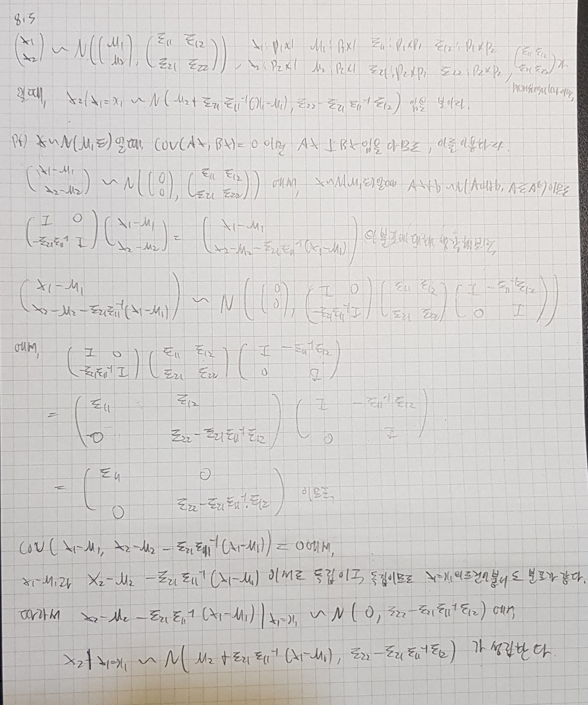
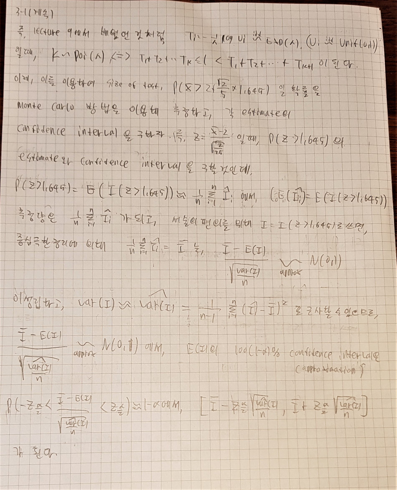

```{r setup, include=FALSE}
knitr::opts_chunk$set(echo = TRUE)
# Dig into the internal representation of R objects
library(Matrix)
library(readr)
library(statmod)
```


$$A^{T} = A^{'}$$
표기의 편의성을 위해,위와같이 표기하였습니다!!!


```{r}
set.seed(123)
```
실행시 똑같은 결과를 보장하기 위해, 위와 같은 시드를 먼저 설정해줍니다.


## Q1. Textbook problem

### 8-2.

이 방법은 매우 적절하지 않다.

크게는 다음과 같이 2가지의 문제점이 있다.

1. U(0,1)의 분포를 만들어야 하는데, 이 방법으로는 0.00~0.99까지의 수만 만들 수 있으므로, U(0,1)의 분포라고 보기에는 너무 coarse한 난수들이 나온다.

2. 만들어진 난수들이 서로 correlate되어있다. 즉, $X_i \sim U(0,1)$인, 서로 indep한 $X_1, X_2,... X_{10}$들을 만드는것이 목적인데,

이렇게 만들어진 $X_1 \sim X_{10}$인 10개의 난수들은 서로 independent 
하지 않고, $X_1$의 값이 정해지면 나머지 난수들의 값도 모두 특정할 수 있게 되므로, independent하지 않다는 큰 문제점이 있다.

### 8-3.



위와같이, 정규분포에서의 조건부 분포를 구할 수 있다.

이제, $\Sigma = (\sigma_{ij})_{i = 1,2...p, j = 1,2...p}$,

$X \sim N_p(0, \Sigma)$일때, X에 해당하는 난수를 만들어보자.

먼저, $X = (X_1, X_2 ... X_p)^t$라 할때,

$X_1 \sim N(0, \sigma_{11})$임을 알고, 이를 만들 수 있다.

그 후, 위의 정리를 사용하여 $X_2|X_1$을 구하면,

$$\begin{pmatrix} 
   X_1 \\
   X_2 
\end{pmatrix} \sim N_2(\begin{pmatrix} 
   0 \\
   0  
\end{pmatrix}, \begin{pmatrix} 
   \sigma_{11}  & \sigma_{12}  \\
   \sigma_{21}  & \sigma_{22}  
\end{pmatrix})$$
에서,

$$X_2|_{X_1 = x_1} \sim N(\sigma_{21} \sigma_{11}^{-1} x_1, \sigma_{22} - \sigma_{21} \sigma_{11}^{-1} \sigma_{12})$$
이므로, 위와 같이 표현가능하다.

마찬가지로, 
$$\begin{pmatrix} 
   X_1 \\
   X_2 \\
   ... \\
   X_k
\end{pmatrix} \sim N_k(\begin{pmatrix} 
   0 \\
   0 \\
   ... \\
   0
\end{pmatrix}, \begin{pmatrix} 
   \Sigma_{11}  & \Sigma_{12}  \\
   \Sigma_{21}  & \Sigma_{22}  
\end{pmatrix})$$

라 하면 ($\Sigma_{22}$는 1 x 1,  $\Sigma_{21}$ 은 1 x (k-1), $\Sigma_{12}$ 는 (k-1) x 1, $\Sigma_{11}$ 은 (k-1) x (k-1) matrix)


$$X_k|_{X_1,X_2...X_{k-1} = (x_1, x_2, ... x_{k-1})} \sim
N(\Sigma_{21}\Sigma_{11}^{-1}\begin{pmatrix} 
   x_1 \\
   x_2 \\
   ... \\
   x_{k-1}
\end{pmatrix}, \Sigma_{22} - \Sigma_{21} \Sigma_{11}^{-1} \Sigma_{12})$$

이 성립하므로, 따라서 위와 같은 과정을 통해 $X_1, X_2... X_p$를 만드는 코드를 구현해보자. r 내장함수인 rnorm을 이용한다.

다음 함수는 multivarate normal의 차원인 p와 분산행렬을 받아 위 방법대로 sampling한 p개의 random variable을 리턴해준다.

이때, 분산행렬이 nonsingular해야만 한다. nonsingular 하지 않으면 에러가 난다.

```{r}
rand_normal <- function(p, sigma)
{
    rand_val <- vector(length = p)
    rand_val[1] <- rnorm(n = 1, mean = 0, sd = sqrt(sigma[1,1]))
    
    for(i in 1 + seq_len(p-1)) # 2~p
    {
        sigma_11 <- matrix(sigma[1:(i-1),1:(i-1)], nrow = i-1, ncol = i-1)
        sigma_12 <- matrix(sigma[1:(i-1),i], nrow = i-1, ncol = 1)
        sigma_21 <- matrix(sigma[i,1:(i-1)], nrow = 1, ncol = i-1)
        sigma_22 <- sigma[i,i]
        
        mean_of_cond <- sigma_21 %*% solve(sigma_11, rand_val[1:(i-1)])
        var_of_cond <- sigma_22 - sigma_21 %*% solve(sigma_11, sigma_12)
        rand_val[i] <- rnorm(n = 1, mean = mean_of_cond, sd = sqrt(var_of_cond)) 
    }
    
    return(rand_val)
}


```


사용례는 다음과 같다.

```{r}
my_ranval <- rand_normal(100, diag(100))
r_ranval <- rnorm(100,0,1)

summary(my_ranval)
summary(r_ranval)
```

값이 잘 생성됨을 알 수 있다.


### 8-4.


## Q2. Acceptance-rejection sampling

Suppose we want to generate samples from a Beta($\alpha$,$\beta$) distribution, whose density is given by $$ f(x) = \frac{x^{\alpha-1}(1-x)^{\beta-1}}{B(\alpha,\beta)}~~(0<x<1), \quad B(\alpha,\beta) = \int_0^1 x^{\alpha-1}(1-x)^{\beta-1}dx. $$

### 2-1. 
Write an acceptance-rejection sampling algorithm for generating a Beta random variable, in which two independent uniform random variables are generated and the density function is explicitly used.


### 2-2. 
Find the probability of acceptance of the algorithm in part 1. Evaluate $M$ that maximizes the probabilty of acceptance in case of $\alpha=2$ and $\beta=2$. Implement the algorithm of part 1 with this value of $M$ and estimate the acceptance probability.


이제, 2-1과 위의 결과를 이용해서 알고리즘을 구현하자.

다음과 같이 구현할 수 있다.


```{r}
sample_beta_2_2 <- function()
{
   while(TRUE)
   {
      x <- runif(1, min = 0, max = 1) #sample x
      u <- runif(1, min = 0, max = 1) #sample u
      beta_x <- 6 * x * (1-x)
      if(u <= (beta_x / (1.5))) # u <= f(x)/h(x) = f(x)/c, c = 3/2
      {
         return(x);
      }
   }
}

```


```{r}
sample_beta_2_2()
```


2-1에서 써놓은것과 같이, unif(0,1)을 따르는 X를 sampling하고,
unif(0,1)을 따르는 U를 sampling 한 다음,

$U <= f(X)/h(X) = f(X)/c, c = M = \frac{3}{2}$ 이면 X를 accept하고,
그렇지 않을경우 X를 reject하고 다시 처음부터 과정을 진행하는 알고리즘을 가진다.

이제, 위 함수를 변형하여, probability of acceptance를 estimate하는 함수를 만들어보자.

```{r}
estimate_acceptance_beta_2_2 <- function(n)
{
   
   x <- runif(n, min = 0, max = 1) #sample x
   u <- runif(n, min = 0, max = 1) #sample u
      
   beta_x <- 6 * x * (1-x)
   prob <- (u <= (beta_x / 1.5))
   prob <- sum(prob)/n
   return(prob)
}
```

위 함수는, n개의 데이터를 이용하여 위 알고리즘을 통해, 실제로 accept된 개수를 계산한다.

결과는 다음과 같다.

```{r}
estimate_acceptance_beta_2_2(100)
estimate_acceptance_beta_2_2(1000)
estimate_acceptance_beta_2_2(10000)
estimate_acceptance_beta_2_2(1000000)
```

더 많은 개수의 sample을 가지고 test할때, 우리가 계산한 값인 $\frac{2}{3}$에 가까워 지는것을 알 수 있다.


### 2-3. 
alternative method of generating a Beta random variable is to generate two independent random variables $U$ and $V$ from Unif$[0,1]$, and take ${U^{1/\alpha}}/(U^{1/\alpha}+V^{1\beta})$ only when $U^{1/\alpha}+V^{1/\beta} \le 1$. Evaluate the probability of acceptance of this strategy when $\alpha=\beta=2$. Compare your result with that of part 2. Implement this method and estimate the acceptance probability.


part 2에서는 probablity of acceptance가 $\frac{2}{3}$이었지만, 
3에서는 $\frac{1}{6}$으로, 꽤 낮음을 알 수 있다.

이제 이 방법을 이용하여 sampling하는 함수와, probability of acceptance를 estimate하는 함수를 짜자.

다음과 같이 구현할 수 있다.

```{r}
sample_beta_alter_2_2 <- function()
{
   while(TRUE)
   {
      u <- runif(1, min = 0, max = 1) #sample u
      v <- runif(1, min = 0, max = 1) #sample v
      if((sqrt(u) + sqrt(v)) <= 1) # if acceptance..
      {
         x <- sqrt(u)/(sqrt(u) + sqrt(v)) # u^(1/alpha) / (u^(1/alpha) + v^(1/beta)), alpha = 2, beta = 2
         return(x);
      }
   }
}

```

```{r}
estimate_acceptance_beta_alter_2_2 <- function(n)
{
   
   u <- runif(n, min = 0, max = 1) #sample u
   v <- runif(n, min = 0, max = 1) #sample v
      
   accept <- sqrt(u) + sqrt(v)
   prob <- (accept <= 1)
   prob <- sum(prob)/n
   return(prob)
}
```

```{r}
sample_beta_alter_2_2()
estimate_acceptance_beta_alter_2_2(100)
estimate_acceptance_beta_alter_2_2(1000)
estimate_acceptance_beta_alter_2_2(10000)
estimate_acceptance_beta_alter_2_2(1000000)
```

더 많은 sample에 대해 test 할수록, 우리가 구했던 확률 1/6에 가까워짐을 알 수 있다.


## Q3. Importance sampling

Consider testing the hypotheses $H_0: \lambda=2$ versus $H_a: \lambda>2$ using 25 observations from a Poisson($\lambda$) model. Rote application of the central limit theorem would suggest rejecting $H_0$ at $\alpha=0.05$ when $Z > 1.645$, where $Z = \frac{\bar{X}-2}{\sqrt{2/25}}$.

### 3-1. 
Estimate the size of this test (i.e., the type I error rate) using three Monte Carlo approaches: standard, antithetic, (unstandardized) importance sampling. Provide a confidence interval for each estimate. Discuss the relative merits of each variance reduction technique.

For the importance sampling approach, use a Poisson envelope ($h$ in the course notes) with mean equal to the $H_0$ rejection threshold, namely $\lambda = 2.4653$.





이제, 위와 같은 방법으로 각 estimate와 estimate의 confidence interval을 구하자.

먼저, 다음과 같이 poisson distribution의 random variable을 sample하는 함수를 짜자.

lambda를 받아 해당하는 poisson random variable을 생성한다.

```{r}
sample_poi <- function(lambda)
{
   t_cum <- 0
   k <- 0
   while (TRUE) {
        u <- runif(1)
        t <- -1/lambda * log(u)
        t_cum <- t_cum + t
        
        if(t_cum <= 1)
        {
           k <- k + 1
        }
        else
        {
           break
        }
        
   }
   
   return(k)
}

```

다음은 antithetic variable method에서 쓰일 random variable generator다.서로 cov가 음수인 poisson random variable 2개를 리턴한다.

```{r}
sample_ae_poi <- function(lambda)
{
   t_cum <- 0
   r_cum <- 0
   k1 <- 0
   k2 <- 0
   while (TRUE) {
      
        u <- runif(1)
        t <- -1/lambda * log(u)
        r <- -1/lambda * log(1-u)
        t_cum <- t_cum + t
        r_cum <- r_cum + r
        
        if((t_cum > 1) && (r_cum > 1))
        {
           break
        }
        
        if(t_cum <= 1)
        {
           k1 <- k1 + 1
        }
        
        if(r_cum <= 1)
        {
           k2 <- k2 + 1
        }
   }
   res <- vector(length = 2)
   res[1] <- k1
   res[2] <- k2
   
   return(res)
}

```


다음은, n개의 $\hat{I_i}$를 받아, $E(I)$의 $100(1-\alpha)\%$ apporximated confidence interval을 계산해주는 함수다.

여기서, alpha = 0.05이다.


```{r}
confidence_interval <- function(vec)
{
   n <- length(vec)
   up <- qnorm(0.975)
   dn <- qnorm(0.025)
   sam_mean <- mean(vec)
   sam_var <- var(vec)
   
   ci <- vector(length = 2)
   ci[1] <- sam_mean + dn * sqrt(sam_var/n)
   ci[2] <- sam_mean + up * sqrt(sam_var/n)
   return(ci)
}
```

다음은 n개의 $\hat{I_i}$를 받아, $E(I)$의 estimate를 계산해주는 함수다.

```{r}
estimate_val <- function(vec)
{
   return(mean(vec))
}
```

마지막으로, 25개의 $X_i \sim~ Poi(\lambda)$를 받아,

$Z = \frac{\bar{X} - 2}{\sqrt{\frac{2}{25}}}$의 값을 계산해 주는 함수와, 

이를 이용하여 n개의 Z를 sampling해주는 함수이다.

ae버전을 위한 함수들도 같이 작성하였다.

```{r}
get_z <- function(X)
{
   return((mean(X) - 2)/sqrt(2/25))
}

get_z_w <- function(X)
{
   n <- length(X)
   X1 <- X[1:(n/2)]
   X2 <- X[(n/2+1):n]
   Z <- get_z(X1)
   W <- get_z(X2)
   return(c(Z,W))
}

sample_n_poi <- function(lambda, n)
# sample n poisson variable
{
   x <- rep(lambda, n)
   x <- unlist(lapply(x, sample_poi))
   return(x)
}


sample_n_ae_poi <- function(lambda, n)
# sample 2*n poisson variable, using ae method.
{
   is_odd <- function(x){
      x %% 2 != 0
   }
   is_even <- function(x){
      x %% 2 == 0
   }
   
   x <- rep(lambda, n)
   x <- unlist(lapply(x, sample_ae_poi))
   k1 <- x[is_odd(seq_along(x))]
   k2 <- x[is_even(seq_along(x))]
   
   return(c(k1,k2))
}

sample_z <- function(lambda, n)
{
   x <- rep(lambda, n)
   x <- lapply(x, sample_n_poi, n = 25)
   # 25 * n poisson variable sample
   z <- unlist(lapply(x, get_z))
   return(z)
}
# return z vector, (z1,z2....)


sample_z_w_ae <- function(lambda, n)
{
   x <- rep(lambda, n)
   x <- lapply(x, sample_n_ae_poi, n = 25)
   # 25 * n * 2 poisson variable sample
   z_w <- lapply(x, get_z_w)
   return(z_w)
}
# return z,w list, [[z1,w1], [z2,w2],.. [zn,wn]]


```


이제, 위 함수들을 이용해서 각 method에 따른 $E(I) = P(Z < 1.645)$ 에 대한 estimate된 값과,  confidence interval 을 구하자.


먼저, 다음은 n개의 sample을 이용해서 standard monte carlo 방법을 이용한 각 $\hat{I_i} = P(Z_i > 1.645)$들을 리턴해주는 함수다.

각 sample $Z_i$는, $Poi(\lambda)$를 따르는 25개의 확률변수를 통해 계산된다.


```{r}
standard_monte <- function(n, lambda)
{
   z <- sample_z(lambda, n)
   I <- (z > 1.645)
   return(I)
}
```


다음은 n개의 sample을 이용해서 antithetic 방법을 이용한 각 $\hat{I_i} = \frac{1}{2}(P(Z_i > 1.645) + P(W_i > 1.645)$들을 리턴해주는 함수다.

각 sample $Z_i$와 $W_i$는, $Poi(\lambda)$를 따르는 서로 negative correlated된 25개의 확률변수를 통해 계산된다.

```{r}
antithetic_monte <- function(n, lambda)
{
   z_w <- sample_z_w_ae(lambda, n)
   
   get_I <- function(zw)
   {
      get_I_member <- function(zw_mem)
      {
         mem_I <- (zw_mem[1] > 1.645) + (zw_mem[2] > 1.645)
         return(mem_I/2)
      }
      
      return(unlist(lapply(zw,get_I_member)))
   }
   
   I <- get_I(z_w)
   return(I)
}
```

마지막으로, n개의 sample을 이용해서 importance 방법을 이용한 각 $\hat{I_i} = P(Z_i > 1.645) * \frac{f(Z_i)}{h(Z_i)} $들을 리턴해주는 함수다.

이때, 각 Z_i를 구성하는 $X_i \sim Poi(2.4653)$들을 따르게 되고, 

$\lambda_1 = 2, \lambda_2 = 2.4653$이라 할때,

$\frac{f(Z_i)}{h(Z_i)} = e^{-25(\lambda_1 - \lambda_2)} (\frac{\lambda_1}{\lambda_2})^{25 \bar{X}}$ 이다.


```{r}
importance_monte <- function(n, lambda)
{
   x <- rep(2.4653, n)
   x <- lapply(x, sample_n_poi, n = 25)
   # sampling lambda = 2.4653's x
   
   get_I_z_f_h <- function(X)
   {
      Z <- (mean(X) - 2)/sqrt(2/25)
      f_h <- exp(-25 * (lambda - 2.4653)) * (lambda / 2.4653) ** (sum(X))
      I <- Z > 1.645
      return(I * f_h)
   } # get 25 input x, and return I(Z_i > 1.645) * f(Z_i) / h(Z_i),
   
   return(unlist(lapply(x, get_I_z_f_h)))
}
```


이제, 각각에 대해 n을 바꿔가면서, 

각 method를 이용해 $P(Z > 1.645)$의 추정량을 구하고, 그에 대한 confidence interval을 구하자.

n=100, 1000, 10000에 대해 각 method를 실시하겠다.

lambda = 2를 사용하면 된다.

1. standard monte

```{r}
sm_100 <- standard_monte(100, 2)
sm_1000 <- standard_monte(1000,2)
sm_10000 <- standard_monte(10000,2)

estimate_val(sm_100)
confidence_interval(sm_100)

estimate_val(sm_1000)
confidence_interval(sm_1000)

estimate_val(sm_10000)
confidence_interval(sm_10000)

```

n이 커질수록, CI가 줄어들고, estimate된 값도 참값에 비슷해짐을 관측할 수 있다.


2. antithetic

```{r}
ae_100 <- antithetic_monte(100, 2)
ae_1000 <- antithetic_monte(1000,2)
ae_10000 <- antithetic_monte(10000,2)

estimate_val(ae_100)
confidence_interval(ae_100)

estimate_val(ae_1000)
confidence_interval(ae_1000)

estimate_val(ae_10000)
confidence_interval(ae_10000)

```

같은 n을 사용했을때의 Confidence interval의 구간 길이를 standard monte carlo 방법과 비교해보면,
variance가 줄어들어 더 짧음을 알 수 있다.


3. importance sampling ($h = poi(2.4653)$)

```{r}
is_100 <- importance_monte(100, 2)
is_1000 <- importance_monte(1000,2)
is_10000 <- importance_monte(10000,2)

estimate_val(is_100)
confidence_interval(is_100)

estimate_val(is_1000)
confidence_interval(is_1000)

estimate_val(is_10000)
confidence_interval(is_10000)

```

같은 n을 사용했을때의 Confidence interval의 구간 길이를 다른 방법들과 비교해봤을때, 가장 작음을 알 수 있다.


### 3-2. 

Draw the power curve for this test for $\lambda \in [2.2,4]$, using the same three techniques. Provide pointwise confidence bands in each case. Discuss the relative merits of each technique in this setting.


이제, 위 method를 써서 estimate된 power curve를 그리고, pointwise
confidence interval를 같이 그리자.


위에서 구현한 함수를 이용하면 간편하게 이를 구할 수 있다.


먼저, 앞에서 구현한 각 method의 함수를 이용하여, 그래프를 그려주는 함수를 짜자.

이 함수는 n과 lambda list, method function을 받아,
각 estimate를 할때 n개의 sample을 사용하여, 각 lambda에 대한 그래프를 그려준다.

이때, method function은 n과 lambda를 받아, n개의 각 점에서의 $I_i$값을 리턴하는 함수이다.

즉, 앞에서 구현한 standard_monte, antithetic_monte, importance_monte함수를 사용하면 된다.


```{r}
draw_function <- function(n, lambda_lst, method_func, description = "")
{
   lamb_n <- length(lambda_lst)
   estimate_val <- vector(length = lamb_n)
   up_ci <- vector(length = lamb_n)
   dn_ci <- vector(length = lamb_n)
   # first, get estimate and confidence interval.
   for(i in seq_len(lamb_n))
   {
      est_vec <- method_func(n, lambda_lst[i])
      estimate_val[i] <- estimate_val(est_vec)
      temp_ci <- confidence_interval(est_vec)
      dn_ci[i] <- temp_ci[1]
      up_ci[i] <- temp_ci[2]
   }
   
   # second, plot graph.
   
   plot(lambda_lst, estimate_val, type = "n", 
     xlab = "lambda", ylab = "power (estimated)", main = description, ylim=c(0, 1.2))
   points(lambda_lst, estimate_val, pch = 19, cex = 0.5, col = "red")
   lines(lambda_lst, estimate_val, lwd = 2, col = "red")
   points(lambda_lst, up_ci, pch = 19, cex = 0.5, col = "blue")
   lines(lambda_lst, up_ci, lwd = 2, col = "blue")
   points(lambda_lst, dn_ci, pch = 19, cex = 0.5, col = "blue")
   lines(lambda_lst, dn_ci, lwd = 2, col = "blue")
}
```


이제, 위 함수를 사용하여 각 method에 따른 power의 estimated 그래프를 그려보자.

각 estimate는, n = 250을 사용하도록 하겠다.
$\lambda = 2.2 \sim 4$까지, 0.025 간격으로 그래프를 그릴 것이다.

```{r}
lambda_lst <- seq(from = 2.2, to = 4, by = 0.025)
n <- 250

draw_function(n, lambda_lst, standard_monte, "standard monte carlo")
```

먼저, standard monte carlo에서는, $\lambda$가 커질수록 power가 증가하는 경향을 보임을 알 수 있다.

이는 power는 실제 분포의 $\lambda$가 주어졌을때, 귀무가설 $H_0 : \lambda = 2$를 기각할 확률이 된다.

즉, 대립가설하에서 귀무가설을 기각할 확률이고,

당연히 실제 $\lambda$의 값이 2와 동떨어져 있을수록, 이 확률이 증가해야함을 자명하다.

```{r}
draw_function(n, lambda_lst, antithetic_monte, "antithetic monte carlo")
```

antithetic monte carlo에서는, standard monte carlo 방법과 같이 람다가 커질수록, power의 estimate도 커지는 경향을 보인다. 또한, standard monte carlo보다 추정량의 분산이 작아, confidence interval이 더 좁은것을 볼 수 있다.

```{r}
draw_function(n, lambda_lst, importance_monte, "importance monte carlo")
```

importance monte carlo는 앞과는 심히 다른 양상을 보인다.

$\lambda$가 증가할수록 estimate된 power가 증가하긴 하지만, confidence interval의 너비가 심하게 늘어나다 결국 lambda가 3을 넘어서면서부터 값이 요동치기 시작하는데, 이는 $\lambda = 2$일때의 추정값의 분산을 줄이기 위해 $h$로 대략 $\lambda = 2.4653$에 해당하는 포아송 확률변수의 분포함수를 사용한것이 원인이다.

$\lambda = 2$일때 h가 분산을 줄여준다고 해서, $\lambda$값이 변했을때 분산을 줄여준다고 보장할 수 없고, 또한 앞에서 추정량을 구할때 사용했던 $I_i = I(Z_i > 1.645)\frac{f(Z_i)}{h(Z_i)}$를 생각해보면, $\frac{f(Z_i)}{h(Z_i)} = e^{-25(\lambda_1 - \lambda_2)} (\frac{\lambda_1}{\lambda_2})^{25 \bar{X}}$, $\lambda_2 = 2.4653$으로 고정되어 있으므로,
$\lambda_1 = \lambda$가 증가하면 증가할수록 이 함수의 전체적인 값은 매우 크게 증가해서, estimated된 값이 이상해지는데 크게 영향을 미치게 된다.

따라서, 이러한 이유로 estimate된 power 그래프가 이상해짐을 확인할 수 있었다.