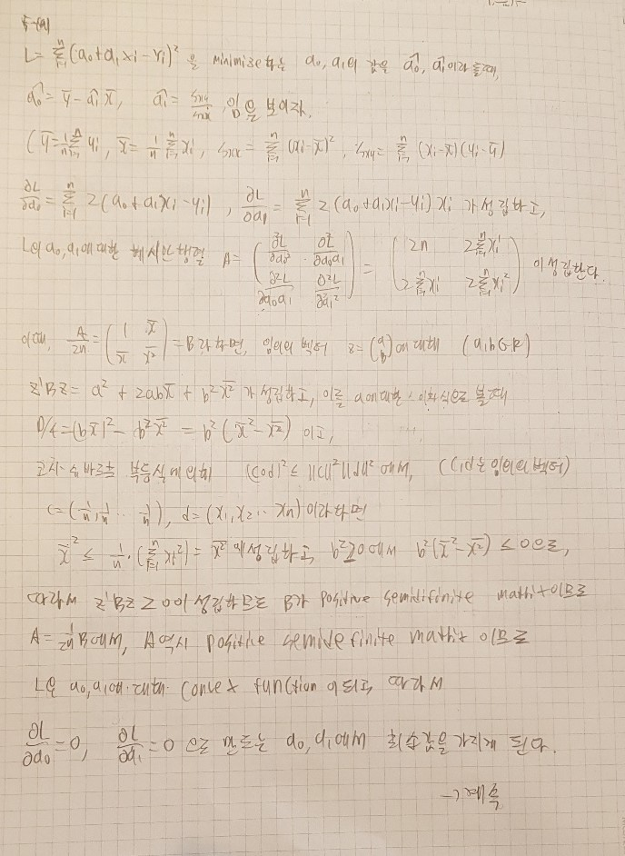
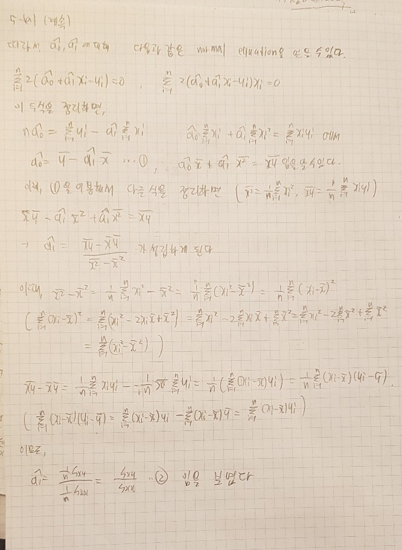
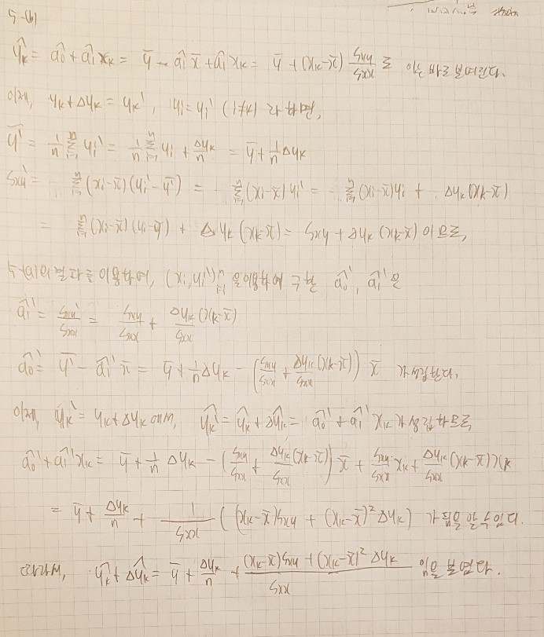
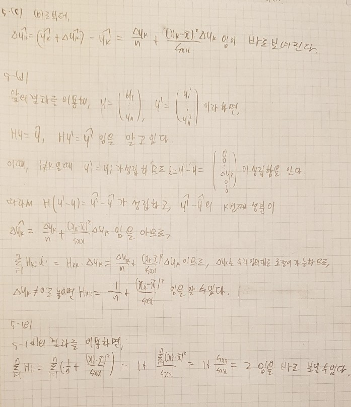

```{r setup, include=FALSE}
knitr::opts_chunk$set(echo = TRUE)
# Dig into the internal representation of R objects
library(tidyverse) # install.packages('tidyverse')
library(splines)
```


## Q1

### 1-(a)


```{r}
move_avg_periodic <- function(y, m){
    n <- length(y)
    y_right <- y[1:m] # using periodic boundary
    y_left <- y[(n-m+1):n] # using periodic boundary
    y_extend <- c(y_left, y , y_right)
    
    ey <- rep(0, length = n)
    
    for(i in 1:n){
        ey[i] <- mean(y_extend[i:(i + 2 * m)])
    }
    
    return(ey)
}

```

y_right와 y_left에 periodic boundary를 이용하여 m만큼의 길이를 확장한뒤,

y에 y_left와 y_right를 붙여 y_extend로 확장하고 moving average방법을 사용하여 

y의 추정값인 ey를 구하고 리턴하게 된다.

### 1-(b)

m<n일때, periodic boundary를 사용한 binomial filter를 이용하여, smooth 하는 코드는 다음과 같다.

```{r}
binomial_periodic <- function(y, m){
    n <- length(y)
    half_m <- m/2
    
    y_right <- y[1:half_m] # using periodic boundary
    y_left <- y[(n-half_m+1):n] # using periodic boundary
    y_extend <- c(y_left, y , y_right)
    
    w <- matrix(0, ncol = n + m, nrow = n + m)
    
    imat <- row(w)
    jmat <- col(w)
    
    check <- (0 <= (half_m + imat - jmat)) & ((half_m + imat - jmat) <= m)

    w[check] <- exp(lgamma(m + 1) - 
                    lgamma(half_m + imat[check] - jmat[check] + 1) -
                    lgamma(half_m - imat[check] + jmat[check] + 1) -
                    m * logb(2))
    # calculate choose(m,0.5m + i - j)/2^m for valid location.
    
    ey <- w %*% y_extend
    ey <- as.vector(ey[(half_m + 1) : (n + half_m)]) # use valid part for binomial filter.
    
    return(ey)
}

```

y_right와 y_left를 이용하여 periodic boundary를 사용하여 0.5m만큼의 길이를 확장한 뒤,
y에 y_right와 y_left를 붙여 y_extend로 확장한다.

그 후, w라는 matrix를 도입해서, 행렬곱을 이용해 y_extend에 w곱을 하는것으로 binomial filter로 smooth하는 효과를 줄 수 있도록, w를 적절히 구성한다.

w에서 $0 <= 0.5m + i - j$, $0.5m + i - j <= m$일때만 binomial filter에 해당하는 값을 가져야만 하므로, True, False로만 이루어진 check라는 matrix를 만들어서 check가 True인 곳에서의
W의 성분을 binomial filter에 맞는 값을 가지게 하였다.

이를 구현하기 위해 $\Gamma(n+1) = n!$임을 이용, exp에 loggamma(lgamma)함수를 이용하여
$\frac{{m \choose 0.5m + i - j}}{2^m}$ 에 해당하는 값을 w에 집어넣게 하였다.

그 후, w와 y를 곱해 ey라는 벡터를 뽑아내고, ey에서 우리가 필요한 부분은 중간부분이므로

이 부분을 적절히 잘라 리턴하게 하였다.


### 1-(c)

위 함수들을 이용하여 다음 값들을 smooth 해보자.

```{r}

ploting_func <- function(ey, y, title = ""){
    x <- seq(from = 1, by = 1, length = length(ey))
    plot(x, ey, type = "n", ylim = c(-5,5), xlab = "X", ylab = "Y", main = title)
    lines(x, ey, lwd = 4)
    points(x, y, pch = 19, lwd = 3, col = 'red')
}

par(mfrow = c(1,1), mai = c(1.5, 1.5, 0.5, 0.5), oma = c(1,1,1,1))
          
y <- c(2.46, -0.59, 1.14, -0.94, 0.62, -0.63, -0.43, 2.30, 1.29, 0.25, 1.92, -0.17, 0.22, -2.13, -3.03, -1.29, -3.24, 1.04, -0.64, 1.85)

m_small = 1
m_medium = 4
m_large = 7


ey_moving_small <- move_avg_periodic(y, m_small)
ey_moving_medium <- move_avg_periodic(y, m_medium)
ey_moving_large <- move_avg_periodic(y, m_large)

ey_binomial_small <- binomial_periodic(y, 2*m_small)
ey_binomial_medium <- binomial_periodic(y, 2*m_medium)
ey_binomial_large <- binomial_periodic(y, 2*m_large)
```

ploting_func라는 함수를 새로 정의하여 그래프를 그리는 과정을 자동화 하였다.

각각의 smooting 한 값을 이용하여, 기존의 y data와 함께 그려보자.

먼저 moving average를 이용한 방법이다.

```{r}
ploting_func(ey_moving_small, y, "moving average using m = 1")
ploting_func(ey_moving_medium, y, "moving average using m = 4")
ploting_func(ey_moving_large, y, "moving average using m = 7")
```

m이 커질수록,그래프의 smoothness는 증가하지만 fitidity는 감소하는것을 알 수 있다.

즉, m이 작으면 원래 데이터인 y에 더 민감하게 반응하여 fit은 잘되지만, smoothness가 떨어지고,

m이 크면 반대로 fit은 잘 되지 않지만, smoothness가 증가하는것을 알 수 있었다.


binomial filter를 이용한 방법으로도 plot해보자.

```{r}
ploting_func(ey_binomial_small, y, "binomial filter using m = 2")
ploting_func(ey_binomial_medium, y, "binomial filter using m = 8")
ploting_func(ey_binomial_large, y, "binomial filter using m = 14")
```

역시, moving average를 이용한 방법과 마찬가지로, m이 커질수록 smoothness는 증가하지만
fitidity가 감소하는것을 알 수 있었다.

moving average를 이용한 방법과의 차이는, binomial filter 방법은 moving average를 이용한 방법에 비해 ey를 계산할때 ey에 해당하는 x와 가까운 y값을 더 많이 반영하기 때문에, moving average에 비해 fitidity가 더 높은편임을 알 수 있다.

즉, 원래 데이터의 경향성을 더 많이 따라가는 경향이 있다.


### 1-(d)

위 함수들을 이용하여 다음 값들을 smooth 해보자.
```{r}
new_y <- c(-0.63, -0.43, 2.30, 1.29, 0.25, 1.92, -0.17, 0.22, -2.13, -3.03, -1.29, -3.24, 1.04, -0.64, 1.85, 2.46, -0.59, 1.14, -0.94, 0.62)

m_small = 1
m_medium = 4
m_large = 7


new_ey_moving_small <- move_avg_periodic(new_y, m_small)
new_ey_moving_medium <- move_avg_periodic(new_y, m_medium)
new_ey_moving_large <- move_avg_periodic(new_y, m_large)

new_ey_binomial_small <- binomial_periodic(new_y, 2*m_small)
new_ey_binomial_medium <- binomial_periodic(new_y, 2*m_medium)
new_ey_binomial_large <- binomial_periodic(new_y, 2*m_large)
```

역시 위와같이, 각각 m값에 따라 moving average와 binomial filter를 이용한 그래프를 그릴것이다.

여기서 특이점으로는, (d)에서의 y값은 (c)에서의 y값을 단순히 shift시킨것에 불과하다는 사실이다.


먼저 moving average에 의한 그래프를 그려보았다.

```{r}
ploting_func(new_ey_moving_small, new_y, "moving average using m = 1")
ploting_func(new_ey_moving_medium, new_y, "moving average using m = 4")
ploting_func(new_ey_moving_large, new_y, "moving average using m = 7")
```

그래프를 잘 살펴보면, 1-(c)에서 그린 그래프들을 단순히 shift 시킨것에 불과함을 알 수 있다.

이는 사실 당연한것인데, periodic boundary를 사용했기 때문에 moving average 방법을 사용했을때,

각 x값에 따른 ey가 계산되는 방법은, 각 x에 해당하는 위치만 다르지 동일한 값들을 사용하게 된다.

따라서 periodic shift가 estimate의 essential behaviour에 영향을 주지 않음을 알 수 있다.


```{r}
ploting_func(new_ey_binomial_small, new_y, "binomial filter using m = 2")
ploting_func(new_ey_binomial_medium, new_y, "binomial filter using m = 8")
ploting_func(new_ey_binomial_large, new_y, "binomial filter using m = 14")
```

binomial filter에 의한 방법도 마찬가지로, 1-(c)에서 그린 그래프들을 단순히 shift 시킨것에 불과하는데, 이 역시 periodic boundary를 사용하기 때문에, binomial filter에 의하면 ey를 계산할때 주변 y값들을 가까우면 가중치를 많이주어서, 멀면 가중치를 적게 주어 반영하게 되는데,
단순히 y값들을 shift 시켰고, 거기에 periodic boundary를 사용했기 때문에
역시 각 x값에 따른 ey가 계산될때는 x의 위치만 다르지, 결국 동일한 값들을 사용하게 되어 단순히 그래프가 shift되기만 하는 것이다.

실제로 계산된 값을 비교해보면

```{r}
ey_moving_medium
new_ey_moving_medium

ey_binomial_medium
new_ey_binomial_medium
```

두 방법 모두 그저 값들이 shift되기만 했음을 알 수 있다.
    
즉, periodic shift가 estimate의 essential behaviour에 영향을 주지 않음을 알 수 있다.


## Q2

### 2-(a)

(F)의 코드를 적당히 고쳐서 {1, 10.3, 16.5, 22.8, 31}의 knot를 사용하게 하면, 다음과 같다.


```{r}
library(splines)

nd <- 31
xx <- seq(from = 1, by = 1, length = nd)
yy <- scan("wak2.csv")

data1 <- data.frame(x = xx, y = yy)

fit.lm <- lm(y ~ bs(x, knots = c(10.3, 16.5, 22.8), degree = 1), data = data1)

ey <- fitted.values(fit.lm)

par(mfrow = c(1,1), mai = c(1.5, 1.5, 0.5, 0.5), oma = c(1,1,1,1))

plot(xx, ey, type = "n", ylim = c(-15,5), xlab = "X", ylab = "Y", main = "using b.spline knots = {1, 10.3, 16.5, 22.8, 31}")

lines(xx, ey, lwd = 4)
points(xx, yy, pch = 4, lwd = 2, col = 'red', cex=2)

```

위와같이 구현하면 된다. 이는 F의 코드에서 knots 부분만 수정해준 것으로, boundary에 해당하는 1, 31의 값은 집어넣지 않아도 된다.

그래프를 보면 해당 값들을 knot로 삼았음을 알 수 있다.

### 2-(b)

data의 movement에 따라 estimate들의 response를 살펴보기 위해, 위에서 구한 fit.lm 모델을 이용하여 새로운 데이터에 대한 prediction들이 어떻게 되는지를 알아볼 것이다.

1~31까지, 0.1 단위로 x값을 생성하여, 위 모델을 통해 각 x에서의 y의 추정값이 어떻게 되는지를 알아볼 것이다.

```{r}
ex <- seq(from = 1, by = 0.1, to = 31)

data2 <- data.frame(x = ex)
new_ey <- predict(fit.lm, newdata = data2)

plot(ex, new_ey, type = "n", ylim = c(-15,5), xlab = "X", ylab = "Y", main = "show responses of estimates given by the movements of data")

lines(ex, new_ey, lwd = 4)
points(xx, yy, pch = 4, lwd = 2, col = 'red', cex=2)

```

2-(a)에서 그린 그래프와 비교해보면, 거의 차이가 없음을 알 수 있는데, 이는 우리가 추정한 spline의 차수가 1차로, 선형함수이기 때문에 knot 사이에 있는 값들은 모두 일직선상에 놓이도록 추정되기 때문이다.

이제 hat matrix에 대한 그래프를 그려보자.

hat matrix를 구하기 위해서는, 각각 $e_1$, $e_2$, ... $e_n$에 해당하는 벡터를 hat matrix에 집어넣어 나온 결과가 hat matrix의 1,2... n번째 열이 되므로, 즉, x데이터로는 그대로 1~31까지의 데이터를 이용하고, y데이터로 각각 $e_1$,$e_2$... $e_n$을 이용하여 estimate한 값들을 통해 hat matrix를 구할수 있다.

여기서 $n=31$이므로, 이를 구하는 코드를 짜고, hat matrix를 plot해보자.

```{r}
nd <- 31
xx <- seq(from = 1, by = 1, length = nd)
hat <- matrix(0, ncol = nd, nrow = nd) #31x31 zero matrix

for(i in 1:nd){
    e <- rep(0, nd)
    e[i] <- 1   #make e_i, elementary vector.
    e_data <- data.frame(x = xx, y = e) #make new data
    e_fit.lm <- lm(y ~ bs(x, knots = c(10.3, 16.5, 22.8), degree = 1), data = e_data)
    
    hat[,i] <- fitted.values(e_fit.lm)
    #get hatmatrix's ith column
}
#get hat, first check if hat is truely hat matrix.
ey
hat %*% yy
max(abs(ey - hat %*% yy))

```

먼저, hat matrix를 구했다. 각 $e_i$에 해당하는 fitted value를 hat matrix의 ith column으로 만들고, 이 hat matrix가 실제 hat인지 알아보기 위해

2-(a)에서 yy값을 이용해 fit한, fitted value인 ey와,
hat과 yy를 곱한 벡터가 같은지를 확인해 보았다.

결과적으로, 두 벡터의 차이가 0벡터이면 같은것으로 판별할 수 있는데, 차이에 해당하는 벡터의 원소들의 절댓값의 최댓값이 $3.55*10^{-15}$정도로, 0에 매우 가까우므로 hat을 구했음을 알 수 있다.

이제 hat matrix를 plot하면

```{r}
persp(hat, zlim = c(-0.3, 1), xlab = "i", ylab = "j", zlab = "weights", lab = c(3,3,3), theta = -30, phi = 20)
```

위와 같음을 알 수 있다. 

이 hat matrix의 특징으로는, 대각선 원소들은 상대적으로 큰 양의 값을 가지고, 대각선 근처의 원소들중 음수인 값들이 있어, 데이터가 변화할때 예상하지 못한 방향으로 그래프가 달라질 수 있는 가능성이 있다.

즉, oscilation 이 존재하는 hat matrix임이 보여진다.


## Q3

### 3-(a)


(G)의 코드를 약간 수정해서, 먼저 llin에서, 각 x값에서 fit하는데 사용한 coefficient들을 추정값과 같이 리턴하도록 만들고,

이를 이용하여 각 x값에서 어떻게 y값을 추정하는지를 알 수 있는 그래프를 만들었다.

즉, 각 x값에서 x에 해당하는 coefficient를 이용해서 접선을 그리도록 하였다.

이때, 너무 많은 x값에서 접선을 출력하면 보기가 힘드므로,

5의 간격을 두고 출력하도록 하였다.


```{r}
lline_modify <- function(yy, hh)
{
    llin_coef <- function(ex1, xdata, ydata, band)
    {
        wts <- exp((-0.5 * (ex1 - xdata)^2/band^2))
        
        data1 <- data.frame(x = xdata, y = ydata, www = wts)
        
        fit.lm <- lm(y ~ x, data = data1, weights = www)
        
        estimate <- fit.lm$coef[1] + fit.lm$coef[2] * ex1
        
        retval <- c(fit.lm$coef, estimate)
        names(retval) = c("(Intercept)", "x", "estimated value")
        
        return(retval)
    }
    
    nd <- length(yy)
    xx <- seq(from = 1, by = 1, length = nd)
    
    xxmat <- matrix(xx, ncol = 1)
    
    coef_at_x <- apply(xxmat, 1, llin_coef, xdata = xx, ydata = yy, band = hh)
    ey <- as.vector(coef_at_x[3,])
    coefs <- coef_at_x[1:2,]
    
    plot(xx, ey, type = "n", ylim = c(5,25), xlab = "X", ylab = "Y", main = sprintf("local regression graph using h = %f", hh))
    lines(xx, ey, lwd=4)
    points(xx, yy, pch = 4, col = "red")
    
    for(i in seq(from = 5, by = 5, to = nd)){
        x = c(i-2, i+2)
        y = coefs[1,i] + coefs[2,i]*x
        lines(x = x, y = y, col = 'blue', lwd = 2)
    }
    # draw tangent line at point
    
}


```

line을 그릴때, x값에 해당하는 coef를 이용해 x 근방의 점 2개를 찍고, 두 점을 이어주어 tangent line을 출력하도록 하였다.


### 3-(b)

이제, 여러가지 bandwidth값을 이용하여 데이터에 대해 그래프를 그려보자.

```{r}
yy <- c(9.6, 12.8, 14.6, 15.6, 15.5, 15.1, 15.6, 13.8, 13.9, 16.1, 17.3, 18, 19, 9, 20, 19.9, 18.2, 15.8, 11.2, 9.6, 15.8, 16.7, 17.5, 13.7, 15.7, 20.6, 21.2, 16.7, 16, 20.7, 17.6)
hh <- 1.5
lline_modify(yy,hh)

hh <- 2.5
lline_modify(yy,hh)

hh <- 5 
lline_modify(yy,hh)
```

bandwidth의 값을 더 크게 할 수록, smoothness가 더 늘어나는것을 볼 수 있다. 이는 각 점에서 local regression을 진행할때 h가 클수록, 고려해야할 주변 점에서의 weight가 커지기 때문이다.

즉, 각 $X_j$에서의 회귀 계수는 다음과 같이 구해지는데

$argmin_{\alpha_j, \beta_j} = \sum_{i=1}^nw_{ij}(\alpha_j + \beta_jX_i - Y_i) $
$w_{ij} = e^{-\frac{1}{2}(\frac{X_i - X_j}{h})^2}$가 h가 큰경우가 h가 작은경우보다 $X_j$에서 떨어져있는 점들에 대해 더 많이 고려해야하므로, 
smoothness 가 증가함을 알 수 있다.

즉, h가 커질수록 smoothness가 늘어나지만 fitidity가 줄어드는것을 확인할 수 있다.

## Q4

### 4-(a)

섹션 2.7 (H)에 있는 코드는 아래와 같다.
```{r}
smspe <- function(yy, lambda)
{
    nd <- length(yy)
    
    ss <- c(1, -2, 1, rep(0, nd-3))
    ss <- rbind(ss, c(-2, 5, -4, 1, rep(0, length = nd - 4)))
    for(ii in 1:(nd - 4)){
        ss <- rbind(ss, c(rep(0, ii-1), 1, -4, 6, -4, 1, rep(0, nd - ii -4)))}
    ss <- rbind(ss, c(rep(0, length = nd - 4), 1, -4, 5, -2))
    ss <- rbind(ss, c(rep(0, length = nd - 3), 1, -2, 1))
    
    ssi <- diag(nd) + lambda*ss 
    
    ey <- solve(ssi, yy) # get ssi^-1*yy
    ey <- as.vector(ey)
    
    return(ey)
}


```

이는 $\hat{y} = (I + \lambda S)^{-1}y$ 식을 통해 $\hat{y}$를 구해주는 함수다.

이제, 이를 이용하여 Q.3에 있는 데이터를 다양한 $\lambda$를 이용하여 smoothing 해보자.

위에서 만든 ploting_func 함수를 조금 바꿔서 다시 이용할것이다.

```{r}
yy <- c(9.6, 12.8, 14.6, 15.6, 15.5, 15.1, 15.6, 13.8, 13.9, 16.1, 17.3, 18, 19, 9, 20, 19.9, 18.2, 15.8, 11.2, 9.6, 15.8, 16.7, 17.5, 13.7, 15.7, 20.6, 21.2, 16.7, 16, 20.7, 17.6)

ploting_func <- function(ey, y, title = ""){
    x <- seq(from = 1, by = 1, length = length(ey))
    plot(x, ey, type = "n", ylim = c(5,25), xlab = "X", ylab = "Y", main = title)
    lines(x, ey, lwd = 4)
    points(x, y, pch = 4, lwd = 3, col = 'red')
}

ey_low <- smspe(yy, 0.01)
ey_medium <- smspe(yy, 0.1)
ey_high <- smspe(yy,1)

ploting_func(ey_low, yy, title = "lambda = 0.01")
ploting_func(ey_medium, yy, title = "lambda = 0.1")
ploting_func(ey_high, yy, title = "lambda = 1")

```

각 lambda값에 따라 그래프를 그려보면, lambda가 크면 클수록 smoothness가 증가하는것을 알 수 있는데, 이는 
$$L = \sum_{i=1}^n(\hat{y_i} - y_i)^2 + \lambda \sum_{i=2}^{n-1}(\hat{y_{i-1}} - 2\hat{y_i} + \hat{y_{i+1}})^2$$

에서, L을 최소화하는 $\hat{y_i}$들을 택하게 되는데,

lambda가 커질수록 smoothness와 관련된 $\sum_{i=2}^{n-1}(\hat{y_{i-1}} - 2\hat{y_i} + \hat{y_{i+1}})^2$를 최소화 해야하는 필요성이 더 커지기 때문에, smoothness가 커지게 된다.

그에 반해 데이터의 fitidity 와 관련된 $\sum_{i=1}^n(\hat{y_i} - y_i)^2$를 낮게 유지할 필요성이 줄어들기 때문에, fitidity가 떨어지게 된다.

### 4-(b)

데이터가 변하게 되면 어떠한 영향을 미치는지 알아보자.

기존 y에서 13번째 데이터인 19에서 15를 빼본 데이터를 가지고 다시 한번 추정을 해본다.

```{r}
modified_y <- yy
modified_y[13] <- modified_y[13] - 15

modified_ey_low <- smspe(modified_y, 0.01)
modified_ey_medium <- smspe(modified_y, 0.1)
modified_ey_high <- smspe(modified_y,1)

ploting_func(modified_ey_low, yy, title = "lambda = 0.01")
ploting_func(modified_ey_medium, yy, title = "lambda = 0.1")
ploting_func(modified_ey_high, yy, title = "lambda = 1")

```


lambda가 커질수록, 기존 y값의 변화에 둔감해짐을 알 수 있다.

특히, lambda가 작은경우 fitidity가 높으므로, y값의 변화에 따라 그래프가 급격하게 변하게 됨을 확인할 수 있었다.

이제, hat matrix의 값을 다시 구해보자.

2-(b)에서와 같은 방법으로, hat matrix를 구할 수 있다.

y의 길이와, lambda값에 따라 smoothing spline의 hat matrix를 구해주는 함수와 그래프를 그려주는 함수를 만들고, lambda값에 따른 hat matrix를 받아오자.


```{r}
get_smooting_spline_hatmatrix <- function(yy, lambda)
{
    nd <- length(yy)
    xx <- seq(from = 1, by = 1, length = nd)
    hat <- matrix(0, ncol = nd, nrow = nd) #ndxnd zero matrix
    
    for(i in 1:nd){
        e <- rep(0, nd)
        e[i] <- 1   #make e_i, elementary vector.
        hat[,i] <- smspe(e, lambda)

        #get hatmatrix's ith column
    }
    #get hat, first check if hat is truely hat matrix.
    return(hat)

}
print_hatmatrix <- function(hat, title = ""){
    persp(hat, zlim = c(-0.3, 1), xlab = "i", ylab = "j", zlab = "weights", lab = c(3,3,3), theta = -30, phi = 20, main = title)
}

hat_low <- get_smooting_spline_hatmatrix(yy, 0.01)
hat_medium <- get_smooting_spline_hatmatrix(yy, 0.1)
hat_high <- get_smooting_spline_hatmatrix(yy, 1)
```

각 lambda값에 대해 hat matrix를 출력해보면 다음과 같다.

```{r}
print_hatmatrix(hat_low,"lambda = 0.01")
print_hatmatrix(hat_medium,"lambda = 0.1")
print_hatmatrix(hat_high,"lambda = 1")
```

diagonal entry를 기준으로 값들이 symmetric함을 확인할 수 있고,

lambda가 작을수록 단위행렬 I와 비슷함을 알 수 있다.

함수를 이용해서 symmtericity를 확인해보면

```{r}
isSymmetric.matrix(hat_low)
isSymmetric.matrix(hat_medium)
isSymmetric.matrix(hat_high)
```

모두 True임이 확인된다.


### 4-(c)

solve 함수를 이용하여 역행렬을 구하자.
solve(A) = $A^{-1}$을 계산해준다.

solve를 이용해 $(I + \lambda S)^{-1}$를 계산해주는 다음 함수를 만들었다.

```{r}
get_hatmatrix_direct <- function(yy, lambda)
{
    nd <- length(yy)
    
    ss <- c(1, -2, 1, rep(0, nd-3))
    ss <- rbind(ss, c(-2, 5, -4, 1, rep(0, length = nd - 4)))
    for(ii in 1:(nd - 4)){
        ss <- rbind(ss, c(rep(0, ii-1), 1, -4, 6, -4, 1, rep(0, nd - ii -4)))}
    ss <- rbind(ss, c(rep(0, length = nd - 4), 1, -4, 5, -2))
    ss <- rbind(ss, c(rep(0, length = nd - 3), 1, -2, 1))
    
    ssi <- diag(nd) + lambda*ss 
    
    return(solve(ssi))
}

direct_hat_low <- get_hatmatrix_direct(yy, 0.01)
direct_hat_medium <- get_hatmatrix_direct(yy, 0.1)
direct_hat_high <- get_hatmatrix_direct(yy, 1)
```

이제, 각 hat matrix가 같은지 알기위해, 각 matrix의 원소의 차이가 어떻게 되는지 알아보면,

```{r}
max(abs(direct_hat_low - hat_low))
max(abs(direct_hat_medium - hat_medium))
max(abs(direct_hat_high - hat_high))
```

각 matrix의 원소 차이의 절댓값들의 최대값이 0으로, 아예 matrix들이 같음을 알 수 있다.

즉, 앞에서 올바르게 hat matrix를 구했음을 알 수 있다.


## Q5

### 5-(a)



### 5-(b)



### 5-(c),(d),(e)



